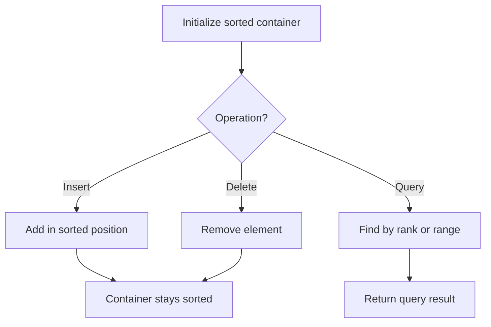

# Problem 2035: Partition Array Into Two Arrays to Minimize Sum Difference

**Difficulty:** Hard  
**Tags:** Array, Two Pointers, Binary Search, Dynamic Programming, Bit Manipulation, Sorting, Ordered Set, Bitmask  
**Pattern:** Ordered Set / SortedList  
**Link:** [leetcode.com/problems/partition-array-into-two-arrays-to-minimize-sum-difference](https://leetcode.com/problems/partition-array-into-two-arrays-to-minimize-sum-difference/)

## Description

You are given an integer array `nums` of `2 * n` integers. You need to partition `nums` into **two** arrays of length `n` to **minimize the absolute difference** of the **sums** of the arrays. To partition `nums`, put each element of `nums` into **one** of the two arrays.

Return *the **minimum** possible absolute difference*.

 

Example 1:

```

**Input:** nums = [3,9,7,3]
**Output:** 2
**Explanation:** One optimal partition is: [3,9] and [7,3].
The absolute difference between the sums of the arrays is abs((3 + 9) - (7 + 3)) = 2.

```

Example 2:

```

**Input:** nums = [-36,36]
**Output:** 72
**Explanation:** One optimal partition is: [-36] and [36].
The absolute difference between the sums of the arrays is abs((-36) - (36)) = 72.

```

Example 3:

```

**Input:** nums = [2,-1,0,4,-2,-9]
**Output:** 0
**Explanation:** One optimal partition is: [2,4,-9] and [-1,0,-2].
The absolute difference between the sums of the arrays is abs((2 + 4 + -9) - (-1 + 0 + -2)) = 0.

```

 

**Constraints:**

	- `1 <= n <= 15`
	- `nums.length == 2 * n`
	- `-10^7 <= nums[i] <= 10^7`

## Approach: Ordered Set / SortedList

Maintain elements in sorted order for efficient insertion, deletion, and rank queries. Use balanced BST, skip list, or sorted container.

## Pseudocode

```
1. Initialize sorted container
2. For each operation:
   - Insert: add element in sorted position O(log n)
   - Delete: remove element O(log n)
   - Query: find kth element, count, or range O(log n)
3. Return results
```

## Algorithm Flow



## Complexity Analysis

- **Time:** O(n log n)
- **Space:** O(n)

## Solution (Python3)

```python
class Solution:
    def minimumDifference(self, nums: List[int]) -> int:
        # Ordered set / SortedList - O(n log n) time
        from sortedcontainers import SortedList
        sl = SortedList()
        result = 0
        for val in nums:
            pos = sl.bisect_left(val)
            if pos < len(sl):
                result = max(result, sl[pos] - val)
            sl.add(val)
        return result
```

## Solution (C++)

```cpp
#include <algorithm>
#include <set>
#include <string>
#include <vector>
using namespace std;

class Solution {
public:
    int minimumDifference(vector<int>& nums) {
        // Ordered set - O(n log n) time
        set<int> ordered;
        int result = 0;
        for (int val : nums) {
            auto it = ordered.lower_bound(val);
            if (it != ordered.end()) {
                result = max(result, *it - val);
            }
            ordered.insert(val);
        }
        return result;
    }
};
```
