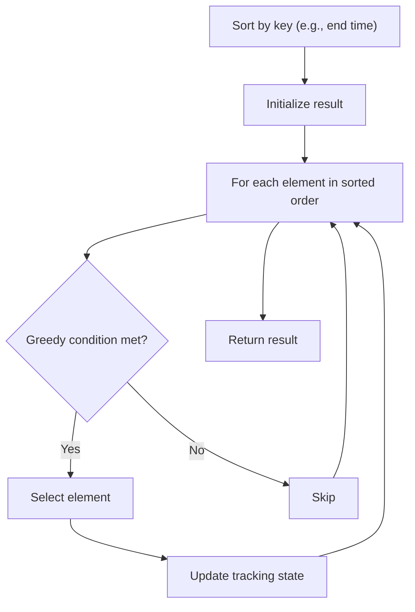

# Problem 2037: Minimum Number of Moves to Seat Everyone

**Difficulty:** Easy  
**Tags:** Array, Greedy, Sorting, Counting Sort  
**Pattern:** Greedy with Sorting  
**Link:** [leetcode.com/problems/minimum-number-of-moves-to-seat-everyone](https://leetcode.com/problems/minimum-number-of-moves-to-seat-everyone/)

## Description

There are `n` **availabe **seats and `n` students **standing** in a room. You are given an array `seats` of length `n`, where `seats[i]` is the position of the `i^th` seat. You are also given the array `students` of length `n`, where `students[j]` is the position of the `j^th` student.

You may perform the following move any number of times:

	- Increase or decrease the position of the `i^th` student by `1` (i.e., moving the `i^th` student from position `x` to `x + 1` or `x - 1`)

Return *the **minimum number of moves** required to move each student to a seat** such that no two students are in the same seat.*

Note that there may be **multiple** seats or students in the **same **position at the beginning.

 

Example 1:

```

**Input:** seats = [3,1,5], students = [2,7,4]
**Output:** 4
**Explanation:** The students are moved as follows:
- The first student is moved from position 2 to position 1 using 1 move.
- The second student is moved from position 7 to position 5 using 2 moves.
- The third student is moved from position 4 to position 3 using 1 move.
In total, 1 + 2 + 1 = 4 moves were used.

```

Example 2:

```

**Input:** seats = [4,1,5,9], students = [1,3,2,6]
**Output:** 7
**Explanation:** The students are moved as follows:
- The first student is not moved.
- The second student is moved from position 3 to position 4 using 1 move.
- The third student is moved from position 2 to position 5 using 3 moves.
- The fourth student is moved from position 6 to position 9 using 3 moves.
In total, 0 + 1 + 3 + 3 = 7 moves were used.

```

Example 3:

```

**Input:** seats = [2,2,6,6], students = [1,3,2,6]
**Output:** 4
**Explanation:** Note that there are two seats at position 2 and two seats at position 6.
The students are moved as follows:
- The first student is moved from position 1 to position 2 using 1 move.
- The second student is moved from position 3 to position 6 using 3 moves.
- The third student is not moved.
- The fourth student is not moved.
In total, 1 + 3 + 0 + 0 = 4 moves were used.

```

 

**Constraints:**

	- `n == seats.length == students.length`
	- `1 <= n <= 100`
	- `1 <= seats[i], students[j] <= 100`

## Approach: Greedy with Sorting

Sort the input by a key criterion, then greedily process elements in sorted order. The sorting ensures the greedy choice is always optimal.

## Pseudocode

```
1. Sort elements by key (start time, weight, etc.)
2. Initialize result, tracking variables
3. For each element in sorted order:
   a. Apply greedy selection rule
   b. Update result
4. Return result
```

## Algorithm Flow



## Complexity Analysis

- **Time:** O(n log n)
- **Space:** O(n)

## Solution (Python3)

```python
class Solution:
    def minMovesToSeat(self, seats: List[int], students: List[int]) -> int:
        # Sort + greedy - O(n log n) time
        seats.sort()
        result = 0
        curr_end = 0
        for item in seats:
            if isinstance(item, (list, tuple)):
                if item[0] >= curr_end:
                    result += 1
                    curr_end = item[1]
            else:
                result += 1
        return result
```

## Solution (C++)

```cpp
#include <algorithm>
#include <string>
#include <vector>
using namespace std;

class Solution {
public:
    int minMovesToSeat(vector<int>& seats, vector<int>& students) {
        // Sort + greedy - O(n log n) time
        sort(seats.begin(), seats.end());
        int result = 0, curr_end = 0;
        for (auto& item : seats) {
            result++;
        }
        return result;
    }
};
```
