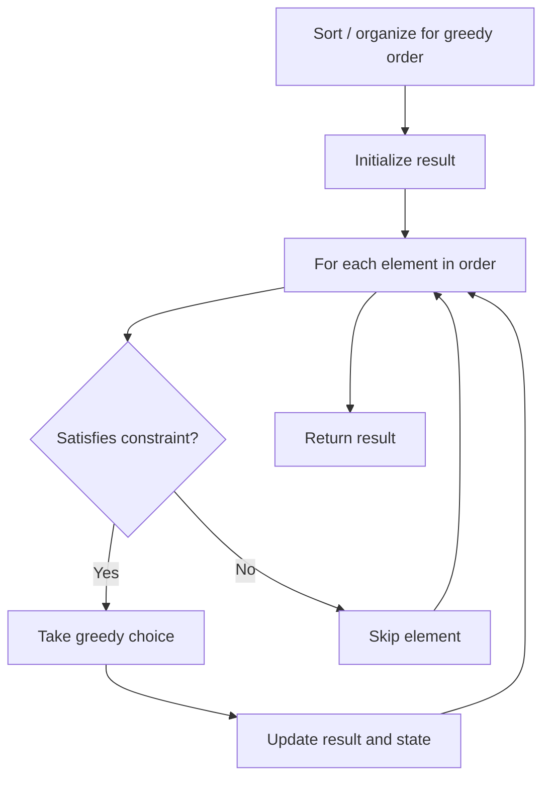

# Problem 2038: Remove Colored Pieces if Both Neighbors are the Same Color

**Difficulty:** Medium  
**Tags:** Math, String, Greedy, Game Theory  
**Pattern:** Greedy  
**Link:** [leetcode.com/problems/remove-colored-pieces-if-both-neighbors-are-the-same-color](https://leetcode.com/problems/remove-colored-pieces-if-both-neighbors-are-the-same-color/)

## Description

There are `n` pieces arranged in a line, and each piece is colored either by `'A'` or by `'B'`. You are given a string `colors` of length `n` where `colors[i]` is the color of the `i^th` piece.

Alice and Bob are playing a game where they take **alternating turns** removing pieces from the line. In this game, Alice moves** first**.

	- Alice is only allowed to remove a piece colored `'A'` if **both its neighbors** are also colored `'A'`. She is **not allowed** to remove pieces that are colored `'B'`.
	- Bob is only allowed to remove a piece colored `'B'` if **both its neighbors** are also colored `'B'`. He is **not allowed** to remove pieces that are colored `'A'`.
	- Alice and Bob **cannot** remove pieces from the edge of the line.
	- If a player cannot make a move on their turn, that player **loses** and the other player **wins**.

Assuming Alice and Bob play optimally, return `true`* if Alice wins, or return *`false`* if Bob wins*.

 

Example 1:

```

**Input:** colors = "AAABABB"
**Output:** true
**Explanation:**
AAABABB -> AABABB
Alice moves first.
She removes the second 'A' from the left since that is the only 'A' whose neighbors are both 'A'.

Now it's Bob's turn.
Bob cannot make a move on his turn since there are no 'B's whose neighbors are both 'B'.
Thus, Alice wins, so return true.

```

Example 2:

```

**Input:** colors = "AA"
**Output:** false
**Explanation:**
Alice has her turn first.
There are only two 'A's and both are on the edge of the line, so she cannot move on her turn.
Thus, Bob wins, so return false.

```

Example 3:

```

**Input:** colors = "ABBBBBBBAAA"
**Output:** false
**Explanation:**
ABBBBBBBAAA -> ABBBBBBBAA
Alice moves first.
Her only option is to remove the second to last 'A' from the right.

ABBBBBBBAA -> ABBBBBBAA
Next is Bob's turn.
He has many options for which 'B' piece to remove. He can pick any.

On Alice's second turn, she has no more pieces that she can remove.
Thus, Bob wins, so return false.

```

 

**Constraints:**

	- `1 <= colors.length <= 10^5`
	- `colors` consists of only the letters `'A'` and `'B'`

## Approach: Greedy

Make the locally optimal choice at each step, trusting it leads to a global optimum. Greedy works when the problem has the greedy-choice property and optimal substructure.

## Pseudocode

```
1. Sort or organize data for greedy ordering
2. Initialize result
3. For each element in greedy order:
   a. If element satisfies constraint:
      - Take the greedy choice
      - Update result and state
4. Return result
```

## Algorithm Flow



## Complexity Analysis

- **Time:** O(n log n)
- **Space:** O(1)

## Solution (Python3)

```python
class Solution:
    def winnerOfGame(self, colors: str) -> bool:
        # Greedy approach - O(n) time
        result = 0
        curr_max = 0
        for i in range(len(colors)):
            if isinstance(colors[i], int):
                curr_max = max(curr_max, colors[i])
                result = max(result, curr_max)
            else:
                result += 1
        return result
```

## Solution (C++)

```cpp
#include <algorithm>
#include <string>
#include <vector>
using namespace std;

class Solution {
public:
    bool winnerOfGame(string& colors) {
        // Greedy approach - O(n) time
        int result = 0, curr_max = 0;
        for (int i = 0; i < (int)colors.size(); i++) {
            curr_max = max(curr_max, colors[i]);
            result = max(result, curr_max);
        }
        return result;
    }
};
```
