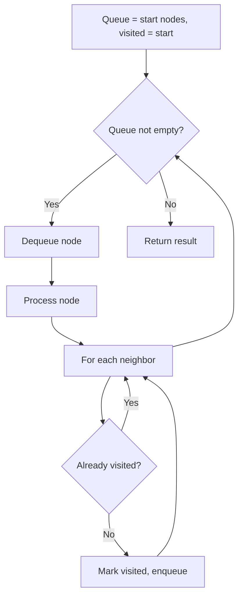
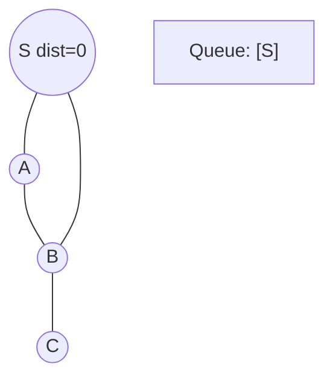
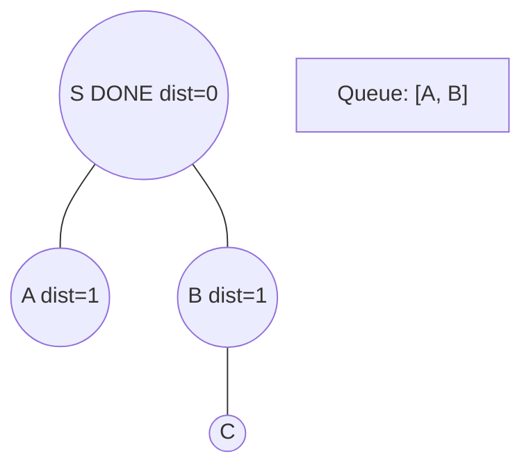
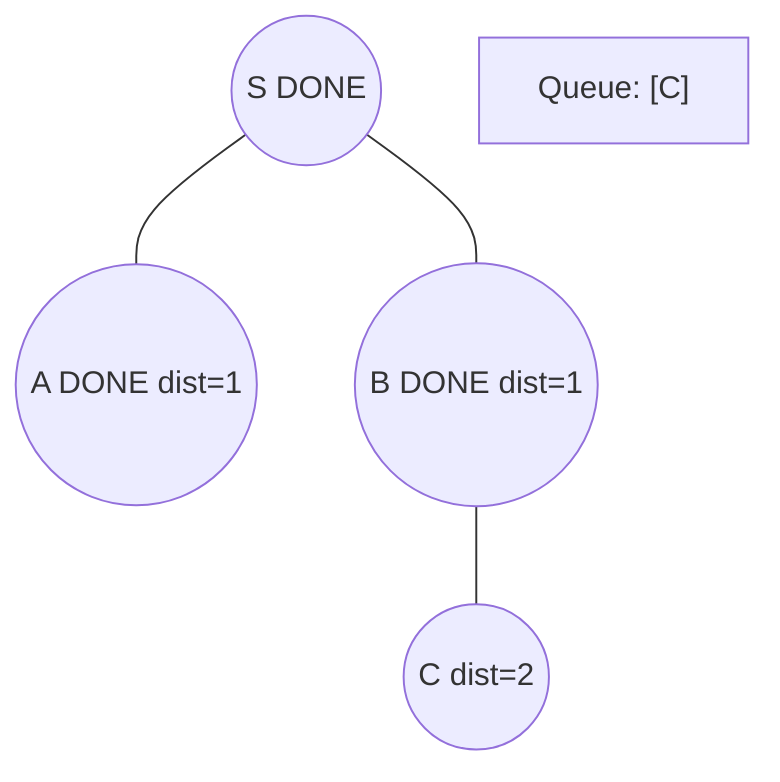
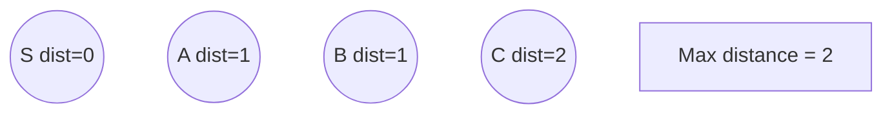

# Problem 2039: The Time When the Network Becomes Idle

**Difficulty:** Medium  
**Tags:** Array, Breadth-First Search, Graph Theory  
**Pattern:** BFS Graph Traversal  
**Link:** [leetcode.com/problems/the-time-when-the-network-becomes-idle](https://leetcode.com/problems/the-time-when-the-network-becomes-idle/)

## Description

There is a network of `n` servers, labeled from `0` to `n - 1`. You are given a 2D integer array `edges`, where `edges[i] = [ui, vi]` indicates there is a message channel between servers `ui` and `vi`, and they can pass **any** number of messages to **each other** directly in **one** second. You are also given a **0-indexed** integer array `patience` of length `n`.

All servers are **connected**, i.e., a message can be passed from one server to any other server(s) directly or indirectly through the message channels.

The server labeled `0` is the **master** server. The rest are **data** servers. Each data server needs to send its message to the master server for processing and wait for a reply. Messages move between servers **optimally**, so every message takes the **least amount of time** to arrive at the master server. The master server will process all newly arrived messages **instantly** and send a reply to the originating server via the **reversed path** the message had gone through.

At the beginning of second `0`, each data server sends its message to be processed. Starting from second `1`, at the **beginning** of **every** second, each data server will check if it has received a reply to the message it sent (including any newly arrived replies) from the master server:

	- If it has not, it will **resend** the message periodically. The data server `i` will resend the message every `patience[i]` second(s), i.e., the data server `i` will resend the message if `patience[i]` second(s) have **elapsed** since the **last** time the message was sent from this server.
	- Otherwise, **no more resending** will occur from this server.

The network becomes **idle** when there are **no** messages passing between servers or arriving at servers.

Return *the **earliest second** starting from which the network becomes **idle***.

 

Example 1:

```

**Input:** edges = [[0,1],[1,2]], patience = [0,2,1]
**Output:** 8
**Explanation:**
At (the beginning of) second 0,
- Data server 1 sends its message (denoted 1A) to the master server.
- Data server 2 sends its message (denoted 2A) to the master server.

At second 1,
- Message 1A arrives at the master server. Master server processes message 1A instantly and sends a reply 1A back.
- Server 1 has not received any reply. 1 second (1 < patience[1] = 2) elapsed since this server has sent the message, therefore it does not resend the message.
- Server 2 has not received any reply. 1 second (1 == patience[2] = 1) elapsed since this server has sent the message, therefore it resends the message (denoted 2B).

At second 2,
- The reply 1A arrives at server 1. No more resending will occur from server 1.
- Message 2A arrives at the master server. Master server processes message 2A instantly and sends a reply 2A back.
- Server 2 resends the message (denoted 2C).
...
At second 4,
- The reply 2A arrives at server 2. No more resending will occur from server 2.
...
At second 7, reply 2D arrives at server 2.

Starting from the beginning of the second 8, there are no messages passing between servers or arriving at servers.
This is the time when the network becomes idle.

```

Example 2:

```

**Input:** edges = [[0,1],[0,2],[1,2]], patience = [0,10,10]
**Output:** 3
**Explanation:** Data servers 1 and 2 receive a reply back at the beginning of second 2.
From the beginning of the second 3, the network becomes idle.

```

 

**Constraints:**

	- `n == patience.length`
	- `2 <= n <= 10^5`
	- `patience[0] == 0`
	- `1 <= patience[i] <= 10^5` for `1 <= i < n`
	- `1 <= edges.length <= min(10^5, n * (n - 1) / 2)`
	- `edges[i].length == 2`
	- `0 <= ui, vi < n`
	- `ui != vi`
	- There are no duplicate edges.
	- Each server can directly or indirectly reach another server.

## Approach: BFS Graph Traversal

Explore the graph breadth-first using a queue. Process nodes level by level; BFS finds shortest paths in unweighted graphs.

## Pseudocode

```
1. Initialize queue with start node(s), visited set
2. While queue not empty:
   a. Dequeue node
   b. Process node
   c. For each unvisited neighbor:
      - Mark visited, enqueue
3. Return result
```

## Algorithm Flow



## Visual State Transitions

**BFS Level-by-Level Traversal:**

**Frame 1: Start BFS from source**


**Frame 2: Process level 0, enqueue neighbors**


**Frame 3: Process level 1**


**Frame 4: All nodes reached**



## Complexity Analysis

- **Time:** O(V + E)
- **Space:** O(V)

## Solution (Python3)

```python
class Solution:
    def networkBecomesIdle(self, edges: List[List[int]], patience: List[int]) -> int:
        # BFS on graph - O(V+E) time
        from collections import deque
        if not edges:
            return 0
        visited = set()
        queue = deque([0])
        visited.add(0)
        dist = 0
        while queue:
            for _ in range(len(queue)):
                node = queue.popleft()
                # Process node
            dist += 1
        return dist
```

## Solution (C++)

```cpp
#include <queue>
#include <string>
#include <unordered_set>
#include <vector>
using namespace std;

class Solution {
public:
    int networkBecomesIdle(vector<vector<int>>& edges, vector<int>& patience) {
        // BFS on graph - O(V+E) time
        if (edges.empty()) return 0;
        queue<int> q;
        unordered_set<int> visited;
        q.push(0);
        visited.insert(0);
        int dist = 0;
        while (!q.empty()) {
            int sz = q.size();
            for (int i = 0; i < sz; i++) {
                int node = q.front(); q.pop();
                // Process node
            }
            dist++;
        }
        return dist;
    }
};
```
