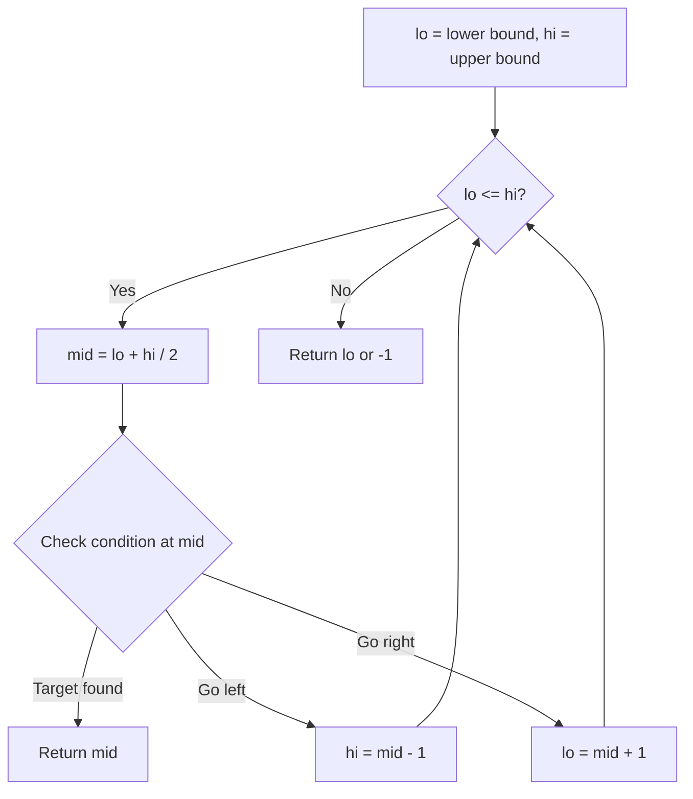
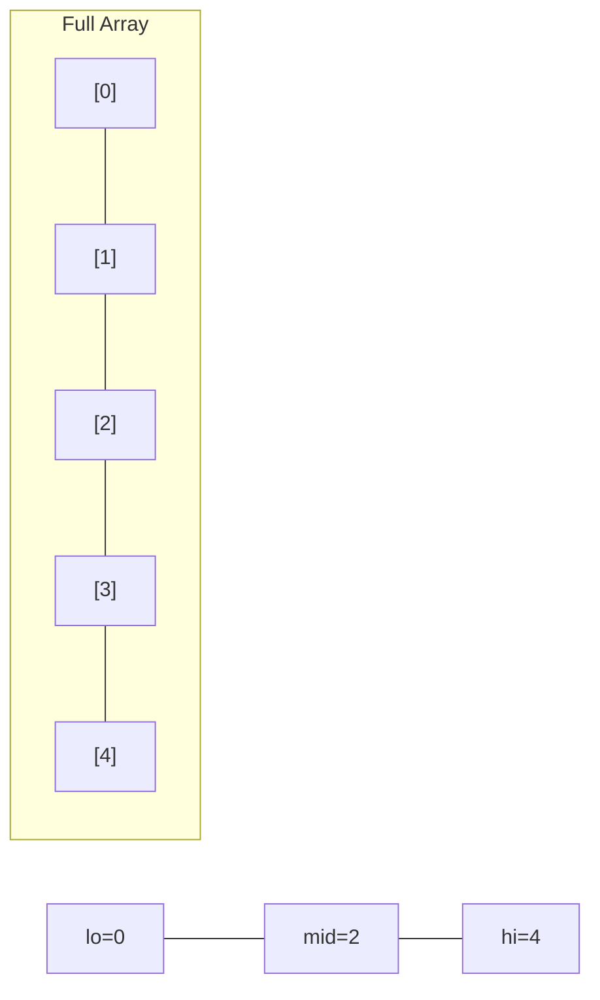
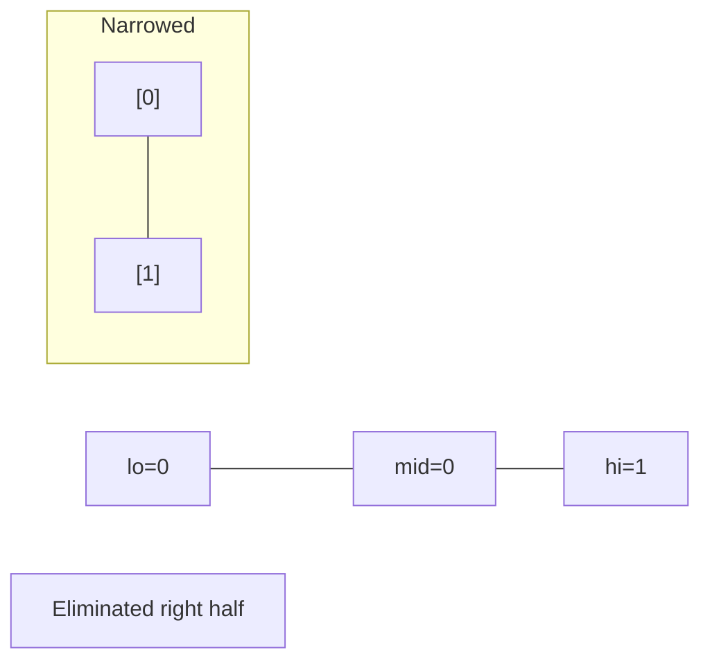
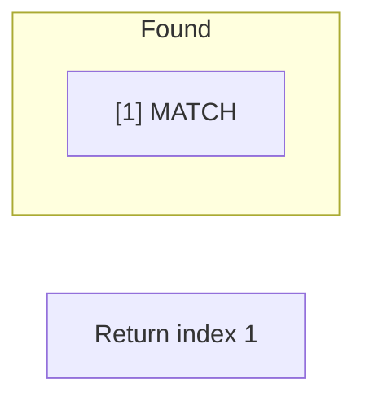

# Problem 2040: Kth Smallest Product of Two Sorted Arrays

**Difficulty:** Hard  
**Tags:** Array, Binary Search  
**Pattern:** Binary Search  
**Link:** [leetcode.com/problems/kth-smallest-product-of-two-sorted-arrays](https://leetcode.com/problems/kth-smallest-product-of-two-sorted-arrays/)

## Description

Given two **sorted 0-indexed** integer arrays `nums1` and `nums2` as well as an integer `k`, return *the *`k^th`* (**1-based**) smallest product of *`nums1[i] * nums2[j]`* where *`0 <= i < nums1.length`* and *`0 <= j < nums2.length`.
 

Example 1:

```

**Input:** nums1 = [2,5], nums2 = [3,4], k = 2
**Output:** 8
**Explanation:** The 2 smallest products are:
- nums1[0] * nums2[0] = 2 * 3 = 6
- nums1[0] * nums2[1] = 2 * 4 = 8
The 2nd smallest product is 8.

```

Example 2:

```

**Input:** nums1 = [-4,-2,0,3], nums2 = [2,4], k = 6
**Output:** 0
**Explanation:** The 6 smallest products are:
- nums1[0] * nums2[1] = (-4) * 4 = -16
- nums1[0] * nums2[0] = (-4) * 2 = -8
- nums1[1] * nums2[1] = (-2) * 4 = -8
- nums1[1] * nums2[0] = (-2) * 2 = -4
- nums1[2] * nums2[0] = 0 * 2 = 0
- nums1[2] * nums2[1] = 0 * 4 = 0
The 6th smallest product is 0.

```

Example 3:

```

**Input:** nums1 = [-2,-1,0,1,2], nums2 = [-3,-1,2,4,5], k = 3
**Output:** -6
**Explanation:** The 3 smallest products are:
- nums1[0] * nums2[4] = (-2) * 5 = -10
- nums1[0] * nums2[3] = (-2) * 4 = -8
- nums1[4] * nums2[0] = 2 * (-3) = -6
The 3rd smallest product is -6.

```

 

**Constraints:**

	- `1 <= nums1.length, nums2.length <= 5 * 10^4`
	- `-10^5 <= nums1[i], nums2[j] <= 10^5`
	- `1 <= k <= nums1.length * nums2.length`
	- `nums1` and `nums2` are sorted.

## Approach: Binary Search

Use binary search to halve the search space each iteration. Define the search range [lo, hi], compute mid, and decide which half to keep based on the problem's monotonic condition.

## Pseudocode

```
1. lo = lower_bound, hi = upper_bound
2. While lo <= hi (or lo < hi):
   a. mid = (lo + hi) // 2
   b. If condition(mid) is satisfied: record answer, search left half
   c. Else: search right half
3. Return answer
```

## Algorithm Flow



## Visual State Transitions

**Binary Search Step-by-Step:**

**Frame 1: Initial search space**


**Frame 2: Compare mid, narrow search**


**Frame 3: Found target**



## Complexity Analysis

- **Time:** O(log n)
- **Space:** O(1)

## Solution (Python3)

```python
class Solution:
    def kthSmallestProduct(self, nums1: List[int], nums2: List[int], k: int) -> int:
        # Binary search - O(log n) time, O(1) space
        lo, hi = 0, len(nums1) - 1
        while lo <= hi:
            mid = lo + (hi - lo) // 2
            if nums1[mid] == nums2:
                return mid
            elif nums1[mid] < nums2:
                lo = mid + 1
            else:
                hi = mid - 1
        return 0
```

## Solution (C++)

```cpp
#include <string>
#include <vector>
using namespace std;

class Solution {
public:
    int kthSmallestProduct(vector<int>& nums1, vector<int>& nums2, int k) {
        // Binary search - O(log n) time, O(1) space
        int lo = 0, hi = nums1.size() - 1;
        while (lo <= hi) {
            int mid = lo + (hi - lo) / 2;
            if (nums1[mid] == nums2) {
                return mid;
            } else if (nums1[mid] < nums2) {
                lo = mid + 1;
            } else {
                hi = mid - 1;
            }
        }
        return 0;
    }
};
```
