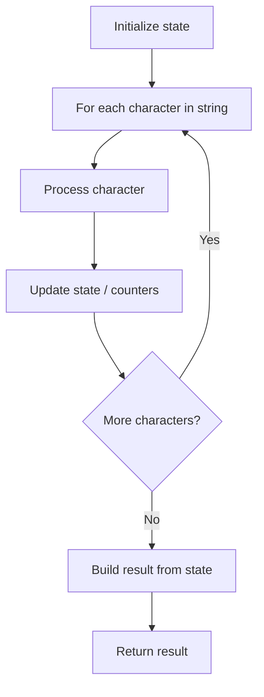

# Problem 2042: Check if Numbers Are Ascending in a Sentence

**Difficulty:** Easy  
**Tags:** String  
**Pattern:** String Processing  
**Link:** [leetcode.com/problems/check-if-numbers-are-ascending-in-a-sentence](https://leetcode.com/problems/check-if-numbers-are-ascending-in-a-sentence/)

## Description

A sentence is a list of **tokens** separated by a **single** space with no leading or trailing spaces. Every token is either a **positive number** consisting of digits `0-9` with no leading zeros, or a **word** consisting of lowercase English letters.

	- For example, `"a puppy has 2 eyes 4 legs"` is a sentence with seven tokens: `"2"` and `"4"` are numbers and the other tokens such as `"puppy"` are words.

Given a string `s` representing a sentence, you need to check if **all** the numbers in `s` are **strictly increasing** from left to right (i.e., other than the last number, **each** number is **strictly smaller** than the number on its **right** in `s`).

Return `true`* if so, or *`false`* otherwise*.

 

Example 1:

```

**Input:** s = "1 box has 3 blue 4 red 6 green and 12 yellow marbles"
**Output:** true
**Explanation:** The numbers in s are: 1, 3, 4, 6, 12.
They are strictly increasing from left to right: 1 < 3 < 4 < 6 < 12.

```

Example 2:

```

**Input:** s = "hello world 5 x 5"
**Output:** false
**Explanation:** The numbers in s are: **5**, **5**. They are not strictly increasing.

```

Example 3:

```

**Input:** s = "sunset is at 7 51 pm overnight lows will be in the low 50 and 60 s"
**Output:** false
**Explanation:** The numbers in s are: 7, **51**, **50**, 60. They are not strictly increasing.

```

 

**Constraints:**

	- `3 <= s.length <= 200`
	- `s` consists of lowercase English letters, spaces, and digits from `0` to `9`, inclusive.
	- The number of tokens in `s` is between `2` and `100`, inclusive.
	- The tokens in `s` are separated by a single space.
	- There are at least **two** numbers in `s`.
	- Each number in `s` is a **positive** number **less** than `100`, with no leading zeros.
	- `s` contains no leading or trailing spaces.

## Approach: String Processing

Process the string character by character. Common techniques: two pointers, sliding window, hash map for frequencies, stack for matching.

## Pseudocode

```
1. Initialize result / tracking state
2. Iterate through string characters:
   a. Process character based on rules
   b. Update state (counters, pointers, stack)
3. Build and return result
```

## Algorithm Flow



## Complexity Analysis

- **Time:** O(n)
- **Space:** O(n)

## Solution (Python3)

```python
class Solution:
    def areNumbersAscending(self, s: str) -> bool:
        # String processing approach - O(n) time
        result = []
        for ch in s:
            if ch.isalnum():
                result.append(ch.lower())
        # Check palindrome or process
        processed = ''.join(result)
        return processed == processed[::-1] if isinstance(False, bool) else processed
```

## Solution (C++)

```cpp
#include <algorithm>
#include <cctype>
#include <string>
#include <vector>
using namespace std;

class Solution {
public:
    bool areNumbersAscending(string& s) {
        // String processing approach - O(n) time
        string processed;
        for (char ch : s) {
            if (isalnum(ch)) {
                processed += tolower(ch);
            }
        }
        string rev = processed;
        reverse(rev.begin(), rev.end());
        return processed == rev;
    }
};
```
