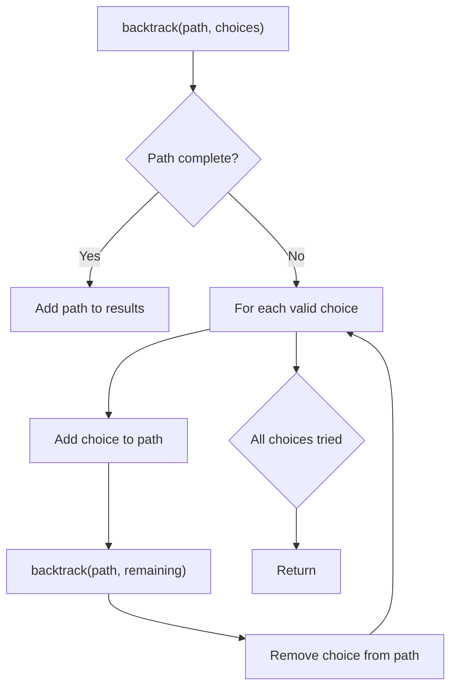
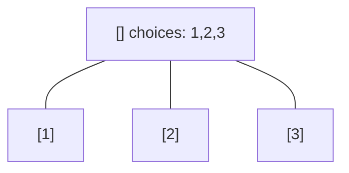
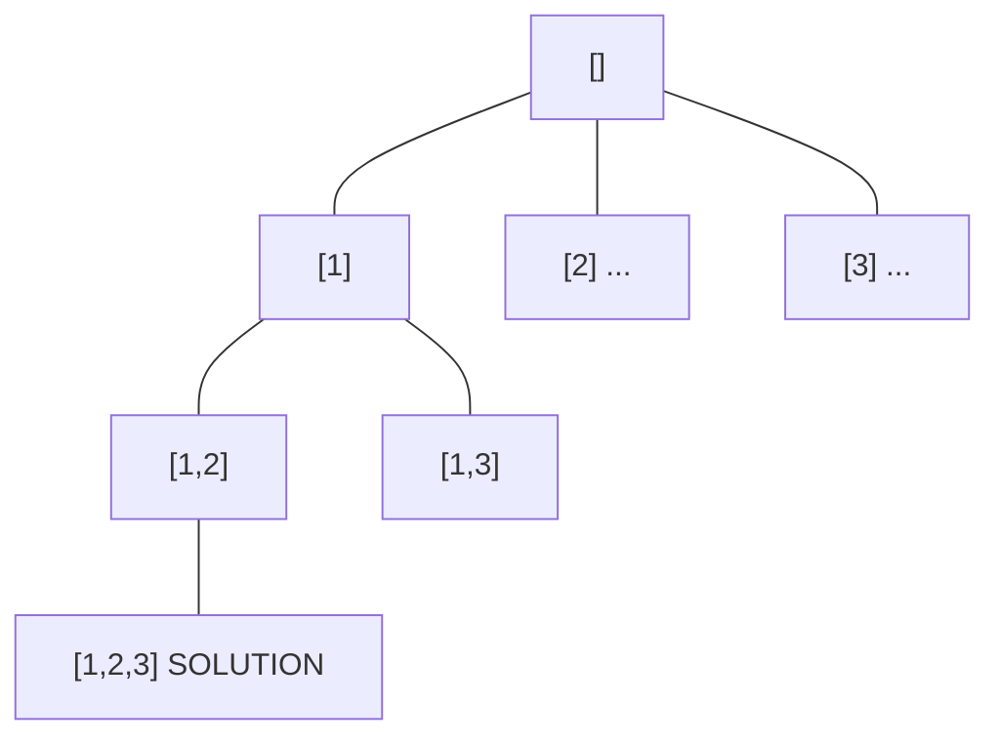
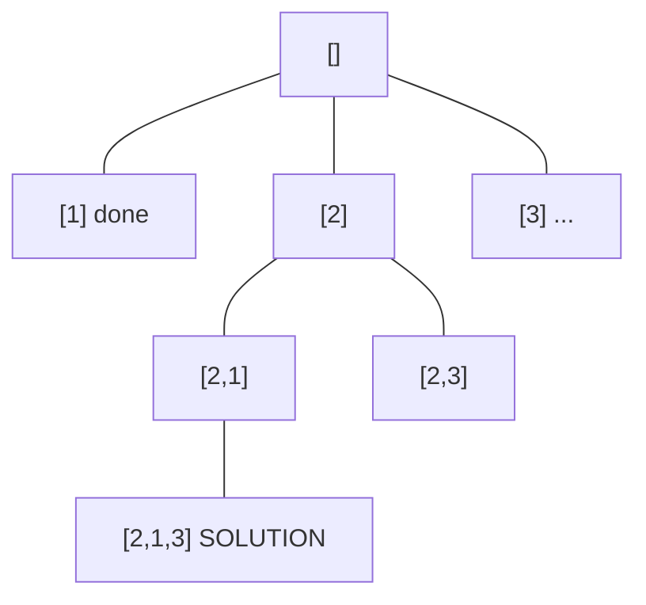
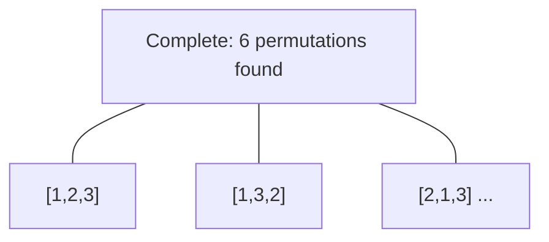

# Problem 2044: Count Number of Maximum Bitwise-OR Subsets

**Difficulty:** Medium  
**Tags:** Array, Backtracking, Bit Manipulation, Enumeration  
**Pattern:** Backtracking  
**Link:** [leetcode.com/problems/count-number-of-maximum-bitwise-or-subsets](https://leetcode.com/problems/count-number-of-maximum-bitwise-or-subsets/)

## Description

Given an integer array `nums`, find the **maximum** possible **bitwise OR** of a subset of `nums` and return *the **number of different non-empty subsets** with the maximum bitwise OR*.

An array `a` is a **subset** of an array `b` if `a` can be obtained from `b` by deleting some (possibly zero) elements of `b`. Two subsets are considered **different** if the indices of the elements chosen are different.

The bitwise OR of an array `a` is equal to `a[0] **OR** a[1] **OR** ... **OR** a[a.length - 1]` (**0-indexed**).

 

Example 1:

```

**Input:** nums = [3,1]
**Output:** 2
**Explanation:** The maximum possible bitwise OR of a subset is 3. There are 2 subsets with a bitwise OR of 3:
- [3]
- [3,1]

```

Example 2:

```

**Input:** nums = [2,2,2]
**Output:** 7
**Explanation:** All non-empty subsets of [2,2,2] have a bitwise OR of 2. There are 23 - 1 = 7 total subsets.

```

Example 3:

```

**Input:** nums = [3,2,1,5]
**Output:** 6
**Explanation:** The maximum possible bitwise OR of a subset is 7. There are 6 subsets with a bitwise OR of 7:
- [3,5]
- [3,1,5]
- [3,2,5]
- [3,2,1,5]
- [2,5]
- [2,1,5]
```

 

**Constraints:**

	- `1 <= nums.length <= 16`
	- `1 <= nums[i] <= 10^5`

## Approach: Backtracking

Explore all possible solutions by building candidates incrementally. At each step, make a choice and recurse. If the choice leads to a dead end, undo the choice (backtrack) and try the next option.

## Pseudocode

```
1. Define backtrack(path, choices):
   a. If path is a complete solution: add to results
   b. For each choice in choices:
      - If choice is valid:
        * Add choice to path
        * backtrack(path, remaining_choices)
        * Remove choice from path (backtrack)
2. Call backtrack([], all_choices)
```

## Algorithm Flow



## Visual State Transitions

**Backtracking Decision Tree:**

**Frame 1: Root - start with empty path**


**Frame 2: Explore branch [1]**


**Frame 3: Backtrack, explore [2]**


**Frame 4: All solutions found**



## Complexity Analysis

- **Time:** O(k^n) or O(n!)
- **Space:** O(n)

## Solution (Python3)

```python
class Solution:
    def countMaxOrSubsets(self, nums: List[int]) -> int:
        # Backtracking - O(2^n) or O(n!) time
        result = []
        
        def backtrack(path, start):
            result.append(path[:])
            for i in range(start, len(nums)):
                path.append(nums[i])
                backtrack(path, i + 1)
                path.pop()
        
        backtrack([], 0)
        return result
```

## Solution (C++)

```cpp
#include <functional>
#include <string>
#include <vector>
using namespace std;

class Solution {
public:
    int countMaxOrSubsets(vector<int>& nums) {
        // Backtracking - O(2^n) or O(n!) time
        vector<vector<int>> result;
        vector<int> path;
        function<void(int)> backtrack = [&](int start) {
            result.push_back(path);
            for (int i = start; i < (int)nums.size(); i++) {
                path.push_back(nums[i]);
                backtrack(i + 1);
                path.pop_back();
            }
        };
        backtrack(0);
        return result;
    }
};
```
