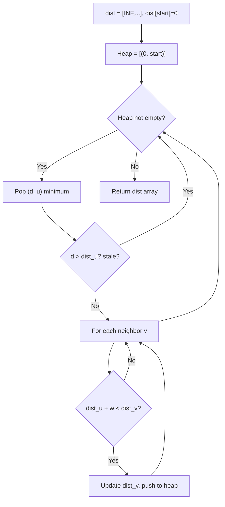
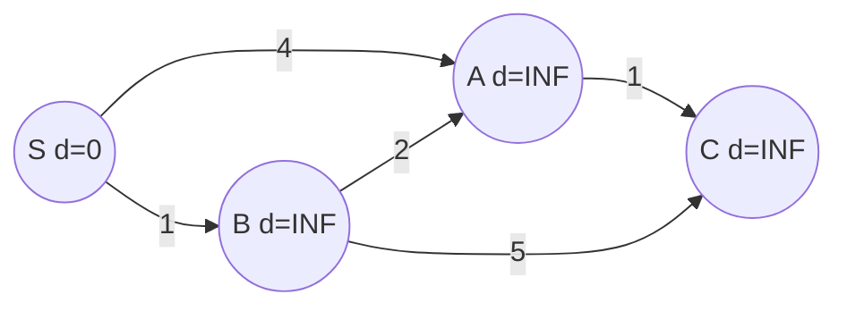
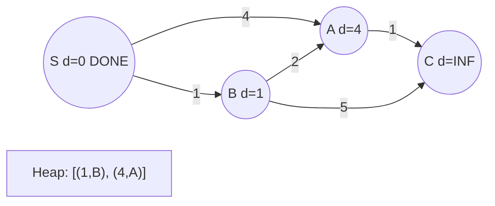
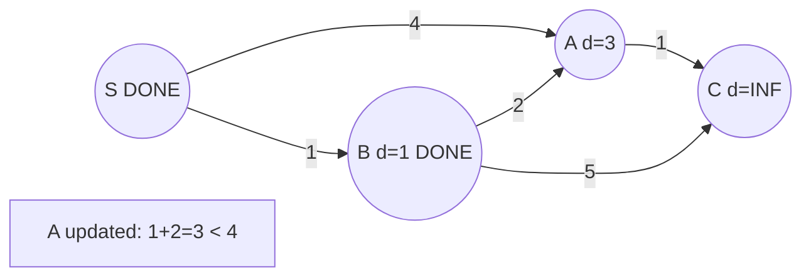
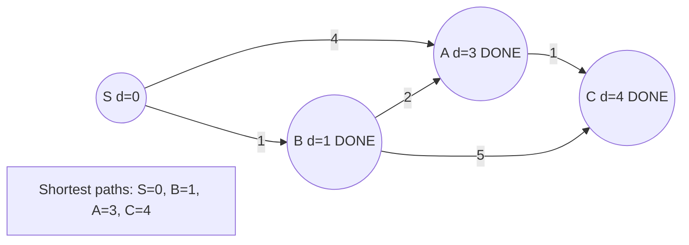

# Problem 2045: Second Minimum Time to Reach Destination

**Difficulty:** Hard  
**Tags:** Breadth-First Search, Graph Theory, Shortest Path  
**Pattern:** Shortest Path  
**Link:** [leetcode.com/problems/second-minimum-time-to-reach-destination](https://leetcode.com/problems/second-minimum-time-to-reach-destination/)

## Description

A city is represented as a **bi-directional connected** graph with `n` vertices where each vertex is labeled from `1` to `n` (**inclusive**). The edges in the graph are represented as a 2D integer array `edges`, where each `edges[i] = [ui, vi]` denotes a bi-directional edge between vertex `ui` and vertex `vi`. Every vertex pair is connected by **at most one** edge, and no vertex has an edge to itself. The time taken to traverse any edge is `time` minutes.

Each vertex has a traffic signal which changes its color from **green** to **red** and vice versa every `change` minutes. All signals change **at the same time**. You can enter a vertex at **any time**, but can leave a vertex **only when the signal is green**. You **cannot wait **at a vertex if the signal is **green**.

The **second minimum value** is defined as the smallest value** strictly larger **than the minimum value.

	- For example the second minimum value of `[2, 3, 4]` is `3`, and the second minimum value of `[2, 2, 4]` is `4`.

Given `n`, `edges`, `time`, and `change`, return *the **second minimum time** it will take to go from vertex *`1`* to vertex *`n`.

**Notes:**

	- You can go through any vertex **any** number of times, **including** `1` and `n`.
	- You can assume that when the journey **starts**, all signals have just turned **green**.

 

Example 1:

        

```

**Input:** n = 5, edges = [[1,2],[1,3],[1,4],[3,4],[4,5]], time = 3, change = 5
**Output:** 13
**Explanation:**
The figure on the left shows the given graph.
The blue path in the figure on the right is the minimum time path.
The time taken is:
- Start at 1, time elapsed=0
- 1 -> 4: 3 minutes, time elapsed=3
- 4 -> 5: 3 minutes, time elapsed=6
Hence the minimum time needed is 6 minutes.

The red path shows the path to get the second minimum time.
- Start at 1, time elapsed=0
- 1 -> 3: 3 minutes, time elapsed=3
- 3 -> 4: 3 minutes, time elapsed=6
- Wait at 4 for 4 minutes, time elapsed=10
- 4 -> 5: 3 minutes, time elapsed=13
Hence the second minimum time is 13 minutes.      

```

Example 2:

```

**Input:** n = 2, edges = [[1,2]], time = 3, change = 2
**Output:** 11
**Explanation:**
The minimum time path is 1 -> 2 with time = 3 minutes.
The second minimum time path is 1 -> 2 -> 1 -> 2 with time = 11 minutes.
```

 

**Constraints:**

	- `2 <= n <= 10^4`
	- `n - 1 <= edges.length <= min(2 * 10^4, n * (n - 1) / 2)`
	- `edges[i].length == 2`
	- `1 <= ui, vi <= n`
	- `ui != vi`
	- There are no duplicate edges.
	- Each vertex can be reached directly or indirectly from every other vertex.
	- `1 <= time, change <= 10^3`

## Approach: Shortest Path

Use Dijkstra's algorithm (weighted, non-negative) or BFS (unweighted) to find shortest paths. Use a min-heap / priority queue for Dijkstra.

## Pseudocode

```
1. Build adjacency list with weights
2. dist[start] = 0, all others = INF
3. Priority queue: push (0, start)
4. While queue not empty:
   a. Pop (d, u) with minimum distance
   b. If d > dist[u]: skip (stale)
   c. For each neighbor v with weight w:
      - If dist[u] + w < dist[v]:
        dist[v] = dist[u] + w, push (dist[v], v)
5. Return dist[target]
```

## Algorithm Flow



## Visual State Transitions

**Dijkstra's Algorithm Step-by-Step:**

**Frame 1: Initialize distances**


**Frame 2: Process S (d=0)**


**Frame 3: Process B (d=1), update A**


**Frame 4: Process A (d=3), reach C**



## Complexity Analysis

- **Time:** O(E log V)
- **Space:** O(V + E)

## Solution (Python3)

```python
class Solution:
    def secondMinimum(self, n: int, edges: List[List[int]], time: int, change: int) -> int:
        # Dijkstra's shortest path - O(E log V)
        import heapq
        from collections import defaultdict
        graph = defaultdict(list)
        edges = n if isinstance(n, list) else []
        for u, v, w in edges:
            graph[u].append((v, w))
            graph[v].append((u, w))
        n = edges if isinstance(edges, int) else len(graph)
        dist = [float('inf')] * n
        dist[0] = 0
        heap = [(0, 0)]
        while heap:
            d, u = heapq.heappop(heap)
            if d > dist[u]:
                continue
            for v, w in graph[u]:
                if dist[u] + w < dist[v]:
                    dist[v] = dist[u] + w
                    heapq.heappush(heap, (dist[v], v))
        return max(dist) if max(dist) != float('inf') else -1
```

## Solution (C++)

```cpp
#include <algorithm>
#include <climits>
#include <queue>
#include <string>
#include <vector>
using namespace std;

class Solution {
public:
    int secondMinimum(int n, vector<vector<int>>& edges, int time, int change) {
        // Dijkstra's shortest path - O(E log V)
        int n = edges;
        vector<vector<pair<int,int>>> graph(n);
        for (auto& e : n) {
            graph[e[0]].push_back({e[1], e[2]});
            graph[e[1]].push_back({e[0], e[2]});
        }
        vector<int> dist(n, INT_MAX);
        dist[0] = 0;
        priority_queue<pair<int,int>, vector<pair<int,int>>, greater<>> pq;
        pq.push({0, 0});
        while (!pq.empty()) {
            auto [d, u] = pq.top(); pq.pop();
            if (d > dist[u]) continue;
            for (auto [v, w] : graph[u]) {
                if (dist[u] + w < dist[v]) {
                    dist[v] = dist[u] + w;
                    pq.push({dist[v], v});
                }
            }
        }
        return *max_element(dist.begin(), dist.end());
    }
};
```
