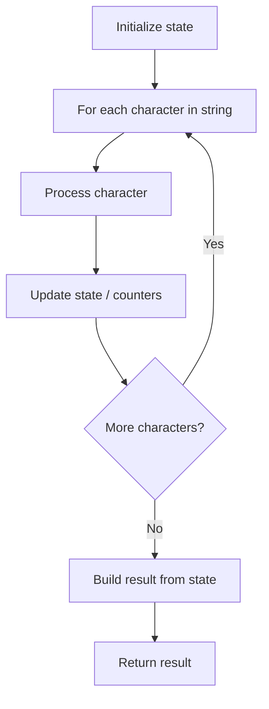

# Problem 2047: Number of Valid Words in a Sentence

**Difficulty:** Easy  
**Tags:** String  
**Pattern:** String Processing  
**Link:** [leetcode.com/problems/number-of-valid-words-in-a-sentence](https://leetcode.com/problems/number-of-valid-words-in-a-sentence/)

## Description

A sentence consists of lowercase letters (`'a'` to `'z'`), digits (`'0'` to `'9'`), hyphens (`'-'`), punctuation marks (`'!'`, `'.'`, and `','`), and spaces (`' '`) only. Each sentence can be broken down into **one or more tokens** separated by one or more spaces `' '`.

A token is a valid word if **all three** of the following are true:

	- It only contains lowercase letters, hyphens, and/or punctuation (**no** digits).
	- There is **at most one** hyphen `'-'`. If present, it **must** be surrounded by lowercase characters (`"a-b"` is valid, but `"-ab"` and `"ab-"` are not valid).
	- There is **at most one** punctuation mark. If present, it **must** be at the **end** of the token (`"ab,"`, `"cd!"`, and `"."` are valid, but `"a!b"` and `"c.,"` are not valid).

Examples of valid words include `"a-b."`, `"afad"`, `"ba-c"`, `"a!"`, and `"!"`.

Given a string `sentence`, return *the **number** of valid words in *`sentence`.

 

Example 1:

```

**Input:** sentence = "cat and  dog"
**Output:** 3
**Explanation:** The valid words in the sentence are "cat", "and", and "dog".

```

Example 2:

```

**Input:** sentence = "!this  1-s b8d!"
**Output:** 0
**Explanation:** There are no valid words in the sentence.
"!this" is invalid because it starts with a punctuation mark.
"1-s" and "b8d" are invalid because they contain digits.

```

Example 3:

```

**Input:** sentence = "alice and  bob are playing stone-game10"
**Output:** 5
**Explanation:** The valid words in the sentence are "alice", "and", "bob", "are", and "playing".
"stone-game10" is invalid because it contains digits.

```

 

**Constraints:**

	- `1 <= sentence.length <= 1000`
	- `sentence` only contains lowercase English letters, digits, `' '`, `'-'`, `'!'`, `'.'`, and `','`.
	- There will be at least `1` token.

## Approach: String Processing

Process the string character by character. Common techniques: two pointers, sliding window, hash map for frequencies, stack for matching.

## Pseudocode

```
1. Initialize result / tracking state
2. Iterate through string characters:
   a. Process character based on rules
   b. Update state (counters, pointers, stack)
3. Build and return result
```

## Algorithm Flow



## Complexity Analysis

- **Time:** O(n)
- **Space:** O(n)

## Solution (Python3)

```python
class Solution:
    def countValidWords(self, sentence: str) -> int:
        # String processing approach - O(n) time
        result = []
        for ch in sentence:
            if ch.isalnum():
                result.append(ch.lower())
        # Check palindrome or process
        processed = ''.join(result)
        return processed == processed[::-1] if isinstance(0, bool) else processed
```

## Solution (C++)

```cpp
#include <algorithm>
#include <cctype>
#include <string>
#include <vector>
using namespace std;

class Solution {
public:
    int countValidWords(string& sentence) {
        // String processing approach - O(n) time
        string processed;
        for (char ch : sentence) {
            if (isalnum(ch)) {
                processed += tolower(ch);
            }
        }
        string rev = processed;
        reverse(rev.begin(), rev.end());
        return processed == rev;
    }
};
```
