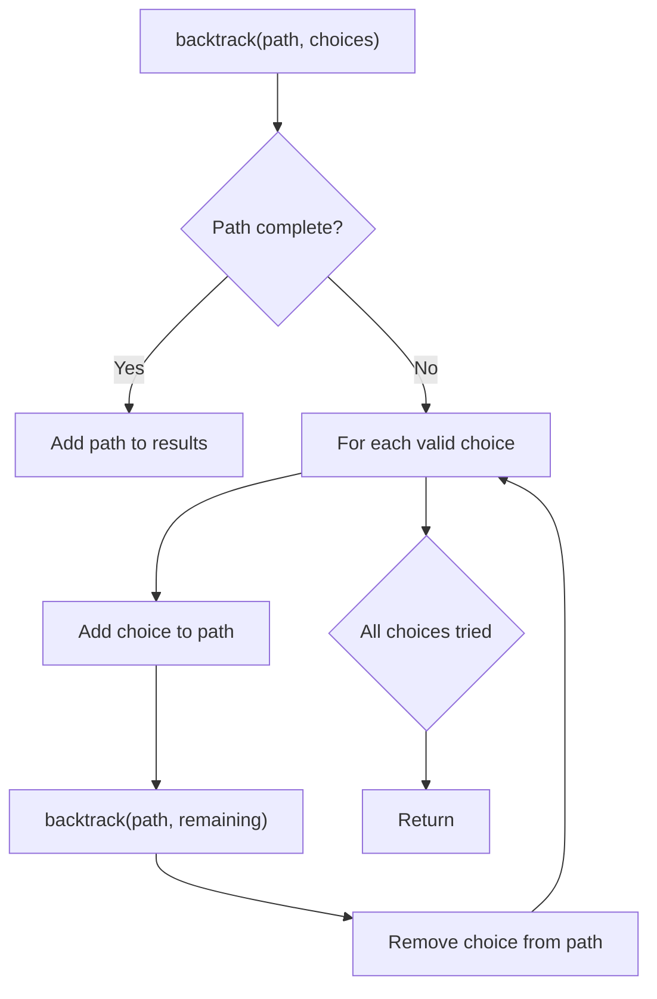
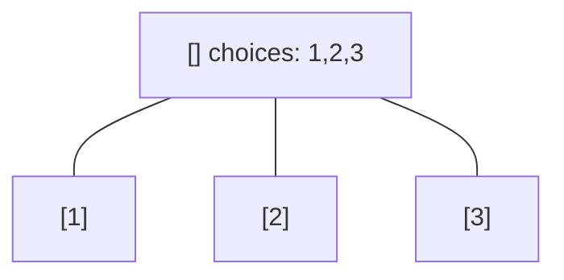
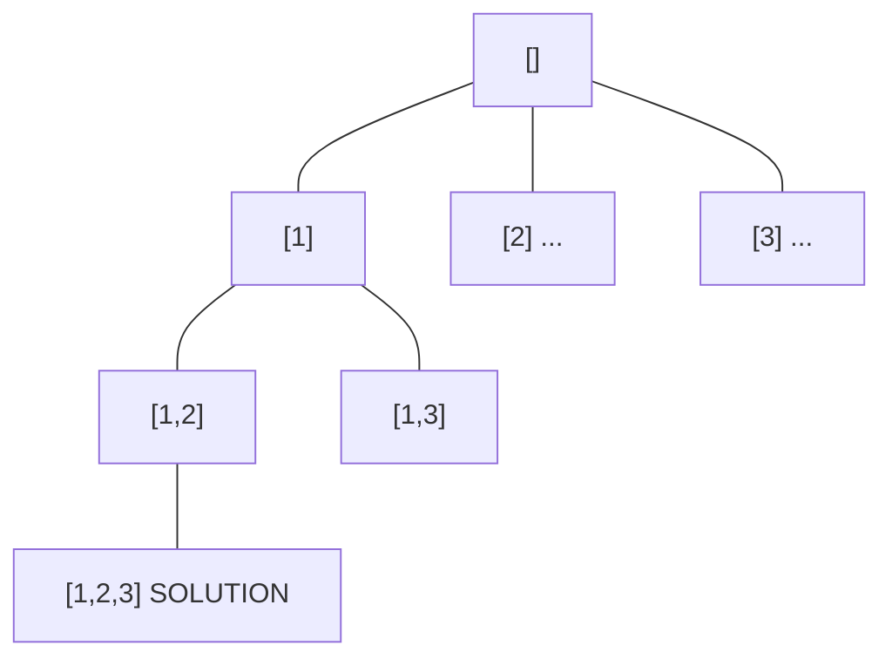
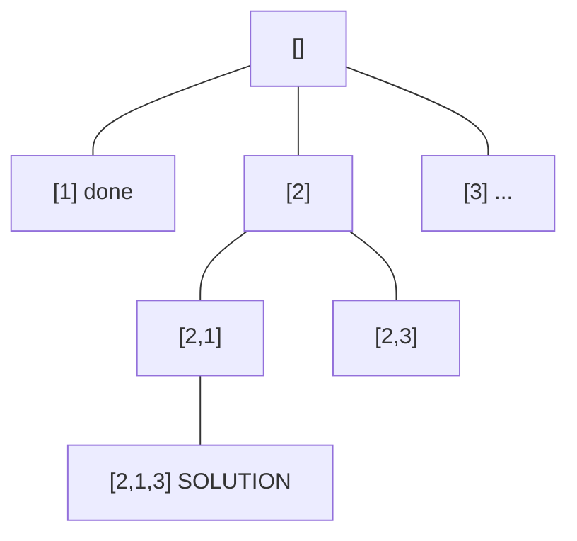
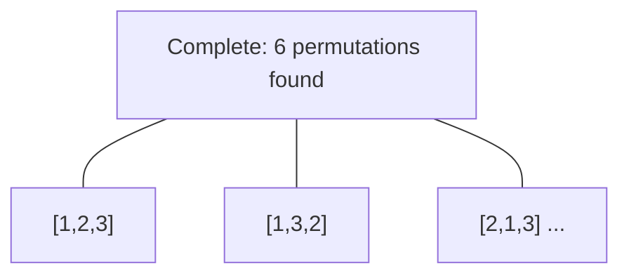

# Problem 2048: Next Greater Numerically Balanced Number

**Difficulty:** Medium  
**Tags:** Hash Table, Math, Backtracking, Counting, Enumeration  
**Pattern:** Backtracking  
**Link:** [leetcode.com/problems/next-greater-numerically-balanced-number](https://leetcode.com/problems/next-greater-numerically-balanced-number/)

## Description

An integer `x` is **numerically balanced** if for every digit `d` in the number `x`, there are **exactly** `d` occurrences of that digit in `x`.

Given an integer `n`, return *the **smallest numerically balanced** number **strictly greater** than *`n`*.*

 

Example 1:

```

**Input:** n = 1
**Output:** 22
**Explanation:** 
22 is numerically balanced since:
- The digit 2 occurs 2 times. 
It is also the smallest numerically balanced number strictly greater than 1.

```

Example 2:

```

**Input:** n = 1000
**Output:** 1333
**Explanation:** 
1333 is numerically balanced since:
- The digit 1 occurs 1 time.
- The digit 3 occurs 3 times. 
It is also the smallest numerically balanced number strictly greater than 1000.
Note that 1022 cannot be the answer because 0 appeared more than 0 times.

```

Example 3:

```

**Input:** n = 3000
**Output:** 3133
**Explanation:** 
3133 is numerically balanced since:
- The digit 1 occurs 1 time.
- The digit 3 occurs 3 times.
It is also the smallest numerically balanced number strictly greater than 3000.

```

 

**Constraints:**

	- `0 <= n <= 10^6`

## Approach: Backtracking

Explore all possible solutions by building candidates incrementally. At each step, make a choice and recurse. If the choice leads to a dead end, undo the choice (backtrack) and try the next option.

## Pseudocode

```
1. Define backtrack(path, choices):
   a. If path is a complete solution: add to results
   b. For each choice in choices:
      - If choice is valid:
        * Add choice to path
        * backtrack(path, remaining_choices)
        * Remove choice from path (backtrack)
2. Call backtrack([], all_choices)
```

## Algorithm Flow



## Visual State Transitions

**Backtracking Decision Tree:**

**Frame 1: Root - start with empty path**


**Frame 2: Explore branch [1]**


**Frame 3: Backtrack, explore [2]**


**Frame 4: All solutions found**



## Complexity Analysis

- **Time:** O(k^n) or O(n!)
- **Space:** O(n)

## Solution (Python3)

```python
class Solution:
    def nextBeautifulNumber(self, n: int) -> int:
        # Backtracking - O(2^n) or O(n!) time
        result = []
        
        def backtrack(path, start):
            result.append(path[:])
            for i in range(start, len(n)):
                path.append(n[i])
                backtrack(path, i + 1)
                path.pop()
        
        backtrack([], 0)
        return result
```

## Solution (C++)

```cpp
#include <functional>
#include <string>
#include <vector>
using namespace std;

class Solution {
public:
    int nextBeautifulNumber(int n) {
        // Backtracking - O(2^n) or O(n!) time
        vector<vector<int>> result;
        vector<int> path;
        function<void(int)> backtrack = [&](int start) {
            result.push_back(path);
            for (int i = start; i < (int)n.size(); i++) {
                path.push_back(n[i]);
                backtrack(i + 1);
                path.pop_back();
            }
        };
        backtrack(0);
        return result;
    }
};
```
