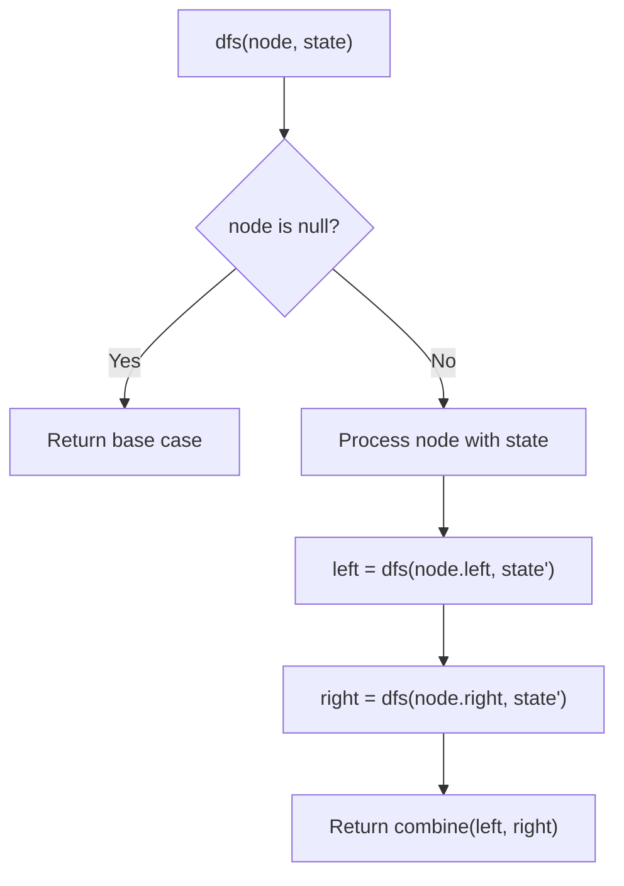
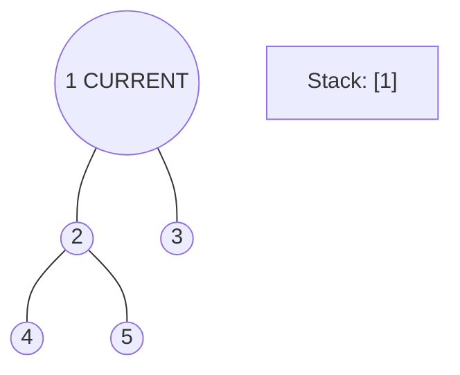
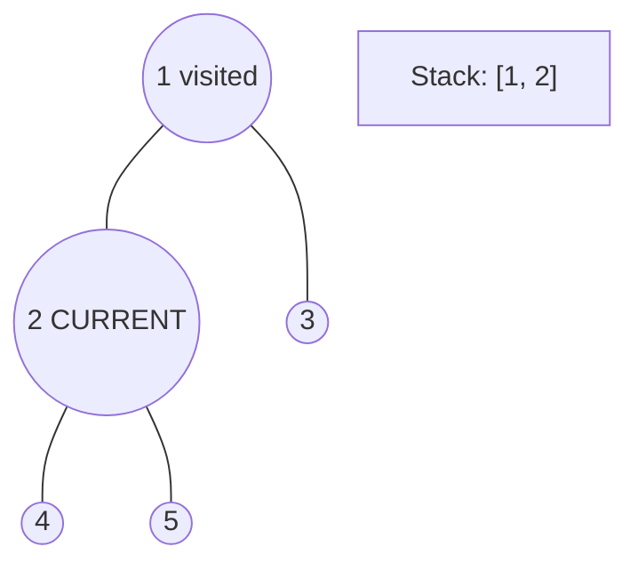
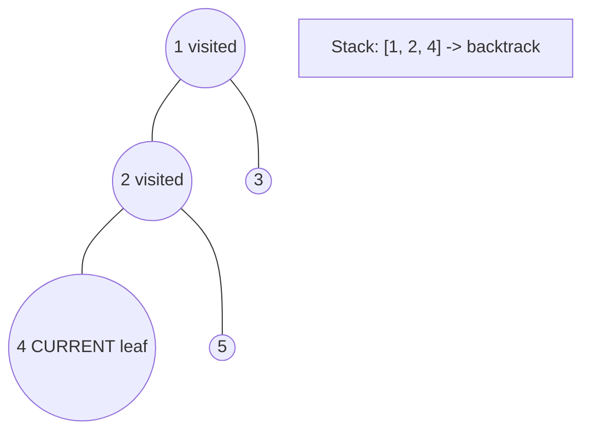
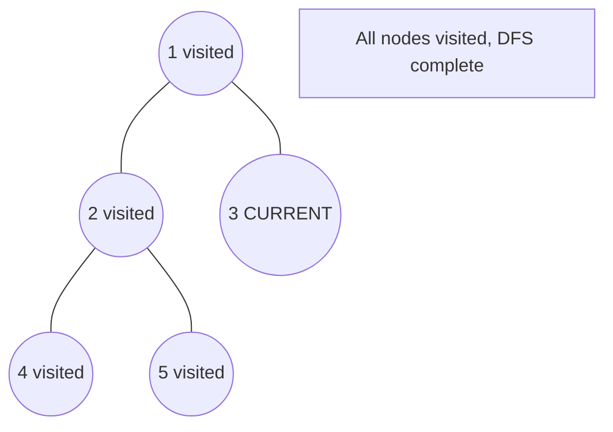

# Problem 2049: Count Nodes With the Highest Score

**Difficulty:** Medium  
**Tags:** Array, Tree, Depth-First Search, Binary Tree  
**Pattern:** DFS Tree Traversal  
**Link:** [leetcode.com/problems/count-nodes-with-the-highest-score](https://leetcode.com/problems/count-nodes-with-the-highest-score/)

## Description

There is a **binary** tree rooted at `0` consisting of `n` nodes. The nodes are labeled from `0` to `n - 1`. You are given a **0-indexed** integer array `parents` representing the tree, where `parents[i]` is the parent of node `i`. Since node `0` is the root, `parents[0] == -1`.

Each node has a **score**. To find the score of a node, consider if the node and the edges connected to it were **removed**. The tree would become one or more **non-empty** subtrees. The **size** of a subtree is the number of the nodes in it. The **score** of the node is the **product of the sizes** of all those subtrees.

Return *the **number** of nodes that have the **highest score***.

 

Example 1:

```

**Input:** parents = [-1,2,0,2,0]
**Output:** 3
**Explanation:**
- The score of node 0 is: 3 * 1 = 3
- The score of node 1 is: 4 = 4
- The score of node 2 is: 1 * 1 * 2 = 2
- The score of node 3 is: 4 = 4
- The score of node 4 is: 4 = 4
The highest score is 4, and three nodes (node 1, node 3, and node 4) have the highest score.

```

Example 2:

```

**Input:** parents = [-1,2,0]
**Output:** 2
**Explanation:**
- The score of node 0 is: 2 = 2
- The score of node 1 is: 2 = 2
- The score of node 2 is: 1 * 1 = 1
The highest score is 2, and two nodes (node 0 and node 1) have the highest score.

```

 

**Constraints:**

	- `n == parents.length`
	- `2 <= n <= 10^5`
	- `parents[0] == -1`
	- `0 <= parents[i] <= n - 1` for `i != 0`
	- `parents` represents a valid binary tree.

## Approach: DFS Tree Traversal

Perform depth-first search on the tree. Recurse on left and right subtrees, combining results bottom-up. Track state (path, depth, sum) during traversal.

## Pseudocode

```
1. Define dfs(node, state):
   a. Base case: if null, return default
   b. Process node with current state
   c. left_result = dfs(node.left, updated_state)
   d. right_result = dfs(node.right, updated_state)
   e. Return combine(left_result, right_result)
2. Return dfs(root, initial_state)
```

## Algorithm Flow



## Visual State Transitions

**DFS Tree Traversal Step-by-Step:**

**Frame 1: Start at root**


**Frame 2: Go left - visit node 2**


**Frame 3: Go left - visit node 4 (leaf)**


**Frame 4: Backtrack, visit node 5, then node 3**



## Complexity Analysis

- **Time:** O(n)
- **Space:** O(h)

## Solution (Python3)

```python
class Solution:
    def countHighestScoreNodes(self, parents: List[int]) -> int:
        # DFS on binary tree - O(n) time, O(h) space
        def dfs(node):
            if not node:
                return 0
            left = dfs(node.left)
            right = dfs(node.right)
            return 1 + max(left, right)
        
        result = dfs(parents)
        return result
```

## Solution (C++)

```cpp
#include <algorithm>
#include <functional>
#include <string>
#include <vector>
using namespace std;

class Solution {
public:
    int countHighestScoreNodes(vector<int>& parents) {
        // DFS on binary tree - O(n) time, O(h) space
        function<int(TreeNode*)> dfs = [&](TreeNode* node) -> int {
            if (!node) return 0;
            int left = dfs(node->left);
            int right = dfs(node->right);
            return 1 + max(left, right);
        };
        return dfs(parents);
    }
};
```
