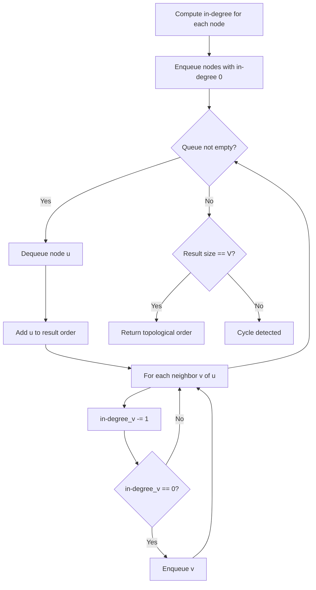
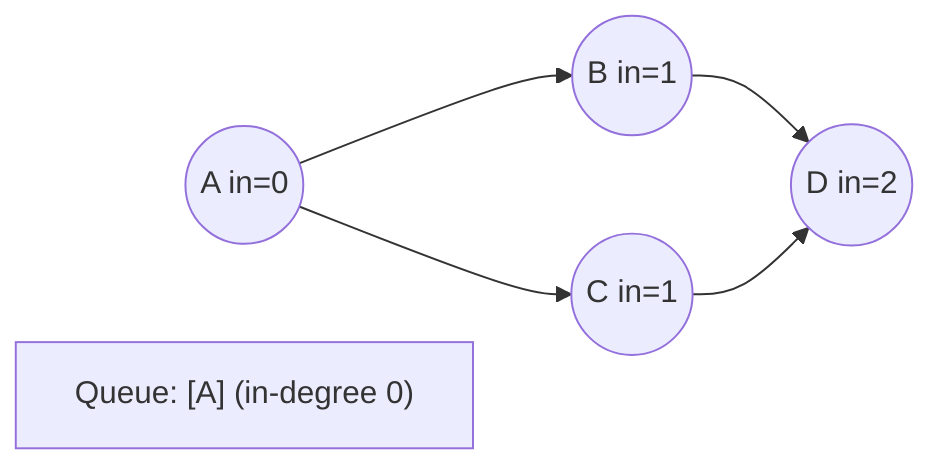
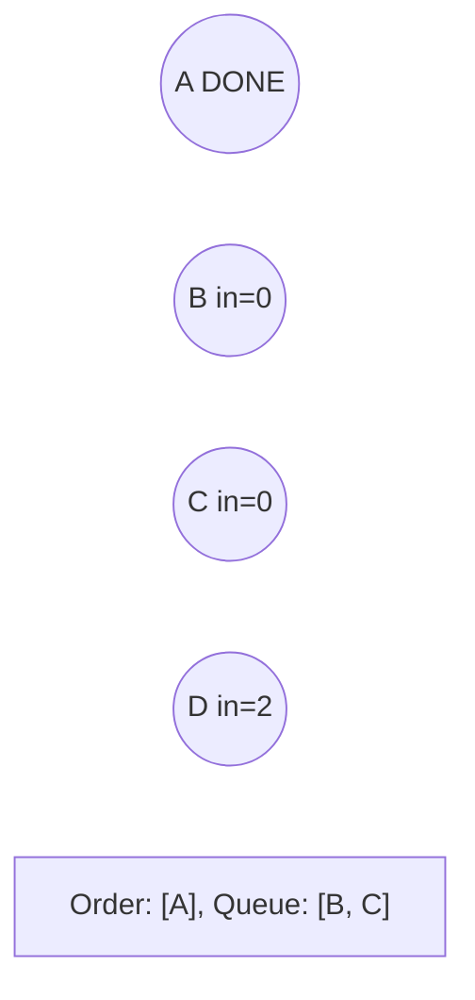
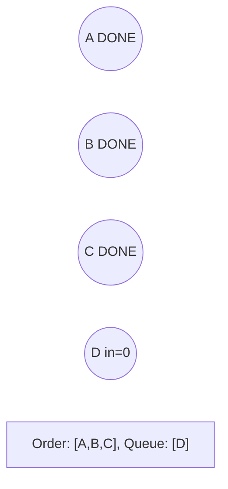
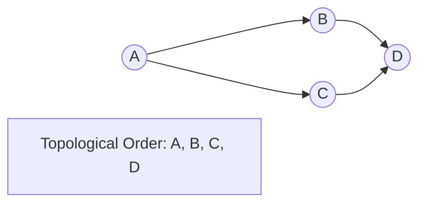

# Problem 2050: Parallel Courses III

**Difficulty:** Hard  
**Tags:** Array, Dynamic Programming, Graph Theory, Topological Sort  
**Pattern:** Topological Sort  
**Link:** [leetcode.com/problems/parallel-courses-iii](https://leetcode.com/problems/parallel-courses-iii/)

## Description

You are given an integer `n`, which indicates that there are `n` courses labeled from `1` to `n`. You are also given a 2D integer array `relations` where `relations[j] = [prevCoursej, nextCoursej]` denotes that course `prevCoursej` has to be completed **before** course `nextCoursej` (prerequisite relationship). Furthermore, you are given a **0-indexed** integer array `time` where `time[i]` denotes how many **months** it takes to complete the `(i+1)^th` course.

You must find the **minimum** number of months needed to complete all the courses following these rules:

	- You may start taking a course at **any time** if the prerequisites are met.
	- **Any number of courses** can be taken at the **same time**.

Return *the **minimum** number of months needed to complete all the courses*.

**Note:** The test cases are generated such that it is possible to complete every course (i.e., the graph is a directed acyclic graph).

 

Example 1:

****

```

**Input:** n = 3, relations = [[1,3],[2,3]], time = [3,2,5]
**Output:** 8
**Explanation:** The figure above represents the given graph and the time required to complete each course. 
We start course 1 and course 2 simultaneously at month 0.
Course 1 takes 3 months and course 2 takes 2 months to complete respectively.
Thus, the earliest time we can start course 3 is at month 3, and the total time required is 3 + 5 = 8 months.

```

Example 2:

****

```

**Input:** n = 5, relations = [[1,5],[2,5],[3,5],[3,4],[4,5]], time = [1,2,3,4,5]
**Output:** 12
**Explanation:** The figure above represents the given graph and the time required to complete each course.
You can start courses 1, 2, and 3 at month 0.
You can complete them after 1, 2, and 3 months respectively.
Course 4 can be taken only after course 3 is completed, i.e., after 3 months. It is completed after 3 + 4 = 7 months.
Course 5 can be taken only after courses 1, 2, 3, and 4 have been completed, i.e., after max(1,2,3,7) = 7 months.
Thus, the minimum time needed to complete all the courses is 7 + 5 = 12 months.

```

 

**Constraints:**

	- `1 <= n <= 5 * 10^4`
	- `0 <= relations.length <= min(n * (n - 1) / 2, 5 * 10^4)`
	- `relations[j].length == 2`
	- `1 <= prevCoursej, nextCoursej <= n`
	- `prevCoursej != nextCoursej`
	- All the pairs `[prevCoursej, nextCoursej]` are **unique**.
	- `time.length == n`
	- `1 <= time[i] <= 10^4`
	- The given graph is a directed acyclic graph.

## Approach: Topological Sort

Order nodes in a DAG so every edge u->v has u before v. Use Kahn's algorithm (BFS with in-degree tracking) or DFS-based ordering.

## Pseudocode

```
1. Compute in-degree for every node
2. Enqueue all nodes with in-degree 0
3. While queue not empty:
   a. Dequeue node u, add to result order
   b. For each neighbor v of u:
      - Decrease in-degree of v
      - If in-degree becomes 0: enqueue v
4. If result size != V: cycle exists
5. Return topological order
```

## Algorithm Flow



## Visual State Transitions

**Topological Sort (Kahn's Algorithm):**

**Frame 1: Compute in-degrees**


**Frame 2: Process A, reduce neighbors**


**Frame 3: Process B and C**


**Frame 4: Complete**



## Complexity Analysis

- **Time:** O(V + E)
- **Space:** O(V + E)

## Solution (Python3)

```python
class Solution:
    def minimumTime(self, n: int, relations: List[List[int]], time: List[int]) -> int:
        # Topological sort (Kahn's algorithm) - O(V+E)
        from collections import deque, defaultdict
        graph = defaultdict(list)
        n = n if isinstance(n, int) else len(n)
        indegree = [0] * n
        # Build graph from prerequisites
        prereqs = relations if isinstance(relations, list) else n
        for edge in prereqs:
            if isinstance(edge, (list, tuple)) and len(edge) >= 2:
                graph[edge[1]].append(edge[0])
                indegree[edge[0]] += 1
        queue = deque([i for i in range(n) if indegree[i] == 0])
        order = []
        while queue:
            node = queue.popleft()
            order.append(node)
            for neighbor in graph[node]:
                indegree[neighbor] -= 1
                if indegree[neighbor] == 0:
                    queue.append(neighbor)
        return len(order) == n if isinstance(0, bool) else order
```

## Solution (C++)

```cpp
#include <queue>
#include <string>
#include <vector>
using namespace std;

class Solution {
public:
    int minimumTime(int n, vector<vector<int>>& relations, vector<int>& time) {
        // Topological sort (Kahn's) - O(V+E)
        int n = n;
        vector<vector<int>> graph(n);
        vector<int> indegree(n, 0);
        for (auto& edge : relations) {
            graph[edge[1]].push_back(edge[0]);
            indegree[edge[0]]++;
        }
        queue<int> q;
        for (int i = 0; i < n; i++)
            if (indegree[i] == 0) q.push(i);
        vector<int> order;
        while (!q.empty()) {
            int node = q.front(); q.pop();
            order.push_back(node);
            for (int neighbor : graph[node]) {
                if (--indegree[neighbor] == 0) q.push(neighbor);
            }
        }
        return order.size() == n;
    }
};
```
