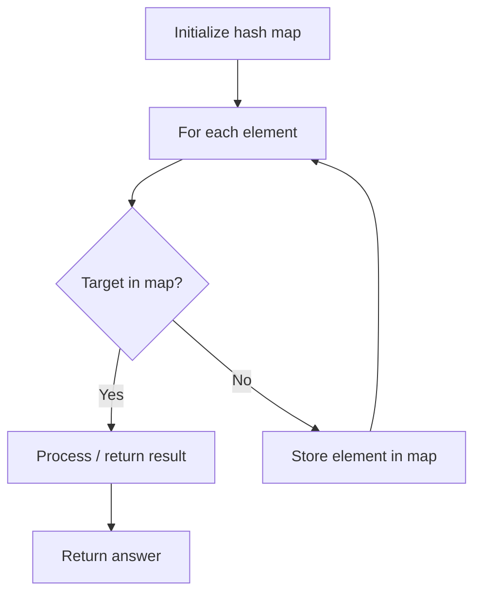

# Problem 2053: Kth Distinct String in an Array

**Difficulty:** Easy  
**Tags:** Array, Hash Table, String, Counting  
**Pattern:** Hash Map Lookup  
**Link:** [leetcode.com/problems/kth-distinct-string-in-an-array](https://leetcode.com/problems/kth-distinct-string-in-an-array/)

## Description

A **distinct string** is a string that is present only **once** in an array.

Given an array of strings `arr`, and an integer `k`, return *the *`k^th`* **distinct string** present in *`arr`. If there are **fewer** than `k` distinct strings, return *an **empty string ***`""`.

Note that the strings are considered in the **order in which they appear** in the array.

 

Example 1:

```

**Input:** arr = ["d","b","c","b","c","a"], k = 2
**Output:** "a"
**Explanation:**
The only distinct strings in arr are "d" and "a".
"d" appears 1st, so it is the 1st distinct string.
"a" appears 2nd, so it is the 2nd distinct string.
Since k == 2, "a" is returned. 

```

Example 2:

```

**Input:** arr = ["aaa","aa","a"], k = 1
**Output:** "aaa"
**Explanation:**
All strings in arr are distinct, so the 1st string "aaa" is returned.

```

Example 3:

```

**Input:** arr = ["a","b","a"], k = 3
**Output:** ""
**Explanation:**
The only distinct string is "b". Since there are fewer than 3 distinct strings, we return an empty string "".

```

 

**Constraints:**

	- `1 <= k <= arr.length <= 1000`
	- `1 <= arr[i].length <= 5`
	- `arr[i]` consists of lowercase English letters.

## Approach: Hash Map Lookup

Use a hash map (dictionary) to store elements for O(1) lookup. Iterate through the input, checking membership or counting frequencies in the map.

## Pseudocode

```
1. Initialize hash map
2. Iterate through elements:
   a. Check if target/complement exists in map
   b. If found: process result
   c. Otherwise: store element in map
3. Return result
```

## Algorithm Flow



## Complexity Analysis

- **Time:** O(n)
- **Space:** O(n)

## Solution (Python3)

```python
class Solution:
    def kthDistinct(self, arr: List[str], k: int) -> str:
        # Hash map approach - O(n) time, O(n) space
        seen = {}
        for i, val in enumerate(arr):
            complement = k - val
            if complement in seen:
                return [seen[complement], i]
            seen[val] = i
        return ""
```

## Solution (C++)

```cpp
#include <string>
#include <unordered_map>
#include <vector>
using namespace std;

class Solution {
public:
    string kthDistinct(vector<string>& arr, int k) {
        // Hash map approach - O(n) time, O(n) space
        unordered_map<int, int> seen;
        for (int i = 0; i < arr.size(); i++) {
            int complement = k - arr[i];
            if (seen.count(complement)) {
                return {seen[complement], i};
            }
            seen[arr[i]] = i;
        }
        return "";
    }
};
```
