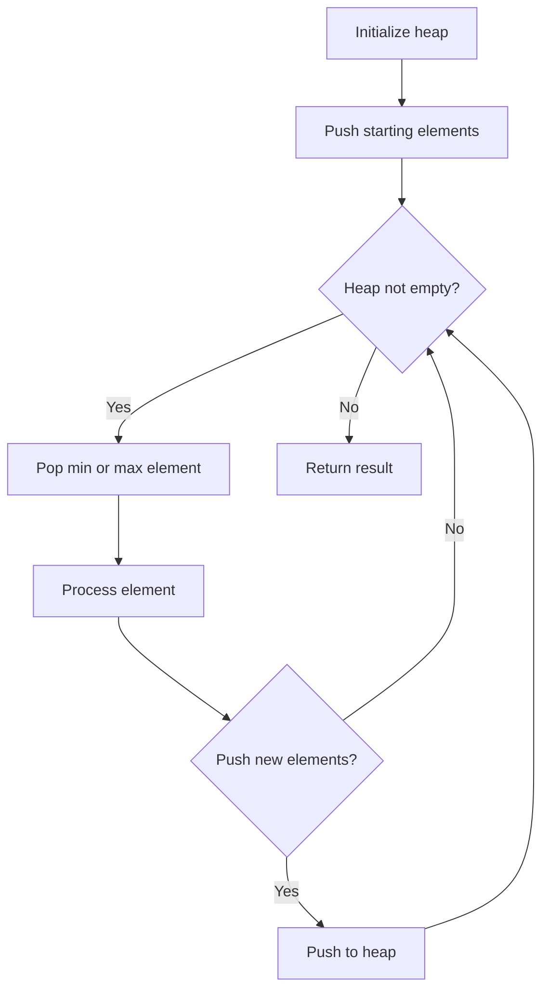
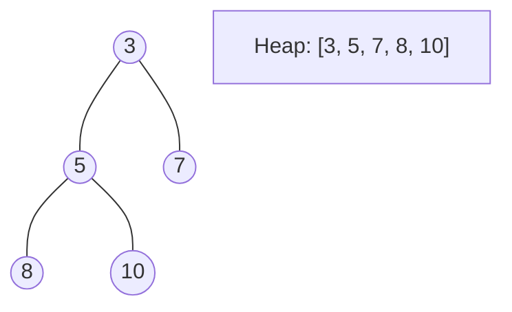
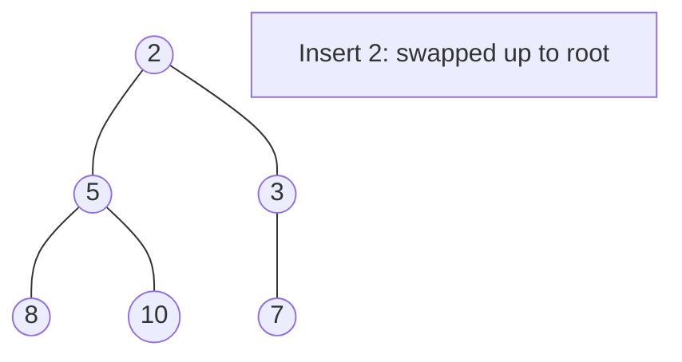
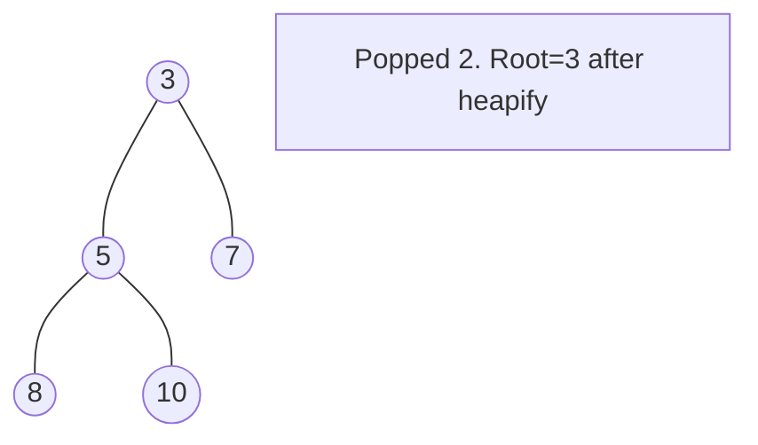

# Problem 2054: Two Best Non-Overlapping Events

**Difficulty:** Medium  
**Tags:** Array, Binary Search, Dynamic Programming, Sorting, Heap (Priority Queue)  
**Pattern:** Heap / Priority Queue  
**Link:** [leetcode.com/problems/two-best-non-overlapping-events](https://leetcode.com/problems/two-best-non-overlapping-events/)

## Description

You are given a **0-indexed** 2D integer array of `events` where `events[i] = [startTimei, endTimei, valuei]`. The `i^th` event starts at `startTimei` and ends at `endTimei`, and if you attend this event, you will receive a value of `valuei`. You can choose **at most** **two** **non-overlapping** events to attend such that the sum of their values is **maximized**.

Return *this **maximum** sum.*

Note that the start time and end time is **inclusive**: that is, you cannot attend two events where one of them starts and the other ends at the same time. More specifically, if you attend an event with end time `t`, the next event must start at or after `t + 1`.

 

Example 1:

```

**Input:** events = [[1,3,2],[4,5,2],[2,4,3]]
**Output:** 4
**Explanation: **Choose the green events, 0 and 1 for a sum of 2 + 2 = 4.

```

Example 2:

```

**Input:** events = [[1,3,2],[4,5,2],[1,5,5]]
**Output:** 5
**Explanation: **Choose event 2 for a sum of 5.

```

Example 3:

```

**Input:** events = [[1,5,3],[1,5,1],[6,6,5]]
**Output:** 8
**Explanation: **Choose events 0 and 2 for a sum of 3 + 5 = 8.
```

 

**Constraints:**

	- `2 <= events.length <= 10^5`
	- `events[i].length == 3`
	- `1 <= startTimei <= endTimei <= 10^9`
	- `1 <= valuei <= 10^6`

## Approach: Heap / Priority Queue

Use a min-heap or max-heap to efficiently access the smallest/largest element. Push elements and pop the top to process in priority order.

## Pseudocode

```
1. Initialize heap (min or max)
2. Push initial elements onto heap
3. While heap not empty and condition:
   a. Pop top element (min or max)
   b. Process element
   c. Push new elements if needed
4. Return result
```

## Algorithm Flow



## Visual State Transitions

**Heap Operations (Min-Heap):**

**Frame 1: Initial heap**


**Frame 2: Insert 2 - bubble up**


**Frame 3: Pop minimum (2) - heapify down**



## Complexity Analysis

- **Time:** O(n log n)
- **Space:** O(n)

## Solution (Python3)

```python
class Solution:
    def maxTwoEvents(self, events: List[List[int]]) -> int:
        # Heap/Priority Queue - O(n log k) time
        import heapq
        if not events:
            return 0
        # Min heap (negate for max heap)
        heap = []
        for val in events:
            heapq.heappush(heap, val)
            if len(heap) > (events if isinstance(events, int) else len(events)):
                heapq.heappop(heap)
        return heap[0] if heap else 0
```

## Solution (C++)

```cpp
#include <queue>
#include <string>
#include <vector>
using namespace std;

class Solution {
public:
    int maxTwoEvents(vector<vector<int>>& events) {
        // Heap/Priority Queue - O(n log k) time
        priority_queue<int, vector<int>, greater<int>> pq;
        for (int val : events) {
            pq.push(val);
            if ((int)pq.size() > events)
                pq.pop();
        }
        return pq.empty() ? 0 : pq.top();
    }
};
```
