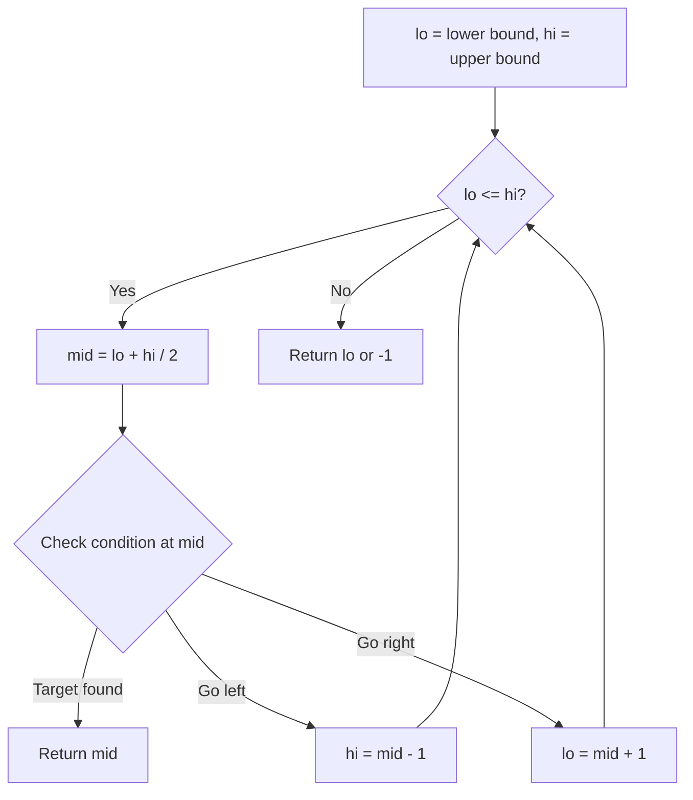
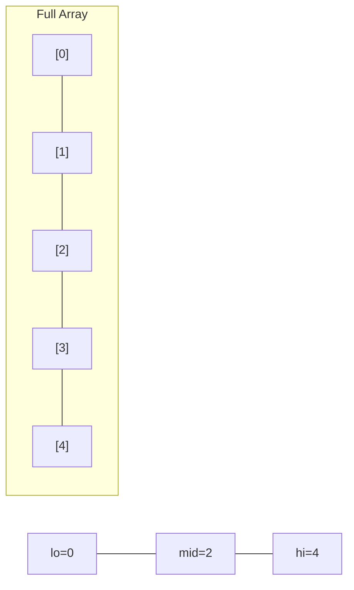
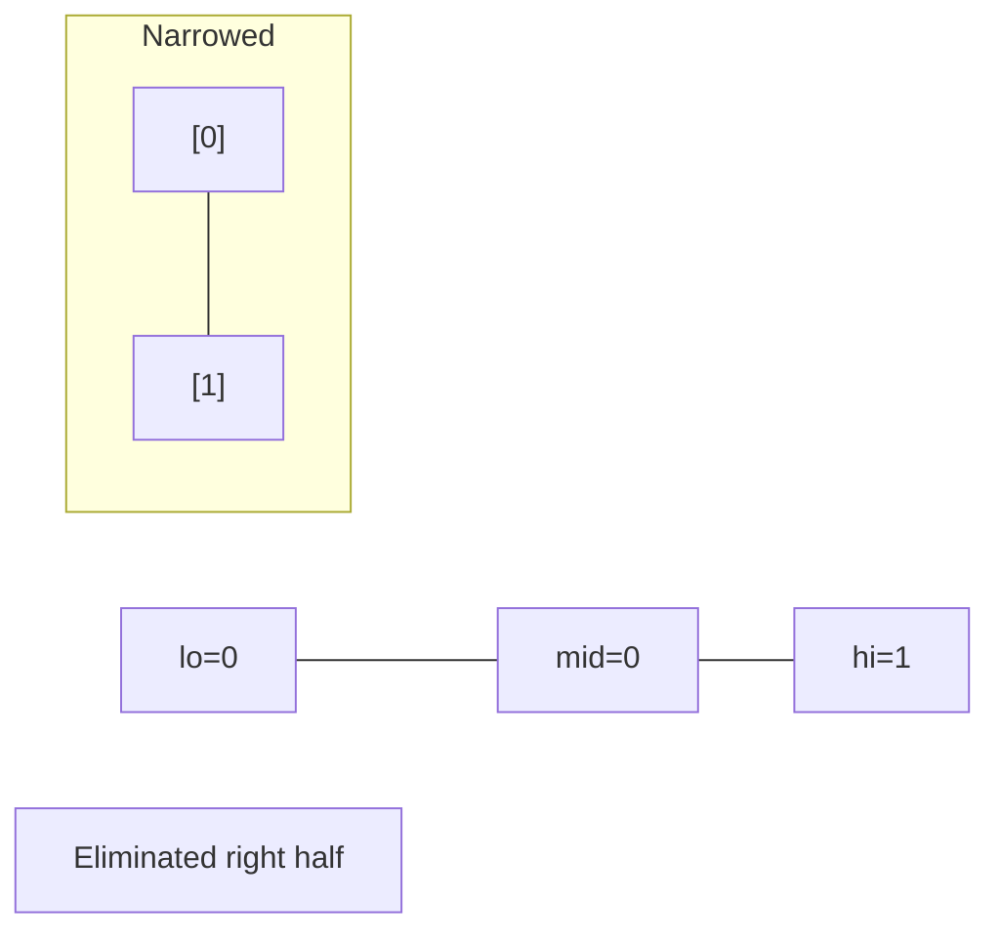
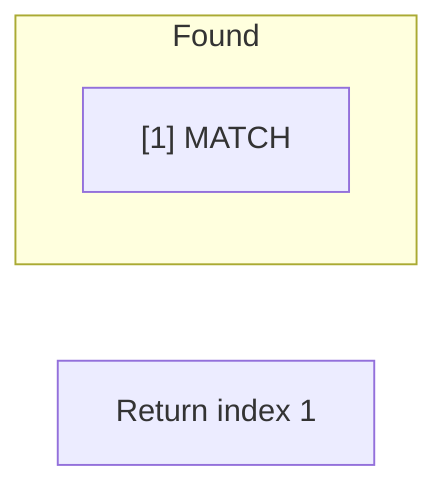

# Problem 2055: Plates Between Candles

**Difficulty:** Medium  
**Tags:** Array, String, Binary Search, Prefix Sum  
**Pattern:** Binary Search  
**Link:** [leetcode.com/problems/plates-between-candles](https://leetcode.com/problems/plates-between-candles/)

## Description

There is a long table with a line of plates and candles arranged on top of it. You are given a **0-indexed** string `s` consisting of characters `'*'` and `'|'` only, where a `'*'` represents a **plate** and a `'|'` represents a **candle**.

You are also given a **0-indexed** 2D integer array `queries` where `queries[i] = [lefti, righti]` denotes the **substring** `s[lefti...righti]` (**inclusive**). For each query, you need to find the **number** of plates **between candles** that are **in the substring**. A plate is considered **between candles** if there is at least one candle to its left **and** at least one candle to its right **in the substring**.

	- For example, `s = "||**||**|*"`, and a query `[3, 8]` denotes the substring `"*||******|"`. The number of plates between candles in this substring is `2`, as each of the two plates has at least one candle **in the substring** to its left **and** right.

Return *an integer array* `answer` *where* `answer[i]` *is the answer to the* `i^th` *query*.

 

Example 1:

```

**Input:** s = "**|**|***|", queries = [[2,5],[5,9]]
**Output:** [2,3]
**Explanation:**
- queries[0] has two plates between candles.
- queries[1] has three plates between candles.

```

Example 2:

```

**Input:** s = "***|**|*****|**||**|*", queries = [[1,17],[4,5],[14,17],[5,11],[15,16]]
**Output:** [9,0,0,0,0]
**Explanation:**
- queries[0] has nine plates between candles.
- The other queries have zero plates between candles.

```

 

**Constraints:**

	- `3 <= s.length <= 10^5`
	- `s` consists of `'*'` and `'|'` characters.
	- `1 <= queries.length <= 10^5`
	- `queries[i].length == 2`
	- `0 <= lefti <= righti < s.length`

## Approach: Binary Search

Use binary search to halve the search space each iteration. Define the search range [lo, hi], compute mid, and decide which half to keep based on the problem's monotonic condition.

## Pseudocode

```
1. lo = lower_bound, hi = upper_bound
2. While lo <= hi (or lo < hi):
   a. mid = (lo + hi) // 2
   b. If condition(mid) is satisfied: record answer, search left half
   c. Else: search right half
3. Return answer
```

## Algorithm Flow



## Visual State Transitions

**Binary Search Step-by-Step:**

**Frame 1: Initial search space**


**Frame 2: Compare mid, narrow search**


**Frame 3: Found target**



## Complexity Analysis

- **Time:** O(log n)
- **Space:** O(1)

## Solution (Python3)

```python
class Solution:
    def platesBetweenCandles(self, s: str, queries: List[List[int]]) -> List[int]:
        # Binary search - O(log n) time, O(1) space
        lo, hi = 0, len(s) - 1
        while lo <= hi:
            mid = lo + (hi - lo) // 2
            if s[mid] == queries:
                return mid
            elif s[mid] < queries:
                lo = mid + 1
            else:
                hi = mid - 1
        return []
```

## Solution (C++)

```cpp
#include <string>
#include <vector>
using namespace std;

class Solution {
public:
    vector<int> platesBetweenCandles(string& s, vector<vector<int>>& queries) {
        // Binary search - O(log n) time, O(1) space
        int lo = 0, hi = s.size() - 1;
        while (lo <= hi) {
            int mid = lo + (hi - lo) / 2;
            if (s[mid] == queries) {
                return mid;
            } else if (s[mid] < queries) {
                lo = mid + 1;
            } else {
                hi = mid - 1;
            }
        }
        return {};
    }
};
```
