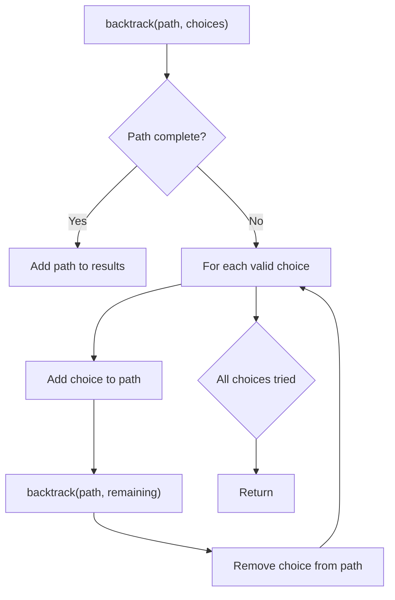
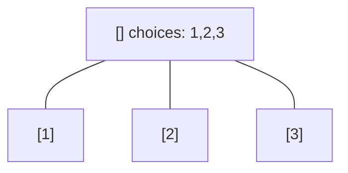
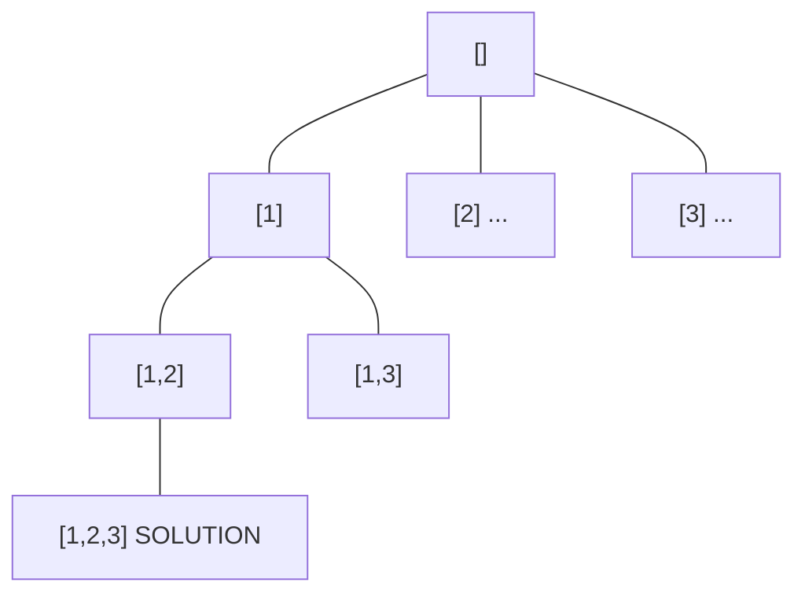
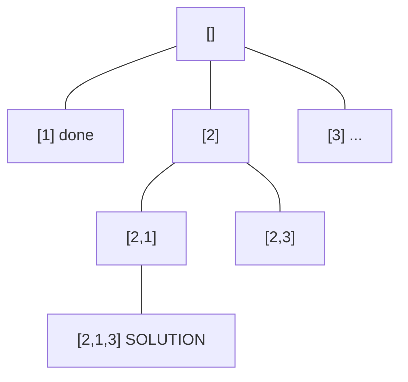
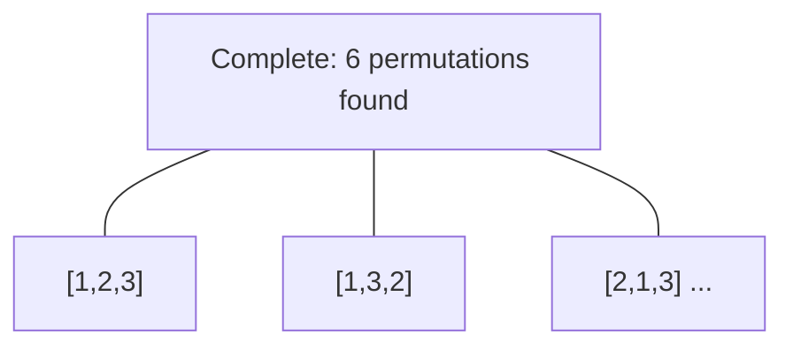

# Problem 2056: Number of Valid Move Combinations On Chessboard

**Difficulty:** Hard  
**Tags:** Array, String, Backtracking, Simulation  
**Pattern:** Backtracking  
**Link:** [leetcode.com/problems/number-of-valid-move-combinations-on-chessboard](https://leetcode.com/problems/number-of-valid-move-combinations-on-chessboard/)

## Description

There is an `8 x 8` chessboard containing `n` pieces (rooks, queens, or bishops). You are given a string array `pieces` of length `n`, where `pieces[i]` describes the type (rook, queen, or bishop) of the `i^th` piece. In addition, you are given a 2D integer array `positions` also of length `n`, where `positions[i] = [ri, ci]` indicates that the `i^th` piece is currently at the **1-based** coordinate `(ri, ci)` on the chessboard.

When making a **move** for a piece, you choose a **destination** square that the piece will travel toward and stop on.

	- A rook can only travel **horizontally or vertically** from `(r, c)` to the direction of `(r+1, c)`, `(r-1, c)`, `(r, c+1)`, or `(r, c-1)`.
	- A queen can only travel **horizontally, vertically, or diagonally** from `(r, c)` to the direction of `(r+1, c)`, `(r-1, c)`, `(r, c+1)`, `(r, c-1)`, `(r+1, c+1)`, `(r+1, c-1)`, `(r-1, c+1)`, `(r-1, c-1)`.
	- A bishop can only travel **diagonally** from `(r, c)` to the direction of `(r+1, c+1)`, `(r+1, c-1)`, `(r-1, c+1)`, `(r-1, c-1)`.

You must make a **move** for every piece on the board simultaneously. A **move combination** consists of all the **moves** performed on all the given pieces. Every second, each piece will instantaneously travel **one square** towards their destination if they are not already at it. All pieces start traveling at the `0^th` second. A move combination is **invalid** if, at a given time, **two or more** pieces occupy the same square.

Return *the number of **valid** move combinations*​​​​​.

**Notes:**

	- **No two pieces** will start in the** same** square.
	- You may choose the square a piece is already on as its **destination**.
	- If two pieces are **directly adjacent** to each other, it is valid for them to **move past each other** and swap positions in one second.

 

Example 1:

```

**Input:** pieces = ["rook"], positions = [[1,1]]
**Output:** 15
**Explanation:** The image above shows the possible squares the piece can move to.

```

Example 2:

```

**Input:** pieces = ["queen"], positions = [[1,1]]
**Output:** 22
**Explanation:** The image above shows the possible squares the piece can move to.

```

Example 3:

```

**Input:** pieces = ["bishop"], positions = [[4,3]]
**Output:** 12
**Explanation:** The image above shows the possible squares the piece can move to.

```

 

**Constraints:**

	- `n == pieces.length `
	- `n == positions.length`
	- `1 <= n <= 4`
	- `pieces` only contains the strings `"rook"`, `"queen"`, and `"bishop"`.
	- There will be at most one queen on the chessboard.
	- `1 <= ri, ci <= 8`
	- Each `positions[i]` is distinct.

## Approach: Backtracking

Explore all possible solutions by building candidates incrementally. At each step, make a choice and recurse. If the choice leads to a dead end, undo the choice (backtrack) and try the next option.

## Pseudocode

```
1. Define backtrack(path, choices):
   a. If path is a complete solution: add to results
   b. For each choice in choices:
      - If choice is valid:
        * Add choice to path
        * backtrack(path, remaining_choices)
        * Remove choice from path (backtrack)
2. Call backtrack([], all_choices)
```

## Algorithm Flow



## Visual State Transitions

**Backtracking Decision Tree:**

**Frame 1: Root - start with empty path**


**Frame 2: Explore branch [1]**


**Frame 3: Backtrack, explore [2]**


**Frame 4: All solutions found**



## Complexity Analysis

- **Time:** O(k^n) or O(n!)
- **Space:** O(n)

## Solution (Python3)

```python
class Solution:
    def countCombinations(self, pieces: List[str], positions: List[List[int]]) -> int:
        # Backtracking - O(2^n) or O(n!) time
        result = []
        
        def backtrack(path, start):
            result.append(path[:])
            for i in range(start, len(pieces)):
                path.append(pieces[i])
                backtrack(path, i + 1)
                path.pop()
        
        backtrack([], 0)
        return result
```

## Solution (C++)

```cpp
#include <functional>
#include <string>
#include <vector>
using namespace std;

class Solution {
public:
    int countCombinations(vector<string>& pieces, vector<vector<int>>& positions) {
        // Backtracking - O(2^n) or O(n!) time
        vector<vector<int>> result;
        vector<int> path;
        function<void(int)> backtrack = [&](int start) {
            result.push_back(path);
            for (int i = start; i < (int)pieces.size(); i++) {
                path.push_back(pieces[i]);
                backtrack(i + 1);
                path.pop_back();
            }
        };
        backtrack(0);
        return result;
    }
};
```
