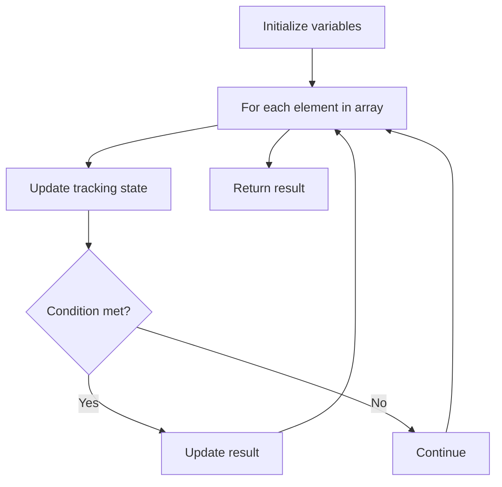

# Problem 2057: Smallest Index With Equal Value

**Difficulty:** Easy  
**Tags:** Array  
**Pattern:** Array Processing  
**Link:** [leetcode.com/problems/smallest-index-with-equal-value](https://leetcode.com/problems/smallest-index-with-equal-value/)

## Description

Given a **0-indexed** integer array `nums`, return *the **smallest** index *`i`* of *`nums`* such that *`i mod 10 == nums[i]`*, or *`-1`* if such index does not exist*.

`x mod y` denotes the **remainder** when `x` is divided by `y`.

 

Example 1:

```

**Input:** nums = [0,1,2]
**Output:** 0
**Explanation:** 
i=0: 0 mod 10 = 0 == nums[0].
i=1: 1 mod 10 = 1 == nums[1].
i=2: 2 mod 10 = 2 == nums[2].
All indices have i mod 10 == nums[i], so we return the smallest index 0.

```

Example 2:

```

**Input:** nums = [4,3,2,1]
**Output:** 2
**Explanation:** 
i=0: 0 mod 10 = 0 != nums[0].
i=1: 1 mod 10 = 1 != nums[1].
i=2: 2 mod 10 = 2 == nums[2].
i=3: 3 mod 10 = 3 != nums[3].
2 is the only index which has i mod 10 == nums[i].

```

Example 3:

```

**Input:** nums = [1,2,3,4,5,6,7,8,9,0]
**Output:** -1
**Explanation:** No index satisfies i mod 10 == nums[i].

```

 

**Constraints:**

	- `1 <= nums.length <= 100`
	- `0 <= nums[i] <= 9`

## Approach: Array Processing

Process the array with a linear scan, tracking state variables. Look for patterns: running maximum/minimum, counting, or transformations.

## Pseudocode

```
1. Initialize tracking variables
2. Iterate through array:
   a. Update tracking state
   b. Check conditions
   c. Update result
3. Return result
```

## Algorithm Flow



## Complexity Analysis

- **Time:** O(n)
- **Space:** O(1)

## Solution (Python3)

```python
class Solution:
    def smallestEqual(self, nums: List[int]) -> int:
        # Array processing - O(n) time
        result = 0
        for i in range(len(nums)):
            # Process element
            pass
        return result
```

## Solution (C++)

```cpp
#include <string>
#include <vector>
using namespace std;

class Solution {
public:
    int smallestEqual(vector<int>& nums) {
        // Array processing - O(n) time
        for (int i = 0; i < (int)nums.size(); i++) {
            // Process element
        }
        return 0;
    }
};
```
