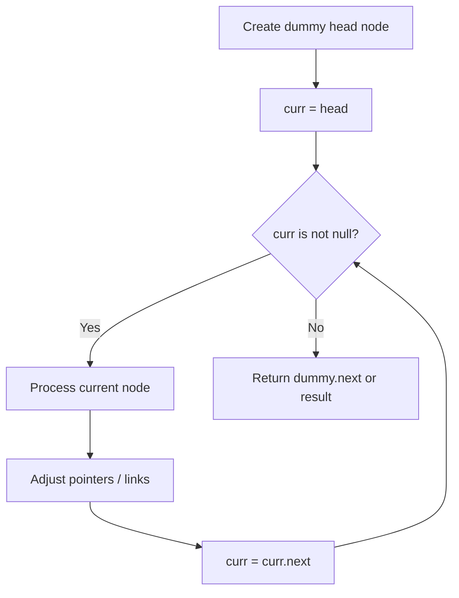
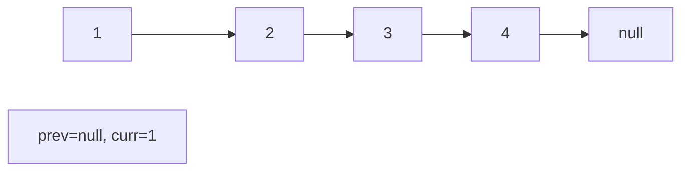
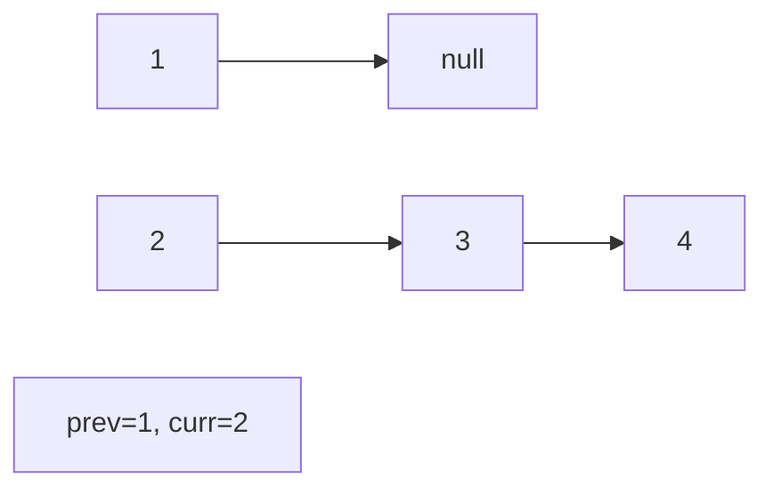
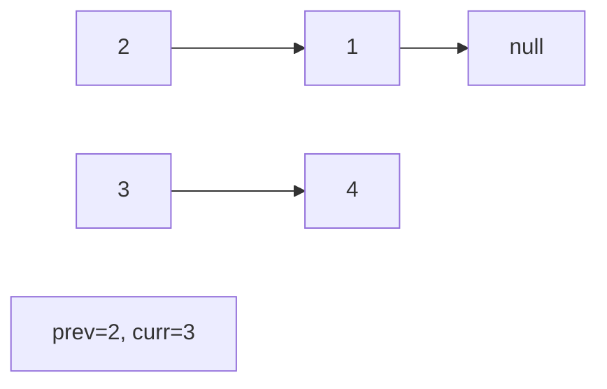
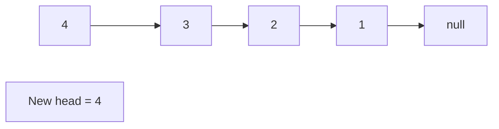

# Problem 2058: Find the Minimum and Maximum Number of Nodes Between Critical Points

**Difficulty:** Medium  
**Tags:** Linked List  
**Pattern:** Linked List  
**Link:** [leetcode.com/problems/find-the-minimum-and-maximum-number-of-nodes-between-critical-points](https://leetcode.com/problems/find-the-minimum-and-maximum-number-of-nodes-between-critical-points/)

## Description

A **critical point** in a linked list is defined as **either** a **local maxima** or a **local minima**.

A node is a **local maxima** if the current node has a value **strictly greater** than the previous node and the next node.

A node is a **local minima** if the current node has a value **strictly smaller** than the previous node and the next node.

Note that a node can only be a local maxima/minima if there exists **both** a previous node and a next node.

Given a linked list `head`, return *an array of length 2 containing *`[minDistance, maxDistance]`* where *`minDistance`* is the **minimum distance** between **any two distinct** critical points and *`maxDistance`* is the **maximum distance** between **any two distinct** critical points. If there are **fewer** than two critical points, return *`[-1, -1]`.

 

Example 1:

```

**Input:** head = [3,1]
**Output:** [-1,-1]
**Explanation:** There are no critical points in [3,1].

```

Example 2:

```

**Input:** head = [5,3,1,2,5,1,2]
**Output:** [1,3]
**Explanation:** There are three critical points:
- [5,3,**1**,2,5,1,2]: The third node is a local minima because 1 is less than 3 and 2.
- [5,3,1,2,**5**,1,2]: The fifth node is a local maxima because 5 is greater than 2 and 1.
- [5,3,1,2,5,**1**,2]: The sixth node is a local minima because 1 is less than 5 and 2.
The minimum distance is between the fifth and the sixth node. minDistance = 6 - 5 = 1.
The maximum distance is between the third and the sixth node. maxDistance = 6 - 3 = 3.

```

Example 3:

```

**Input:** head = [1,3,2,2,3,2,2,2,7]
**Output:** [3,3]
**Explanation:** There are two critical points:
- [1,**3**,2,2,3,2,2,2,7]: The second node is a local maxima because 3 is greater than 1 and 2.
- [1,3,2,2,**3**,2,2,2,7]: The fifth node is a local maxima because 3 is greater than 2 and 2.
Both the minimum and maximum distances are between the second and the fifth node.
Thus, minDistance and maxDistance is 5 - 2 = 3.
Note that the last node is not considered a local maxima because it does not have a next node.

```

 

**Constraints:**

	- The number of nodes in the list is in the range `[2, 10^5]`.
	- `1 <= Node.val <= 10^5`

## Approach: Linked List

Traverse or manipulate the linked list using pointer techniques. Common patterns: dummy head node for edge cases, fast/slow pointers for cycle detection or middle finding, in-place reversal, and merge operations.

## Pseudocode

```
1. Create dummy head if needed
2. Initialize pointer(s) at head
3. Traverse / modify list:
   a. Process current node
   b. Adjust next pointers as needed
   c. Move to next node
4. Return dummy.next or result
```

## Algorithm Flow



## Visual State Transitions

**Linked List Operation (Reverse):**

**Frame 1: Initial list**


**Frame 2: Reverse first link**


**Frame 3: Reverse second link**


**Frame 4: Fully reversed**



## Complexity Analysis

- **Time:** O(n)
- **Space:** O(1)

## Solution (Python3)

```python
class Solution:
    def nodesBetweenCriticalPoints(self, head: Optional[ListNode]) -> List[int]:
        # Linked list traversal/manipulation
        dummy = ListNode(0)
        dummy.next = head
        prev, curr = dummy, head
        while curr:
            nxt = curr.next
            # Process current node
            prev = curr
            curr = nxt
        return dummy.next
```

## Solution (C++)

```cpp
#include <string>
#include <vector>
using namespace std;

class Solution {
public:
    vector<int> nodesBetweenCriticalPoints(ListNode* head) {
        // Linked list traversal/manipulation
        ListNode dummy(0);
        dummy.next = head;
        ListNode* prev = &dummy;
        ListNode* curr = head;
        while (curr) {
            ListNode* nxt = curr->next;
            // Process current node
            prev = curr;
            curr = nxt;
        }
        return dummy.next;
    }
};
```
