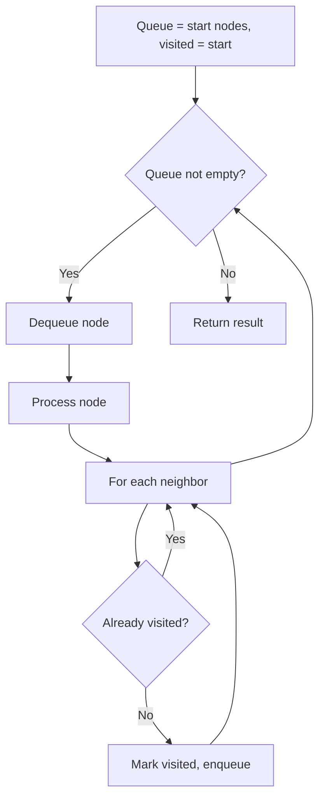
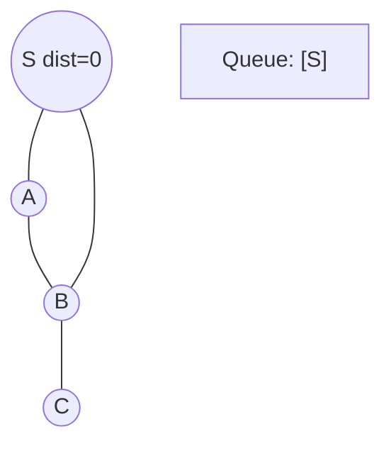
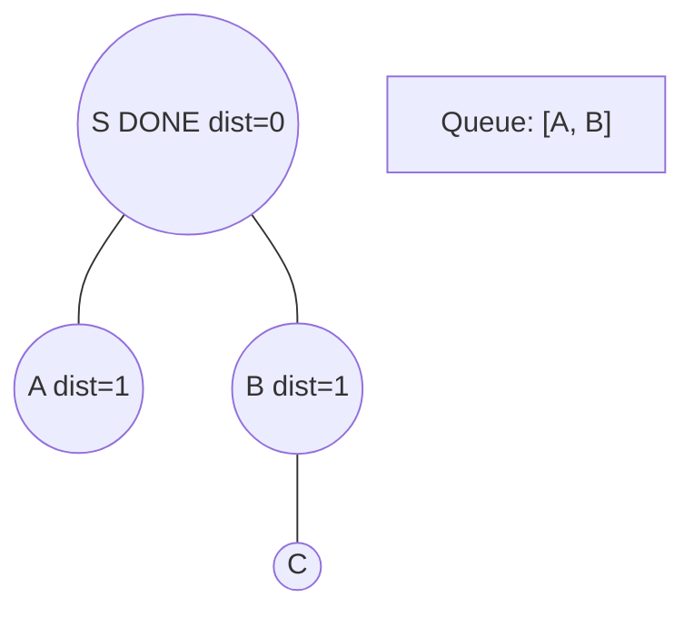
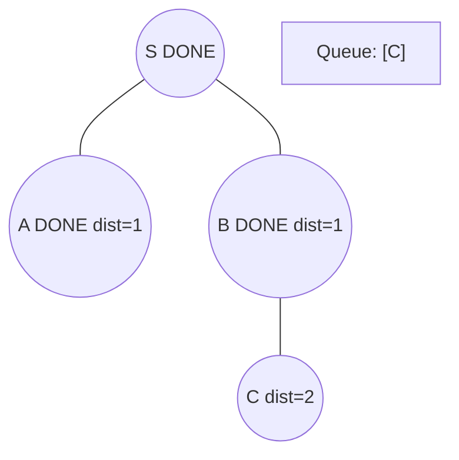
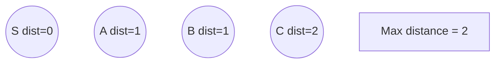

# Problem 2059: Minimum Operations to Convert Number

**Difficulty:** Medium  
**Tags:** Array, Breadth-First Search  
**Pattern:** BFS Graph Traversal  
**Link:** [leetcode.com/problems/minimum-operations-to-convert-number](https://leetcode.com/problems/minimum-operations-to-convert-number/)

## Description

You are given a **0-indexed** integer array `nums` containing **distinct** numbers, an integer `start`, and an integer `goal`. There is an integer `x` that is initially set to `start`, and you want to perform operations on `x` such that it is converted to `goal`. You can perform the following operation repeatedly on the number `x`:

If `0 <= x <= 1000`, then for any index `i` in the array (`0 <= i < nums.length`), you can set `x` to any of the following:

	- `x + nums[i]`
	- `x - nums[i]`
	- `x ^ nums[i]` (bitwise-XOR)

Note that you can use each `nums[i]` any number of times in any order. Operations that set `x` to be out of the range `0 <= x <= 1000` are valid, but no more operations can be done afterward.

Return *the **minimum** number of operations needed to convert *`x = start`* into *`goal`*, and *`-1`* if it is not possible*.

 

Example 1:

```

**Input:** nums = [2,4,12], start = 2, goal = 12
**Output:** 2
**Explanation:** We can go from 2 → 14 → 12 with the following 2 operations.
- 2 + 12 = 14
- 14 - 2 = 12

```

Example 2:

```

**Input:** nums = [3,5,7], start = 0, goal = -4
**Output:** 2
**Explanation:** We can go from 0 → 3 → -4 with the following 2 operations. 
- 0 + 3 = 3
- 3 - 7 = -4
Note that the last operation sets x out of the range 0 <= x <= 1000, which is valid.

```

Example 3:

```

**Input:** nums = [2,8,16], start = 0, goal = 1
**Output:** -1
**Explanation:** There is no way to convert 0 into 1.

```

 

**Constraints:**

	- `1 <= nums.length <= 1000`
	- `-10^9 <= nums[i], goal <= 10^9`
	- `0 <= start <= 1000`
	- `start != goal`
	- All the integers in `nums` are distinct.

## Approach: BFS Graph Traversal

Explore the graph breadth-first using a queue. Process nodes level by level; BFS finds shortest paths in unweighted graphs.

## Pseudocode

```
1. Initialize queue with start node(s), visited set
2. While queue not empty:
   a. Dequeue node
   b. Process node
   c. For each unvisited neighbor:
      - Mark visited, enqueue
3. Return result
```

## Algorithm Flow



## Visual State Transitions

**BFS Level-by-Level Traversal:**

**Frame 1: Start BFS from source**


**Frame 2: Process level 0, enqueue neighbors**


**Frame 3: Process level 1**


**Frame 4: All nodes reached**



## Complexity Analysis

- **Time:** O(V + E)
- **Space:** O(V)

## Solution (Python3)

```python
class Solution:
    def minimumOperations(self, nums: List[int], start: int, goal: int) -> int:
        # BFS on graph - O(V+E) time
        from collections import deque
        if not nums:
            return 0
        visited = set()
        queue = deque([0])
        visited.add(0)
        dist = 0
        while queue:
            for _ in range(len(queue)):
                node = queue.popleft()
                # Process node
            dist += 1
        return dist
```

## Solution (C++)

```cpp
#include <queue>
#include <string>
#include <unordered_set>
#include <vector>
using namespace std;

class Solution {
public:
    int minimumOperations(vector<int>& nums, int start, int goal) {
        // BFS on graph - O(V+E) time
        if (nums.empty()) return 0;
        queue<int> q;
        unordered_set<int> visited;
        q.push(0);
        visited.insert(0);
        int dist = 0;
        while (!q.empty()) {
            int sz = q.size();
            for (int i = 0; i < sz; i++) {
                int node = q.front(); q.pop();
                // Process node
            }
            dist++;
        }
        return dist;
    }
};
```
