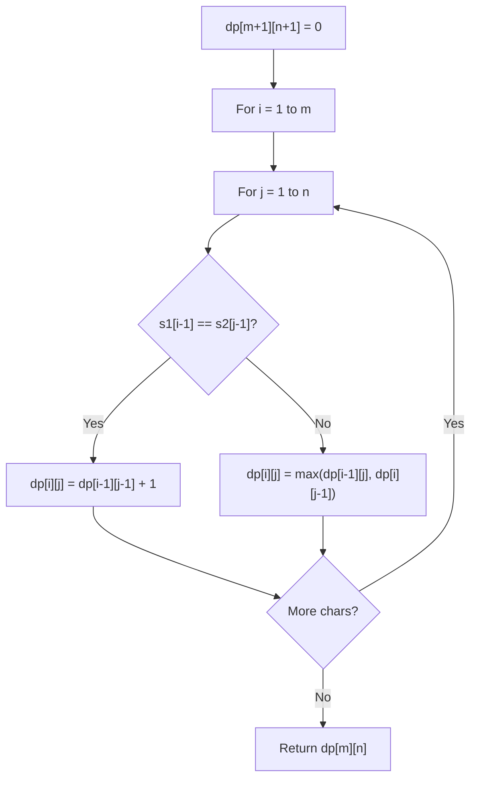

# Problem 2060: Check if an Original String Exists Given Two Encoded Strings

**Difficulty:** Hard  
**Tags:** String, Dynamic Programming  
**Pattern:** Dynamic Programming (String)  
**Link:** [leetcode.com/problems/check-if-an-original-string-exists-given-two-encoded-strings](https://leetcode.com/problems/check-if-an-original-string-exists-given-two-encoded-strings/)

## Description

An original string, consisting of lowercase English letters, can be encoded by the following steps:

	- Arbitrarily **split** it into a **sequence** of some number of **non-empty** substrings.
	- Arbitrarily choose some elements (possibly none) of the sequence, and **replace** each with **its length** (as a numeric string).
	- **Concatenate** the sequence as the encoded string.

For example, **one way** to encode an original string `"abcdefghijklmnop"` might be:

	- Split it as a sequence: `["ab", "cdefghijklmn", "o", "p"]`.
	- Choose the second and third elements to be replaced by their lengths, respectively. The sequence becomes `["ab", "12", "1", "p"]`.
	- Concatenate the elements of the sequence to get the encoded string: `"ab121p"`.

Given two encoded strings `s1` and `s2`, consisting of lowercase English letters and digits `1-9` (inclusive), return `true`* if there exists an original string that could be encoded as **both** *`s1`* and *`s2`*. Otherwise, return *`false`.

**Note**: The test cases are generated such that the number of consecutive digits in `s1` and `s2` does not exceed `3`.

 

Example 1:

```

**Input:** s1 = "internationalization", s2 = "i18n"
**Output:** true
**Explanation:** It is possible that "internationalization" was the original string.
- "internationalization" 
  -> Split:       ["internationalization"]
  -> Do not replace any element
  -> Concatenate:  "internationalization", which is s1.
- "internationalization"
  -> Split:       ["i", "nternationalizatio", "n"]
  -> Replace:     ["i", "18",                 "n"]
  -> Concatenate:  "i18n", which is s2

```

Example 2:

```

**Input:** s1 = "l123e", s2 = "44"
**Output:** true
**Explanation:** It is possible that "leetcode" was the original string.
- "leetcode" 
  -> Split:      ["l", "e", "et", "cod", "e"]
  -> Replace:    ["l", "1", "2",  "3",   "e"]
  -> Concatenate: "l123e", which is s1.
- "leetcode" 
  -> Split:      ["leet", "code"]
  -> Replace:    ["4",    "4"]
  -> Concatenate: "44", which is s2.

```

Example 3:

```

**Input:** s1 = "a5b", s2 = "c5b"
**Output:** false
**Explanation:** It is impossible.
- The original string encoded as s1 must start with the letter 'a'.
- The original string encoded as s2 must start with the letter 'c'.

```

 

**Constraints:**

	- `1 <= s1.length, s2.length <= 40`
	- `s1` and `s2` consist of digits `1-9` (inclusive), and lowercase English letters only.
	- The number of consecutive digits in `s1` and `s2` does not exceed `3`.

## Approach: Dynamic Programming (String)

Compare or match two strings using a 2D DP table. dp[i][j] represents the answer for substrings s1[0..i-1] and s2[0..j-1]. Common patterns: LCS, edit distance, regex matching.

## Pseudocode

```
1. Create dp[m+1][n+1]
2. Initialize base cases
3. For i from 1 to m:
   For j from 1 to n:
     If s1[i-1] == s2[j-1]: dp[i][j] = dp[i-1][j-1] + 1
     Else: dp[i][j] = best of (dp[i-1][j], dp[i][j-1], dp[i-1][j-1])
4. Return dp[m][n]
```

## Algorithm Flow



## Complexity Analysis

- **Time:** O(m * n)
- **Space:** O(m * n)

## Solution (Python3)

```python
class Solution:
    def possiblyEquals(self, s1: str, s2: str) -> bool:
        # String DP - O(m*n) time and space
        m, n = len(s1), len(s2)
        dp = [[0] * (n + 1) for _ in range(m + 1)]
        for i in range(1, m + 1):
            for j in range(1, n + 1):
                if s1[i-1] == s2[j-1]:
                    dp[i][j] = dp[i-1][j-1] + 1
                else:
                    dp[i][j] = max(dp[i-1][j], dp[i][j-1])
        return dp[m][n]
```

## Solution (C++)

```cpp
#include <algorithm>
#include <string>
#include <vector>
using namespace std;

class Solution {
public:
    bool possiblyEquals(string& s1, string& s2) {
        // String DP - O(m*n) time and space
        int m = s1.size(), n = s2.size();
        vector<vector<int>> dp(m + 1, vector<int>(n + 1, 0));
        for (int i = 1; i <= m; i++) {
            for (int j = 1; j <= n; j++) {
                if (s1[i-1] == s2[j-1])
                    dp[i][j] = dp[i-1][j-1] + 1;
                else
                    dp[i][j] = max(dp[i-1][j], dp[i][j-1]);
            }
        }
        return dp[m][n];
    }
};
```
