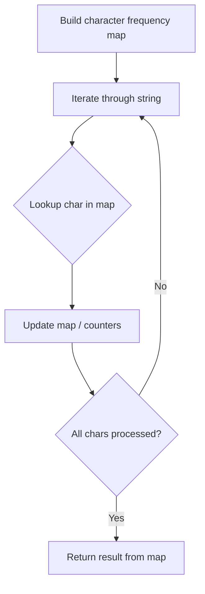

# Problem 2062: Count Vowel Substrings of a String

**Difficulty:** Easy  
**Tags:** Hash Table, String  
**Pattern:** Hash Map String Processing  
**Link:** [leetcode.com/problems/count-vowel-substrings-of-a-string](https://leetcode.com/problems/count-vowel-substrings-of-a-string/)

## Description

A **substring** is a contiguous (non-empty) sequence of characters within a string.

A **vowel substring** is a substring that **only** consists of vowels (`'a'`, `'e'`, `'i'`, `'o'`, and `'u'`) and has **all five** vowels present in it.

Given a string `word`, return *the number of **vowel substrings** in* `word`.

 

Example 1:

```

**Input:** word = "aeiouu"
**Output:** 2
**Explanation:** The vowel substrings of word are as follows (underlined):
- "**aeiou**u"
- "**aeiouu**"

```

Example 2:

```

**Input:** word = "unicornarihan"
**Output:** 0
**Explanation:** Not all 5 vowels are present, so there are no vowel substrings.

```

Example 3:

```

**Input:** word = "cuaieuouac"
**Output:** 7
**Explanation:** The vowel substrings of word are as follows (underlined):
- "c**uaieuo**uac"
- "c**uaieuou**ac"
- "c**uaieuoua**c"
- "cu**aieuo**uac"
- "cu**aieuou**ac"
- "cu**aieuoua**c"
- "cua**ieuoua**c"

```

 

**Constraints:**

	- `1 <= word.length <= 100`
	- `word` consists of lowercase English letters only.

## Approach: Hash Map String Processing

Use a hash map to count character frequencies or map characters/strings for O(1) lookups. Process the string in one or two passes.

## Pseudocode

```
1. Build frequency map / char-to-index map
2. Iterate through string:
   a. Look up character in map
   b. Update counts or mappings
3. Return result based on map state
```

## Algorithm Flow



## Complexity Analysis

- **Time:** O(n)
- **Space:** O(n)

## Solution (Python3)

```python
class Solution:
    def countVowelSubstrings(self, word: str) -> int:
        # Hash map for string/character frequency - O(n) time
        freq = {}
        for ch in word:
            freq[ch] = freq.get(ch, 0) + 1
        # Process frequency map
        for ch, cnt in freq.items():
            if cnt == 1:
                return word.index(ch)
        return 0
```

## Solution (C++)

```cpp
#include <string>
#include <unordered_map>
#include <vector>
using namespace std;

class Solution {
public:
    int countVowelSubstrings(string& word) {
        // Hash map for string/character frequency - O(n) time
        unordered_map<char, int> freq;
        for (char ch : word) {
            freq[ch]++;
        }
        // Process frequency map
        for (int i = 0; i < word.size(); i++) {
            if (freq[word[i]] == 1) return i;
        }
        return 0;
    }
};
```
