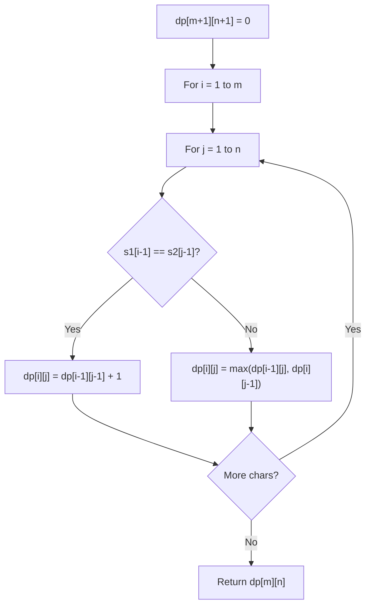

# Problem 2063: Vowels of All Substrings

**Difficulty:** Medium  
**Tags:** Math, String, Dynamic Programming, Combinatorics  
**Pattern:** Dynamic Programming (String)  
**Link:** [leetcode.com/problems/vowels-of-all-substrings](https://leetcode.com/problems/vowels-of-all-substrings/)

## Description

Given a string `word`, return *the **sum of the number of vowels** (*`'a'`, `'e'`*,* `'i'`*,* `'o'`*, and* `'u'`*)* *in every substring of *`word`.

A **substring** is a contiguous (non-empty) sequence of characters within a string.

**Note:** Due to the large constraints, the answer may not fit in a signed 32-bit integer. Please be careful during the calculations.

 

Example 1:

```

**Input:** word = "aba"
**Output:** 6
**Explanation:** 
All possible substrings are: "a", "ab", "aba", "b", "ba", and "a".
- "b" has 0 vowels in it
- "a", "ab", "ba", and "a" have 1 vowel each
- "aba" has 2 vowels in it
Hence, the total sum of vowels = 0 + 1 + 1 + 1 + 1 + 2 = 6. 

```

Example 2:

```

**Input:** word = "abc"
**Output:** 3
**Explanation:** 
All possible substrings are: "a", "ab", "abc", "b", "bc", and "c".
- "a", "ab", and "abc" have 1 vowel each
- "b", "bc", and "c" have 0 vowels each
Hence, the total sum of vowels = 1 + 1 + 1 + 0 + 0 + 0 = 3.

```

Example 3:

```

**Input:** word = "ltcd"
**Output:** 0
**Explanation:** There are no vowels in any substring of "ltcd".

```

 

**Constraints:**

	- `1 <= word.length <= 10^5`
	- `word` consists of lowercase English letters.

## Approach: Dynamic Programming (String)

Compare or match two strings using a 2D DP table. dp[i][j] represents the answer for substrings s1[0..i-1] and s2[0..j-1]. Common patterns: LCS, edit distance, regex matching.

## Pseudocode

```
1. Create dp[m+1][n+1]
2. Initialize base cases
3. For i from 1 to m:
   For j from 1 to n:
     If s1[i-1] == s2[j-1]: dp[i][j] = dp[i-1][j-1] + 1
     Else: dp[i][j] = best of (dp[i-1][j], dp[i][j-1], dp[i-1][j-1])
4. Return dp[m][n]
```

## Algorithm Flow



## Complexity Analysis

- **Time:** O(m * n)
- **Space:** O(m * n)

## Solution (Python3)

```python
class Solution:
    def countVowels(self, word: str) -> int:
        # String DP - O(m*n) time and space
        m, n = len(word), len(word)
        dp = [[0] * (n + 1) for _ in range(m + 1)]
        for i in range(1, m + 1):
            for j in range(1, n + 1):
                if word[i-1] == word[j-1]:
                    dp[i][j] = dp[i-1][j-1] + 1
                else:
                    dp[i][j] = max(dp[i-1][j], dp[i][j-1])
        return dp[m][n]
```

## Solution (C++)

```cpp
#include <algorithm>
#include <string>
#include <vector>
using namespace std;

class Solution {
public:
    int countVowels(string& word) {
        // String DP - O(m*n) time and space
        int m = word.size(), n = word.size();
        vector<vector<int>> dp(m + 1, vector<int>(n + 1, 0));
        for (int i = 1; i <= m; i++) {
            for (int j = 1; j <= n; j++) {
                if (word[i-1] == word[j-1])
                    dp[i][j] = dp[i-1][j-1] + 1;
                else
                    dp[i][j] = max(dp[i-1][j], dp[i][j-1]);
            }
        }
        return dp[m][n];
    }
};
```
