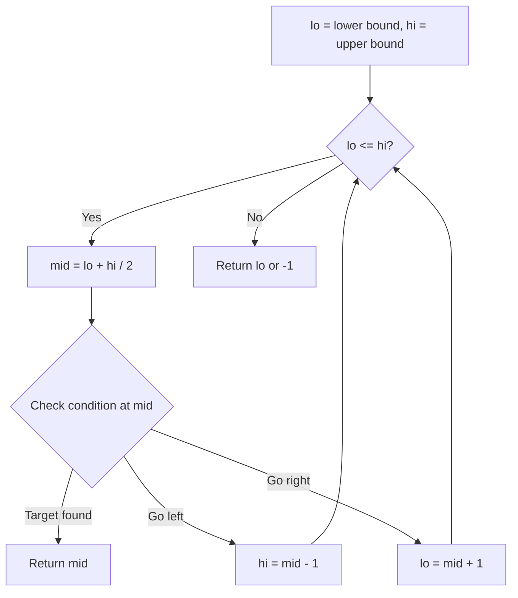
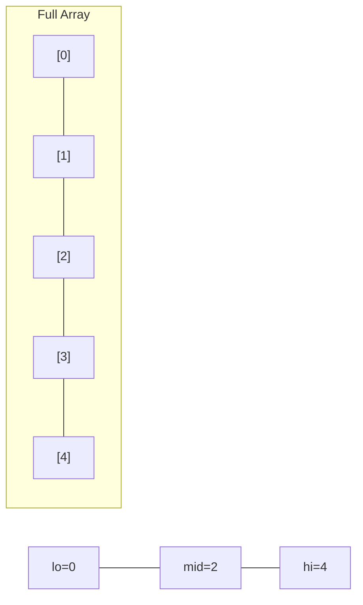
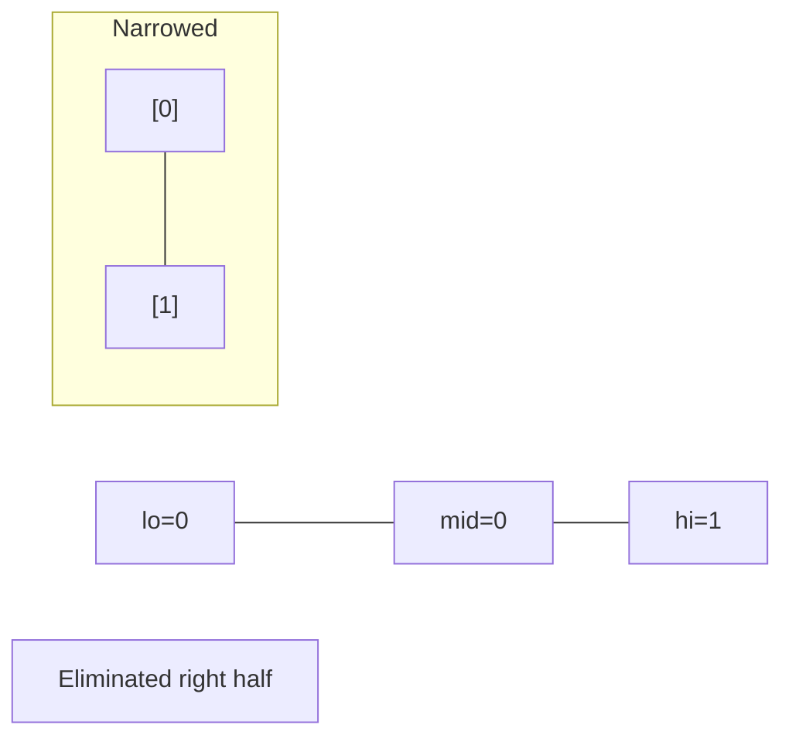
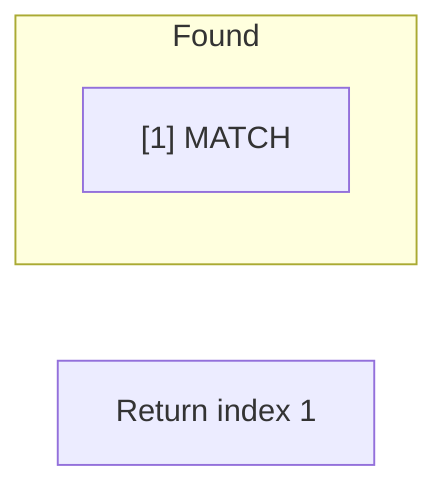

# Problem 2064: Minimized Maximum of Products Distributed to Any Store

**Difficulty:** Medium  
**Tags:** Array, Binary Search, Greedy  
**Pattern:** Binary Search  
**Link:** [leetcode.com/problems/minimized-maximum-of-products-distributed-to-any-store](https://leetcode.com/problems/minimized-maximum-of-products-distributed-to-any-store/)

## Description

You are given an integer `n` indicating there are `n` specialty retail stores. There are `m` product types of varying amounts, which are given as a **0-indexed** integer array `quantities`, where `quantities[i]` represents the number of products of the `i^th` product type.

You need to distribute **all products** to the retail stores following these rules:

	- A store can only be given **at most one product type** but can be given **any** amount of it.
	- After distribution, each store will have been given some number of products (possibly `0`). Let `x` represent the maximum number of products given to any store. You want `x` to be as small as possible, i.e., you want to **minimize** the **maximum** number of products that are given to any store.

Return *the minimum possible* `x`.

 

Example 1:

```

**Input:** n = 6, quantities = [11,6]
**Output:** 3
**Explanation:** One optimal way is:
- The 11 products of type 0 are distributed to the first four stores in these amounts: 2, 3, 3, 3
- The 6 products of type 1 are distributed to the other two stores in these amounts: 3, 3
The maximum number of products given to any store is max(2, 3, 3, 3, 3, 3) = 3.

```

Example 2:

```

**Input:** n = 7, quantities = [15,10,10]
**Output:** 5
**Explanation:** One optimal way is:
- The 15 products of type 0 are distributed to the first three stores in these amounts: 5, 5, 5
- The 10 products of type 1 are distributed to the next two stores in these amounts: 5, 5
- The 10 products of type 2 are distributed to the last two stores in these amounts: 5, 5
The maximum number of products given to any store is max(5, 5, 5, 5, 5, 5, 5) = 5.

```

Example 3:

```

**Input:** n = 1, quantities = [100000]
**Output:** 100000
**Explanation:** The only optimal way is:
- The 100000 products of type 0 are distributed to the only store.
The maximum number of products given to any store is max(100000) = 100000.

```

 

**Constraints:**

	- `m == quantities.length`
	- `1 <= m <= n <= 10^5`
	- `1 <= quantities[i] <= 10^5`

## Approach: Binary Search

Use binary search to halve the search space each iteration. Define the search range [lo, hi], compute mid, and decide which half to keep based on the problem's monotonic condition.

## Pseudocode

```
1. lo = lower_bound, hi = upper_bound
2. While lo <= hi (or lo < hi):
   a. mid = (lo + hi) // 2
   b. If condition(mid) is satisfied: record answer, search left half
   c. Else: search right half
3. Return answer
```

## Algorithm Flow



## Visual State Transitions

**Binary Search Step-by-Step:**

**Frame 1: Initial search space**


**Frame 2: Compare mid, narrow search**


**Frame 3: Found target**



## Complexity Analysis

- **Time:** O(log n)
- **Space:** O(1)

## Solution (Python3)

```python
class Solution:
    def minimizedMaximum(self, n: int, quantities: List[int]) -> int:
        # Binary search - O(log n) time, O(1) space
        lo, hi = 0, len(n) - 1
        while lo <= hi:
            mid = lo + (hi - lo) // 2
            if n[mid] == quantities:
                return mid
            elif n[mid] < quantities:
                lo = mid + 1
            else:
                hi = mid - 1
        return 0
```

## Solution (C++)

```cpp
#include <string>
#include <vector>
using namespace std;

class Solution {
public:
    int minimizedMaximum(int n, vector<int>& quantities) {
        // Binary search - O(log n) time, O(1) space
        int lo = 0, hi = n.size() - 1;
        while (lo <= hi) {
            int mid = lo + (hi - lo) / 2;
            if (n[mid] == quantities) {
                return mid;
            } else if (n[mid] < quantities) {
                lo = mid + 1;
            } else {
                hi = mid - 1;
            }
        }
        return 0;
    }
};
```
