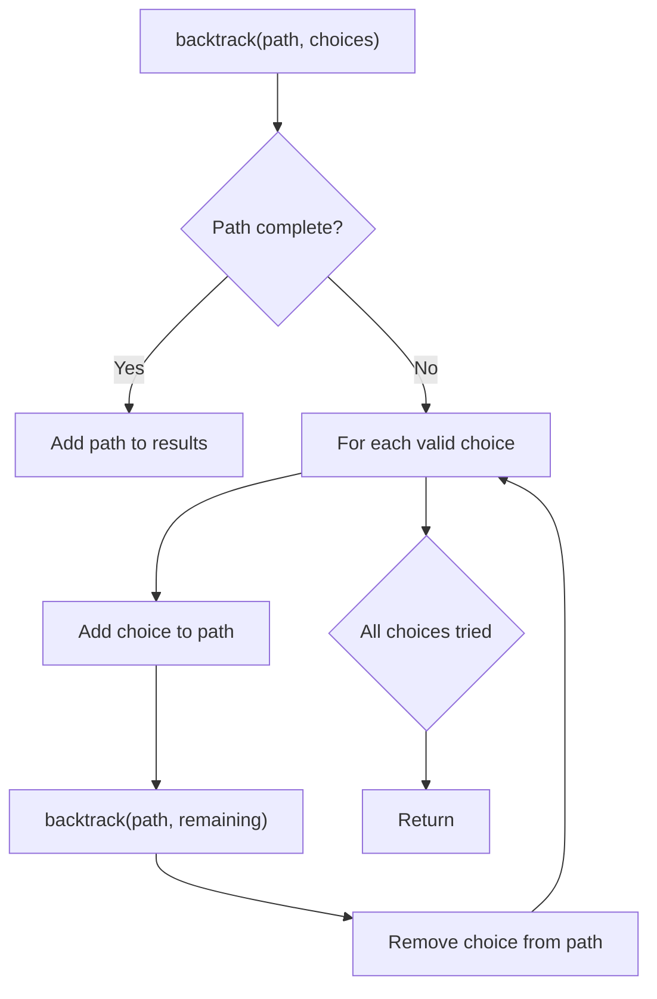
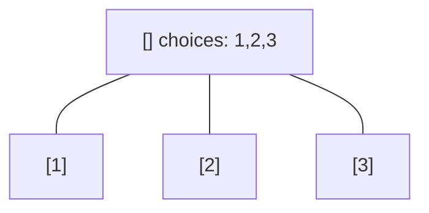
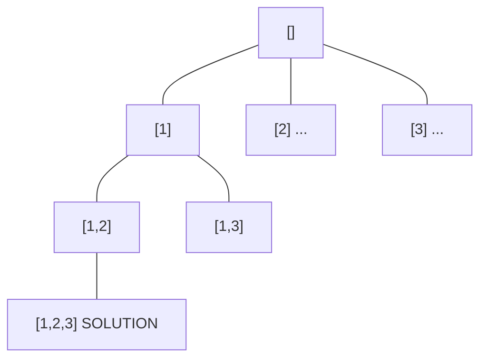
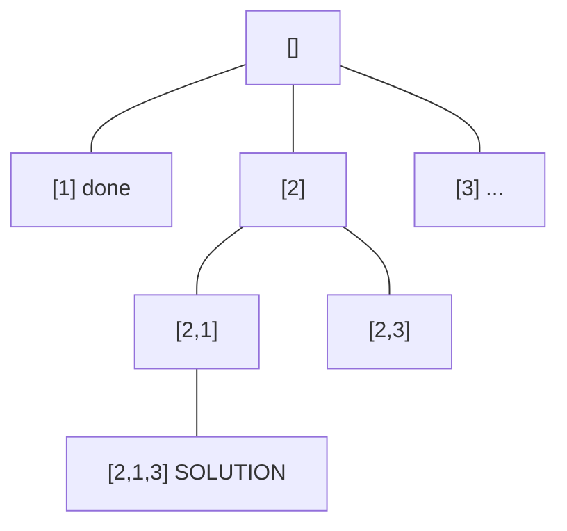
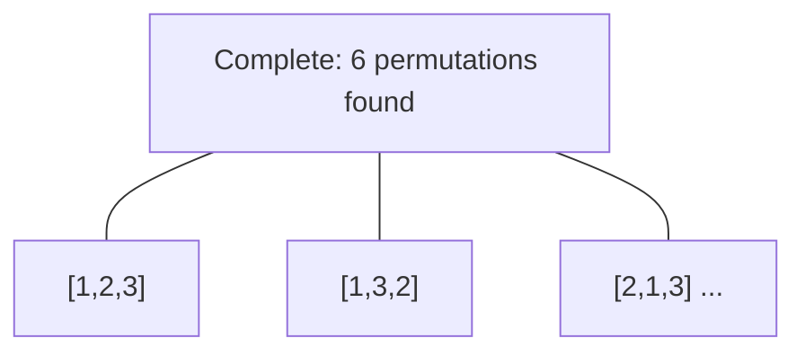

# Problem 2065: Maximum Path Quality of a Graph

**Difficulty:** Hard  
**Tags:** Array, Backtracking, Graph Theory  
**Pattern:** Backtracking  
**Link:** [leetcode.com/problems/maximum-path-quality-of-a-graph](https://leetcode.com/problems/maximum-path-quality-of-a-graph/)

## Description

There is an **undirected** graph with `n` nodes numbered from `0` to `n - 1` (**inclusive**). You are given a **0-indexed** integer array `values` where `values[i]` is the **value **of the `i^th` node. You are also given a **0-indexed** 2D integer array `edges`, where each `edges[j] = [uj, vj, timej]` indicates that there is an undirected edge between the nodes `uj` and `vj`, and it takes `timej` seconds to travel between the two nodes. Finally, you are given an integer `maxTime`.

A **valid** **path** in the graph is any path that starts at node `0`, ends at node `0`, and takes **at most** `maxTime` seconds to complete. You may visit the same node multiple times. The **quality** of a valid path is the **sum** of the values of the **unique nodes** visited in the path (each node's value is added **at most once** to the sum).

Return *the **maximum** quality of a valid path*.

**Note:** There are **at most four** edges connected to each node.

 

Example 1:

```

**Input:** values = [0,32,10,43], edges = [[0,1,10],[1,2,15],[0,3,10]], maxTime = 49
**Output:** 75
**Explanation:**
One possible path is 0 -> 1 -> 0 -> 3 -> 0. The total time taken is 10 + 10 + 10 + 10 = 40 <= 49.
The nodes visited are 0, 1, and 3, giving a maximal path quality of 0 + 32 + 43 = 75.

```

Example 2:

```

**Input:** values = [5,10,15,20], edges = [[0,1,10],[1,2,10],[0,3,10]], maxTime = 30
**Output:** 25
**Explanation:**
One possible path is 0 -> 3 -> 0. The total time taken is 10 + 10 = 20 <= 30.
The nodes visited are 0 and 3, giving a maximal path quality of 5 + 20 = 25.

```

Example 3:

```

**Input:** values = [1,2,3,4], edges = [[0,1,10],[1,2,11],[2,3,12],[1,3,13]], maxTime = 50
**Output:** 7
**Explanation:**
One possible path is 0 -> 1 -> 3 -> 1 -> 0. The total time taken is 10 + 13 + 13 + 10 = 46 <= 50.
The nodes visited are 0, 1, and 3, giving a maximal path quality of 1 + 2 + 4 = 7.

```

 

**Constraints:**

	- `n == values.length`
	- `1 <= n <= 1000`
	- `0 <= values[i] <= 10^8`
	- `0 <= edges.length <= 2000`
	- `edges[j].length == 3 `
	- `0 <= uj < vj <= n - 1`
	- `10 <= timej, maxTime <= 100`
	- All the pairs `[uj, vj]` are **unique**.
	- There are **at most four** edges connected to each node.
	- The graph may not be connected.

## Approach: Backtracking

Explore all possible solutions by building candidates incrementally. At each step, make a choice and recurse. If the choice leads to a dead end, undo the choice (backtrack) and try the next option.

## Pseudocode

```
1. Define backtrack(path, choices):
   a. If path is a complete solution: add to results
   b. For each choice in choices:
      - If choice is valid:
        * Add choice to path
        * backtrack(path, remaining_choices)
        * Remove choice from path (backtrack)
2. Call backtrack([], all_choices)
```

## Algorithm Flow



## Visual State Transitions

**Backtracking Decision Tree:**

**Frame 1: Root - start with empty path**


**Frame 2: Explore branch [1]**


**Frame 3: Backtrack, explore [2]**


**Frame 4: All solutions found**



## Complexity Analysis

- **Time:** O(k^n) or O(n!)
- **Space:** O(n)

## Solution (Python3)

```python
class Solution:
    def maximalPathQuality(self, values: List[int], edges: List[List[int]], maxTime: int) -> int:
        # Backtracking - O(2^n) or O(n!) time
        result = []
        
        def backtrack(path, start):
            result.append(path[:])
            for i in range(start, len(values)):
                path.append(values[i])
                backtrack(path, i + 1)
                path.pop()
        
        backtrack([], 0)
        return result
```

## Solution (C++)

```cpp
#include <functional>
#include <string>
#include <vector>
using namespace std;

class Solution {
public:
    int maximalPathQuality(vector<int>& values, vector<vector<int>>& edges, int maxTime) {
        // Backtracking - O(2^n) or O(n!) time
        vector<vector<int>> result;
        vector<int> path;
        function<void(int)> backtrack = [&](int start) {
            result.push_back(path);
            for (int i = start; i < (int)values.size(); i++) {
                path.push_back(values[i]);
                backtrack(i + 1);
                path.pop_back();
            }
        };
        backtrack(0);
        return result;
    }
};
```
