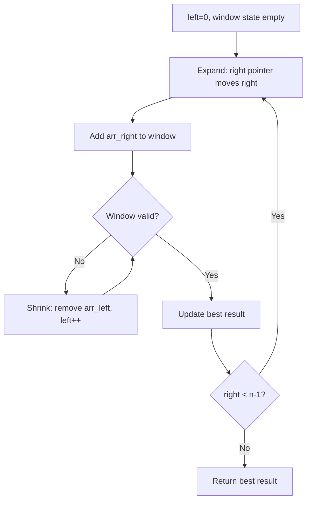
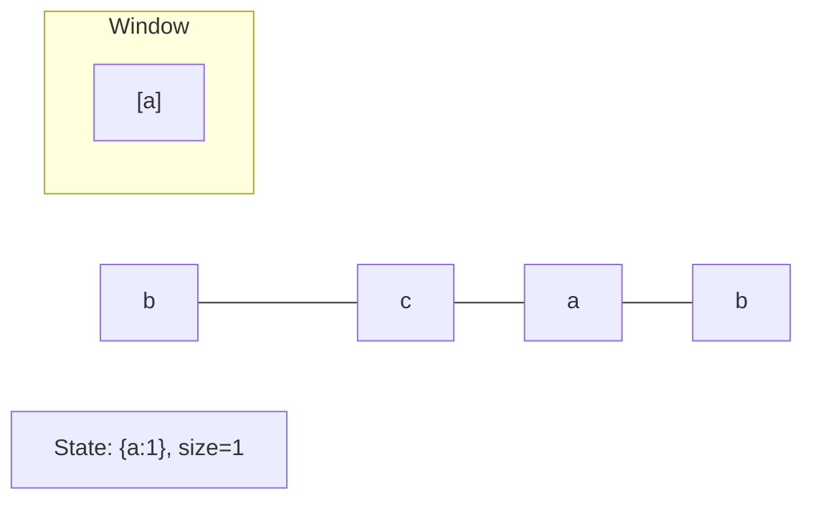
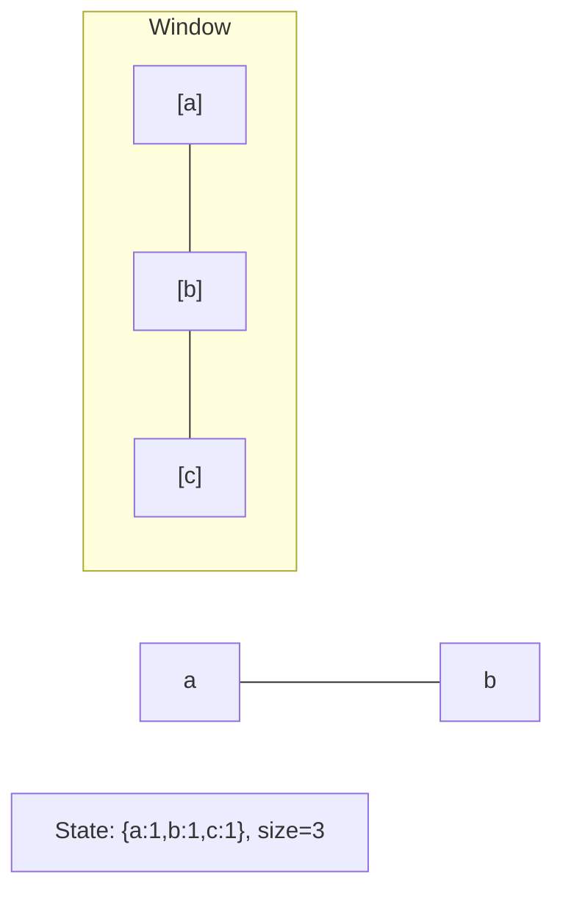
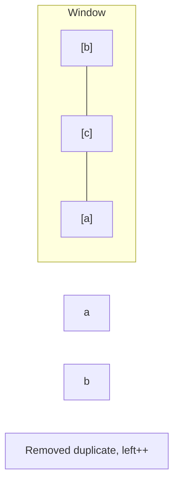
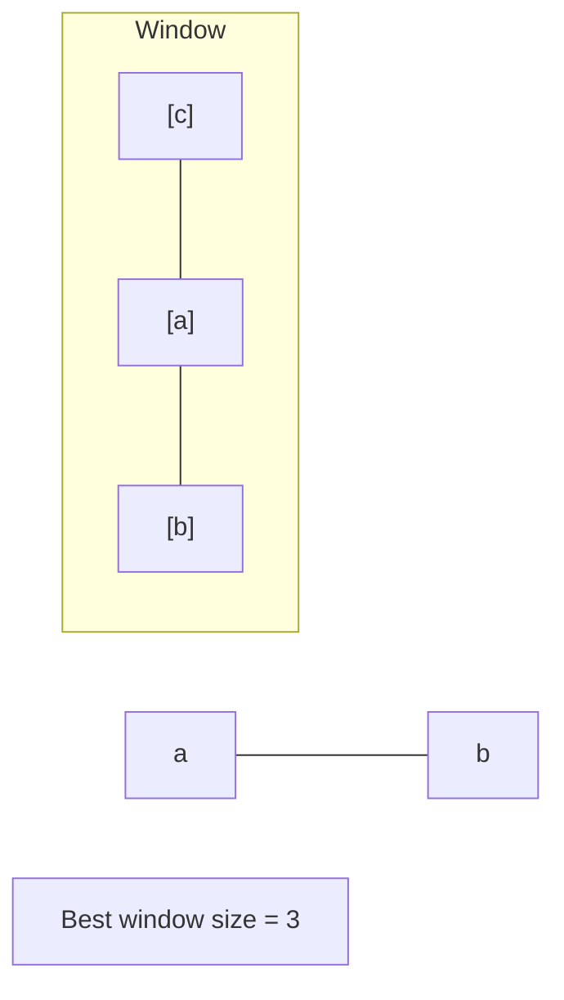

# Problem 2067: Number of Equal Count Substrings

**Difficulty:** Medium  
**Tags:** Hash Table, String, Sliding Window, Counting  
**Pattern:** Sliding Window  
**Link:** [leetcode.com/problems/number-of-equal-count-substrings](https://leetcode.com/problems/number-of-equal-count-substrings/)

## Description

*(Premium problem -- description requires LeetCode subscription)*

## Approach: Sliding Window

Maintain a window over the data using two pointers. Expand the right boundary to include new elements, and shrink the left boundary when the window constraint is violated. Track the optimal window.

## Pseudocode

```
1. Initialize left = 0, result = initial_value
2. For right in range(n):
   a. Add element at right to window state
   b. While window is invalid:
      - Remove element at left from window state
      - left++
   c. Update result = best of (result, window size/value)
3. Return result
```

## Algorithm Flow



## Visual State Transitions

**Sliding Window Step-by-Step:**

**Frame 1: Initial window (left=0, right=0)**


**Frame 2: Expand right (right=2)**


**Frame 3: Violation - shrink left**


**Frame 4: Continue expanding**



## Complexity Analysis

- **Time:** O(n)
- **Space:** O(k)

## Solution (Python3)

```python
class Solution:
    pass
```

## Solution (C++)

```cpp
class Solution {
public:
    // Design problem stub
};
```
