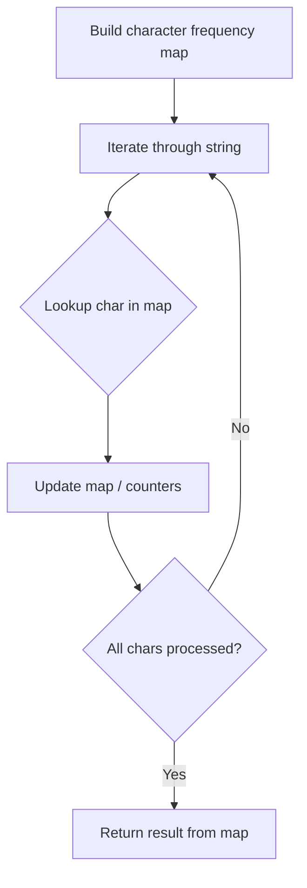

# Problem 2068: Check Whether Two Strings are Almost Equivalent

**Difficulty:** Easy  
**Tags:** Hash Table, String, Counting  
**Pattern:** Hash Map String Processing  
**Link:** [leetcode.com/problems/check-whether-two-strings-are-almost-equivalent](https://leetcode.com/problems/check-whether-two-strings-are-almost-equivalent/)

## Description

Two strings `word1` and `word2` are considered **almost equivalent** if the differences between the frequencies of each letter from `'a'` to `'z'` between `word1` and `word2` is **at most** `3`.

Given two strings `word1` and `word2`, each of length `n`, return `true` *if *`word1` *and* `word2` *are **almost equivalent**, or* `false` *otherwise*.

The **frequency** of a letter `x` is the number of times it occurs in the string.

 

Example 1:

```

**Input:** word1 = "aaaa", word2 = "bccb"
**Output:** false
**Explanation:** There are 4 'a's in "aaaa" but 0 'a's in "bccb".
The difference is 4, which is more than the allowed 3.

```

Example 2:

```

**Input:** word1 = "abcdeef", word2 = "abaaacc"
**Output:** true
**Explanation:** The differences between the frequencies of each letter in word1 and word2 are at most 3:
- 'a' appears 1 time in word1 and 4 times in word2. The difference is 3.
- 'b' appears 1 time in word1 and 1 time in word2. The difference is 0.
- 'c' appears 1 time in word1 and 2 times in word2. The difference is 1.
- 'd' appears 1 time in word1 and 0 times in word2. The difference is 1.
- 'e' appears 2 times in word1 and 0 times in word2. The difference is 2.
- 'f' appears 1 time in word1 and 0 times in word2. The difference is 1.

```

Example 3:

```

**Input:** word1 = "cccddabba", word2 = "babababab"
**Output:** true
**Explanation:** The differences between the frequencies of each letter in word1 and word2 are at most 3:
- 'a' appears 2 times in word1 and 4 times in word2. The difference is 2.
- 'b' appears 2 times in word1 and 5 times in word2. The difference is 3.
- 'c' appears 3 times in word1 and 0 times in word2. The difference is 3.
- 'd' appears 2 times in word1 and 0 times in word2. The difference is 2.

```

 

**Constraints:**

	- `n == word1.length == word2.length`
	- `1 <= n <= 100`
	- `word1` and `word2` consist only of lowercase English letters.

## Approach: Hash Map String Processing

Use a hash map to count character frequencies or map characters/strings for O(1) lookups. Process the string in one or two passes.

## Pseudocode

```
1. Build frequency map / char-to-index map
2. Iterate through string:
   a. Look up character in map
   b. Update counts or mappings
3. Return result based on map state
```

## Algorithm Flow



## Complexity Analysis

- **Time:** O(n)
- **Space:** O(n)

## Solution (Python3)

```python
class Solution:
    def checkAlmostEquivalent(self, word1: str, word2: str) -> bool:
        # Hash map for string/character frequency - O(n) time
        freq = {}
        for ch in word1:
            freq[ch] = freq.get(ch, 0) + 1
        # Process frequency map
        for ch, cnt in freq.items():
            if cnt == 1:
                return word1.index(ch)
        return False
```

## Solution (C++)

```cpp
#include <string>
#include <unordered_map>
#include <vector>
using namespace std;

class Solution {
public:
    bool checkAlmostEquivalent(string& word1, string& word2) {
        // Hash map for string/character frequency - O(n) time
        unordered_map<char, int> freq;
        for (char ch : word1) {
            freq[ch]++;
        }
        // Process frequency map
        for (int i = 0; i < word1.size(); i++) {
            if (freq[word1[i]] == 1) return i;
        }
        return false;
    }
};
```
