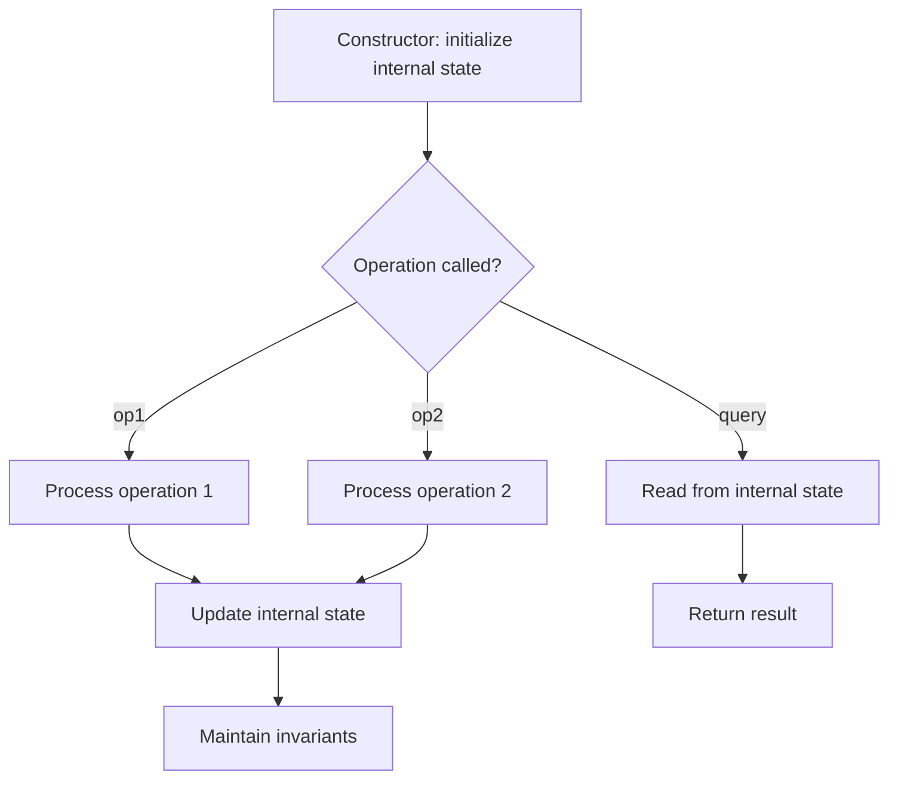

# Problem 2069: Walking Robot Simulation II

**Difficulty:** Medium  
**Tags:** Design, Simulation  
**Pattern:** Design  
**Link:** [leetcode.com/problems/walking-robot-simulation-ii](https://leetcode.com/problems/walking-robot-simulation-ii/)

## Description

A `width x height` grid is on an XY-plane with the **bottom-left** cell at `(0, 0)` and the **top-right** cell at `(width - 1, height - 1)`. The grid is aligned with the four cardinal directions (`"North"`, `"East"`, `"South"`, and `"West"`). A robot is **initially** at cell `(0, 0)` facing direction `"East"`.

The robot can be instructed to move for a specific number of **steps**. For each step, it does the following.

	- Attempts to move **forward one** cell in the direction it is facing.
	- If the cell the robot is **moving to** is **out of bounds**, the robot instead **turns** 90 degrees **counterclockwise** and retries the step.

After the robot finishes moving the number of steps required, it stops and awaits the next instruction.

Implement the `Robot` class:

	- `Robot(int width, int height)` Initializes the `width x height` grid with the robot at `(0, 0)` facing `"East"`.
	- `void step(int num)` Instructs the robot to move forward `num` steps.
	- `int[] getPos()` Returns the current cell the robot is at, as an array of length 2, `[x, y]`.
	- `String getDir()` Returns the current direction of the robot, `"North"`, `"East"`, `"South"`, or `"West"`.

 

Example 1:

```

**Input**
["Robot", "step", "step", "getPos", "getDir", "step", "step", "step", "getPos", "getDir"]
[[6, 3], [2], [2], [], [], [2], [1], [4], [], []]
**Output**
[null, null, null, [4, 0], "East", null, null, null, [1, 2], "West"]

**Explanation**
Robot robot = new Robot(6, 3); // Initialize the grid and the robot at (0, 0) facing East.
robot.step(2);  // It moves two steps East to (2, 0), and faces East.
robot.step(2);  // It moves two steps East to (4, 0), and faces East.
robot.getPos(); // return [4, 0]
robot.getDir(); // return "East"
robot.step(2);  // It moves one step East to (5, 0), and faces East.
                // Moving the next step East would be out of bounds, so it turns and faces North.
                // Then, it moves one step North to (5, 1), and faces North.
robot.step(1);  // It moves one step North to (5, 2), and faces **North** (not West).
robot.step(4);  // Moving the next step North would be out of bounds, so it turns and faces West.
                // Then, it moves four steps West to (1, 2), and faces West.
robot.getPos(); // return [1, 2]
robot.getDir(); // return "West"

```

 

**Constraints:**

	- `2 <= width, height <= 100`
	- `1 <= num <= 10^5`
	- At most `10^4` calls **in total** will be made to `step`, `getPos`, and `getDir`.

## Approach: Design

Design a data structure or system that supports specific operations efficiently. Choose appropriate underlying data structures (hash map, linked list, heap, etc.).

## Pseudocode

```
1. Choose data structures for internal state
2. Implement constructor: initialize state
3. Implement each operation:
   - Maintain invariants
   - Optimize for target time complexity
4. Handle edge cases
```

## Algorithm Flow



## Complexity Analysis

- **Time:** O(1) per operation
- **Space:** O(n)

## Solution (Python3)

```python
class Robot:
    def __init__(self, width: int, height: int):
        # Initialize data structure
        self.width = width
        self.height = height

    def step(self, num: int) -> None:
        return None

    def getPos(self) -> List[int]:
        return []

    def getDir(self) -> str:
        return ""

```

## Solution (C++)

```cpp
#include <string>
#include <vector>
using namespace std;

class Robot {
public:
    Robot(int width, int height) {
        // Initialize
    }

    void step(int num) {
        return ;
    }

    vector<int> getPos() {
        return {};
    }

    string getDir() {
        return "";
    }

};
```
