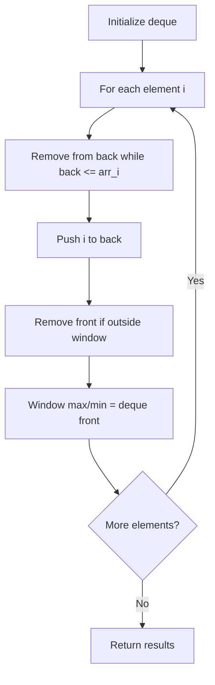

# Problem 2071: Maximum Number of Tasks You Can Assign

**Difficulty:** Hard  
**Tags:** Array, Two Pointers, Binary Search, Greedy, Queue, Sorting, Monotonic Queue  
**Pattern:** Monotonic Queue / Deque  
**Link:** [leetcode.com/problems/maximum-number-of-tasks-you-can-assign](https://leetcode.com/problems/maximum-number-of-tasks-you-can-assign/)

## Description

You have `n` tasks and `m` workers. Each task has a strength requirement stored in a **0-indexed** integer array `tasks`, with the `i^th` task requiring `tasks[i]` strength to complete. The strength of each worker is stored in a **0-indexed** integer array `workers`, with the `j^th` worker having `workers[j]` strength. Each worker can only be assigned to a **single** task and must have a strength **greater than or equal** to the task's strength requirement (i.e., `workers[j] >= tasks[i]`).

Additionally, you have `pills` magical pills that will **increase a worker's strength** by `strength`. You can decide which workers receive the magical pills, however, you may only give each worker **at most one** magical pill.

Given the **0-indexed **integer arrays `tasks` and `workers` and the integers `pills` and `strength`, return *the **maximum** number of tasks that can be completed.*

 

Example 1:

```

**Input:** tasks = [**3**,**2**,**1**], workers = [**0**,**3**,**3**], pills = 1, strength = 1
**Output:** 3
**Explanation:**
We can assign the magical pill and tasks as follows:
- Give the magical pill to worker 0.
- Assign worker 0 to task 2 (0 + 1 >= 1)
- Assign worker 1 to task 1 (3 >= 2)
- Assign worker 2 to task 0 (3 >= 3)

```

Example 2:

```

**Input:** tasks = [**5**,4], workers = [**0**,0,0], pills = 1, strength = 5
**Output:** 1
**Explanation:**
We can assign the magical pill and tasks as follows:
- Give the magical pill to worker 0.
- Assign worker 0 to task 0 (0 + 5 >= 5)

```

Example 3:

```

**Input:** tasks = [**10**,**15**,30], workers = [**0**,**10**,10,10,10], pills = 3, strength = 10
**Output:** 2
**Explanation:**
We can assign the magical pills and tasks as follows:
- Give the magical pill to worker 0 and worker 1.
- Assign worker 0 to task 0 (0 + 10 >= 10)
- Assign worker 1 to task 1 (10 + 10 >= 15)
The last pill is not given because it will not make any worker strong enough for the last task.

```

 

**Constraints:**

	- `n == tasks.length`
	- `m == workers.length`
	- `1 <= n, m <= 5 * 10^4`
	- `0 <= pills <= m`
	- `0 <= tasks[i], workers[j], strength <= 10^9`

## Approach: Monotonic Queue / Deque

Use a deque to maintain a monotonic window of elements. Remove from the back to maintain order, remove from the front when elements leave the window.

## Pseudocode

```
1. Initialize deque
2. For each element:
   a. Remove from back while deque back <= current
   b. Add current to back
   c. Remove from front if outside window
   d. Front of deque is the window max/min
3. Return results
```

## Algorithm Flow



## Complexity Analysis

- **Time:** O(n)
- **Space:** O(k)

## Solution (Python3)

```python
class Solution:
    def maxTaskAssign(self, tasks: List[int], workers: List[int], pills: int, strength: int) -> int:
        # Monotonic deque - O(n) time
        from collections import deque
        dq = deque()  # store indices
        result = []
        k = workers if isinstance(workers, int) else 1
        for i in range(len(tasks)):
            while dq and dq[0] < i - k + 1:
                dq.popleft()
            while dq and tasks[dq[-1]] < tasks[i]:
                dq.pop()
            dq.append(i)
            if i >= k - 1:
                result.append(tasks[dq[0]])
        return result
```

## Solution (C++)

```cpp
#include <deque>
#include <string>
#include <vector>
using namespace std;

class Solution {
public:
    int maxTaskAssign(vector<int>& tasks, vector<int>& workers, int pills, int strength) {
        // Monotonic deque - O(n) time
        deque<int> dq;
        vector<int> result;
        int k = workers;
        for (int i = 0; i < (int)tasks.size(); i++) {
            while (!dq.empty() && dq.front() < i - k + 1)
                dq.pop_front();
            while (!dq.empty() && tasks[dq.back()] < tasks[i])
                dq.pop_back();
            dq.push_back(i);
            if (i >= k - 1)
                result.push_back(tasks[dq.front()]);
        }
        return result;
    }
};
```
