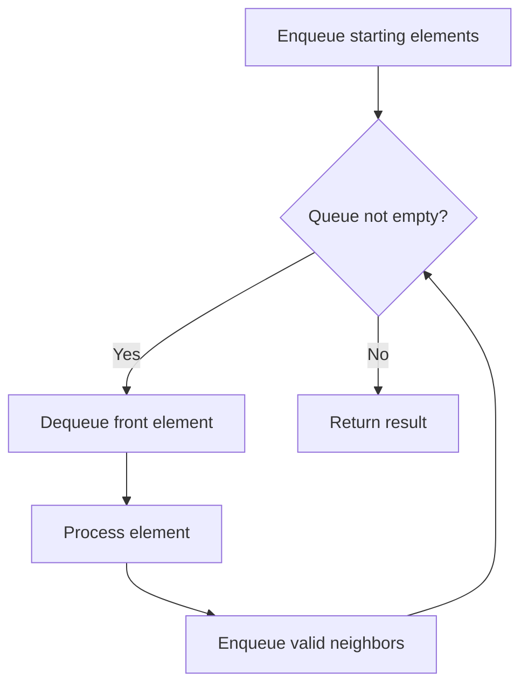

# Problem 2073: Time Needed to Buy Tickets

**Difficulty:** Easy  
**Tags:** Array, Queue, Simulation  
**Pattern:** Queue / BFS  
**Link:** [leetcode.com/problems/time-needed-to-buy-tickets](https://leetcode.com/problems/time-needed-to-buy-tickets/)

## Description

There are `n` people in a line queuing to buy tickets, where the `0^th` person is at the **front** of the line and the `(n - 1)^th` person is at the **back** of the line.

You are given a **0-indexed** integer array `tickets` of length `n` where the number of tickets that the `i^th` person would like to buy is `tickets[i]`.

Each person takes **exactly 1 second** to buy a ticket. A person can only buy **1 ticket at a time** and has to go back to **the end** of the line (which happens **instantaneously**) in order to buy more tickets. If a person does not have any tickets left to buy, the person will **leave **the line.

Return the **time taken** for the person **initially** at position **k**** **(0-indexed) to finish buying tickets.

 

Example 1:

**Input:** tickets = [2,3,2], k = 2

**Output:** 6

**Explanation:**

	- The queue starts as [2,3,2], where the kth person is underlined.
	- After the person at the front has bought a ticket, the queue becomes [3,2,1] at 1 second.
	- Continuing this process, the queue becomes [2,1,2] at 2 seconds.
	- Continuing this process, the queue becomes [1,2,1] at 3 seconds.
	- Continuing this process, the queue becomes [2,1] at 4 seconds. Note: the person at the front left the queue.
	- Continuing this process, the queue becomes [1,1] at 5 seconds.
	- Continuing this process, the queue becomes [1] at 6 seconds. The kth person has bought all their tickets, so return 6.

Example 2:

**Input:** tickets = [5,1,1,1], k = 0

**Output:** 8

**Explanation:**

	- The queue starts as [5,1,1,1], where the kth person is underlined.
	- After the person at the front has bought a ticket, the queue becomes [1,1,1,4] at 1 second.
	- Continuing this process for 3 seconds, the queue becomes [4] at 4 seconds.
	- Continuing this process for 4 seconds, the queue becomes [] at 8 seconds. The kth person has bought all their tickets, so return 8.

 

**Constraints:**

	- `n == tickets.length`
	- `1 <= n <= 100`
	- `1 <= tickets[i] <= 100`
	- `0 <= k < n`

## Approach: Queue / BFS

Use a queue (FIFO) for level-order or breadth-first processing. Enqueue starting elements, then process level by level.

## Pseudocode

```
1. Initialize queue with starting element(s)
2. While queue is not empty:
   a. Dequeue front element
   b. Process element
   c. Enqueue valid neighbors/children
3. Return result
```

## Algorithm Flow



## Complexity Analysis

- **Time:** O(n)
- **Space:** O(n)

## Solution (Python3)

```python
class Solution:
    def timeRequiredToBuy(self, tickets: List[int], k: int) -> int:
        # Queue-based approach - O(n) time
        from collections import deque
        queue = deque()
        for val in tickets:
            queue.append(val)
        result = []
        while queue:
            result.append(queue.popleft())
        return result
```

## Solution (C++)

```cpp
#include <queue>
#include <string>
#include <vector>
using namespace std;

class Solution {
public:
    int timeRequiredToBuy(vector<int>& tickets, int k) {
        // Queue-based approach - O(n) time
        queue<int> q;
        for (int val : tickets) {
            q.push(val);
        }
        vector<int> result;
        while (!q.empty()) {
            result.push_back(q.front());
            q.pop();
        }
        return result;
    }
};
```
