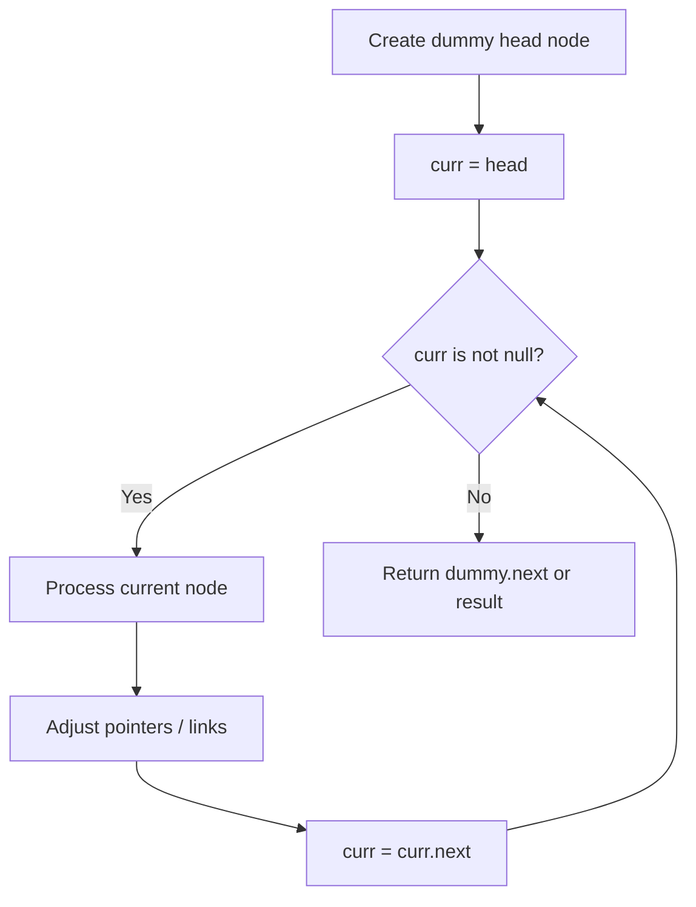
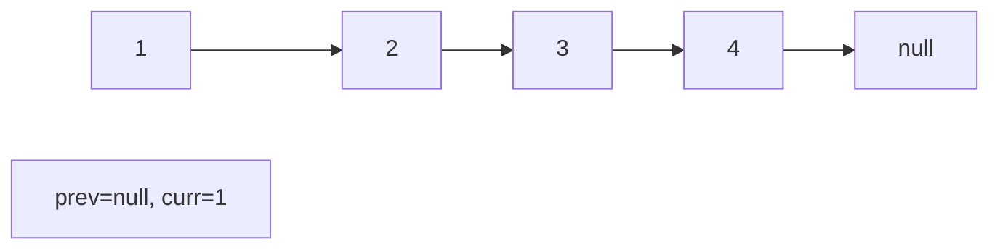
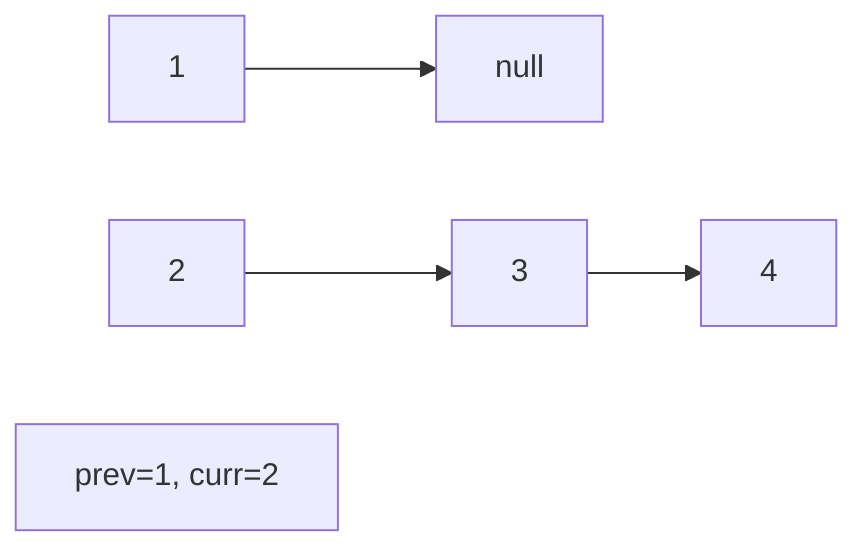
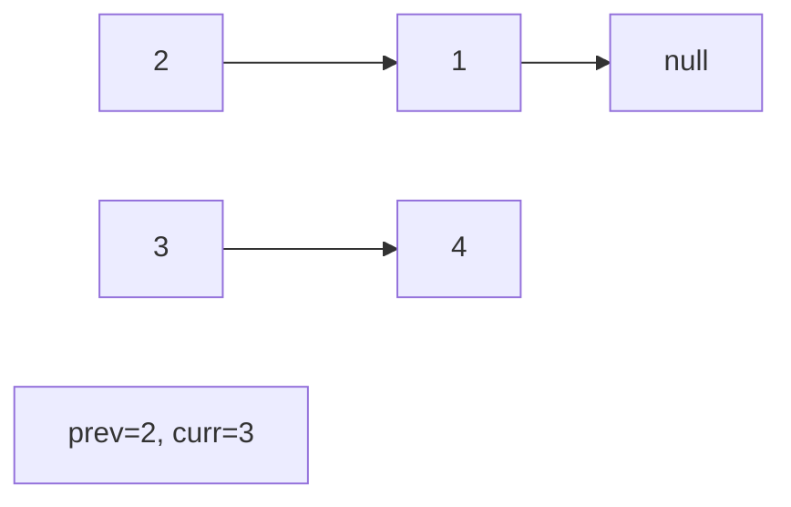
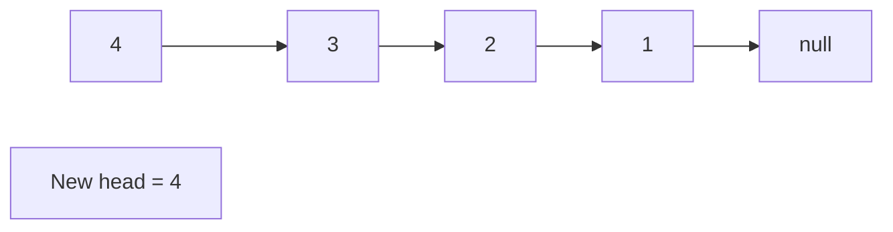

# Problem 2074: Reverse Nodes in Even Length Groups

**Difficulty:** Medium  
**Tags:** Linked List  
**Pattern:** Linked List  
**Link:** [leetcode.com/problems/reverse-nodes-in-even-length-groups](https://leetcode.com/problems/reverse-nodes-in-even-length-groups/)

## Description

You are given the `head` of a linked list.

The nodes in the linked list are **sequentially** assigned to **non-empty** groups whose lengths form the sequence of the natural numbers (`1, 2, 3, 4, ...`). The **length** of a group is the number of nodes assigned to it. In other words,

	- The `1^st` node is assigned to the first group.
	- The `2^nd` and the `3^rd` nodes are assigned to the second group.
	- The `4^th`, `5^th`, and `6^th` nodes are assigned to the third group, and so on.

Note that the length of the last group may be less than or equal to `1 + the length of the second to last group`.

**Reverse** the nodes in each group with an **even** length, and return *the* `head` *of the modified linked list*.

 

Example 1:

```

**Input:** head = [5,2,6,3,9,1,7,3,8,4]
**Output:** [5,6,2,3,9,1,4,8,3,7]
**Explanation:**
- The length of the first group is 1, which is odd, hence no reversal occurs.
- The length of the second group is 2, which is even, hence the nodes are reversed.
- The length of the third group is 3, which is odd, hence no reversal occurs.
- The length of the last group is 4, which is even, hence the nodes are reversed.

```

Example 2:

```

**Input:** head = [1,1,0,6]
**Output:** [1,0,1,6]
**Explanation:**
- The length of the first group is 1. No reversal occurs.
- The length of the second group is 2. The nodes are reversed.
- The length of the last group is 1. No reversal occurs.

```

Example 3:

```

**Input:** head = [1,1,0,6,5]
**Output:** [1,0,1,5,6]
**Explanation:**
- The length of the first group is 1. No reversal occurs.
- The length of the second group is 2. The nodes are reversed.
- The length of the last group is 2. The nodes are reversed.

```

 

**Constraints:**

	- The number of nodes in the list is in the range `[1, 10^5]`.
	- `0 <= Node.val <= 10^5`

## Approach: Linked List

Traverse or manipulate the linked list using pointer techniques. Common patterns: dummy head node for edge cases, fast/slow pointers for cycle detection or middle finding, in-place reversal, and merge operations.

## Pseudocode

```
1. Create dummy head if needed
2. Initialize pointer(s) at head
3. Traverse / modify list:
   a. Process current node
   b. Adjust next pointers as needed
   c. Move to next node
4. Return dummy.next or result
```

## Algorithm Flow



## Visual State Transitions

**Linked List Operation (Reverse):**

**Frame 1: Initial list**


**Frame 2: Reverse first link**


**Frame 3: Reverse second link**


**Frame 4: Fully reversed**



## Complexity Analysis

- **Time:** O(n)
- **Space:** O(1)

## Solution (Python3)

```python
class Solution:
    def reverseEvenLengthGroups(self, head: Optional[ListNode]) -> Optional[ListNode]:
        # Linked list traversal/manipulation
        dummy = ListNode(0)
        dummy.next = head
        prev, curr = dummy, head
        while curr:
            nxt = curr.next
            # Process current node
            prev = curr
            curr = nxt
        return dummy.next
```

## Solution (C++)

```cpp
#include <string>
#include <vector>
using namespace std;

class Solution {
public:
    ListNode* reverseEvenLengthGroups(ListNode* head) {
        // Linked list traversal/manipulation
        ListNode dummy(0);
        dummy.next = head;
        ListNode* prev = &dummy;
        ListNode* curr = head;
        while (curr) {
            ListNode* nxt = curr->next;
            // Process current node
            prev = curr;
            curr = nxt;
        }
        return dummy.next;
    }
};
```
