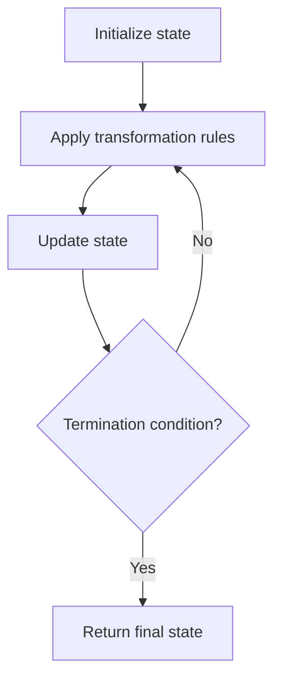

# Problem 2075: Decode the Slanted Ciphertext

**Difficulty:** Medium  
**Tags:** String, Simulation  
**Pattern:** Simulation  
**Link:** [leetcode.com/problems/decode-the-slanted-ciphertext](https://leetcode.com/problems/decode-the-slanted-ciphertext/)

## Description

A string `originalText` is encoded using a **slanted transposition cipher** to a string `encodedText` with the help of a matrix having a **fixed number of rows** `rows`.

`originalText` is placed first in a top-left to bottom-right manner.

The blue cells are filled first, followed by the red cells, then the yellow cells, and so on, until we reach the end of `originalText`. The arrow indicates the order in which the cells are filled. All empty cells are filled with `' '`. The number of columns is chosen such that the rightmost column will **not be empty** after filling in `originalText`.

`encodedText` is then formed by appending all characters of the matrix in a row-wise fashion.

The characters in the blue cells are appended first to `encodedText`, then the red cells, and so on, and finally the yellow cells. The arrow indicates the order in which the cells are accessed.

For example, if `originalText = "cipher"` and `rows = 3`, then we encode it in the following manner:

The blue arrows depict how `originalText` is placed in the matrix, and the red arrows denote the order in which `encodedText` is formed. In the above example, `encodedText = "ch ie pr"`.

Given the encoded string `encodedText` and number of rows `rows`, return *the original string* `originalText`.

**Note:** `originalText` **does not** have any trailing spaces `' '`. The test cases are generated such that there is only one possible `originalText`.

 

Example 1:

```

**Input:** encodedText = "ch   ie   pr", rows = 3
**Output:** "cipher"
**Explanation:** This is the same example described in the problem description.

```

Example 2:

```

**Input:** encodedText = "iveo    eed   l te   olc", rows = 4
**Output:** "i love leetcode"
**Explanation:** The figure above denotes the matrix that was used to encode originalText. 
The blue arrows show how we can find originalText from encodedText.

```

Example 3:

```

**Input:** encodedText = "coding", rows = 1
**Output:** "coding"
**Explanation:** Since there is only 1 row, both originalText and encodedText are the same.

```

 

**Constraints:**

	- `0 <= encodedText.length <= 10^6`
	- `encodedText` consists of lowercase English letters and `' '` only.
	- `encodedText` is a valid encoding of some `originalText` that **does not** have trailing spaces.
	- `1 <= rows <= 1000`
	- The testcases are generated such that there is **only one** possible `originalText`.

## Approach: Simulation

Simulate the process described in the problem step by step. Follow the rules exactly, tracking state at each step.

## Pseudocode

```
1. Initialize state (grid, pointers, counters)
2. For each step / iteration:
   a. Apply the transformation rules
   b. Update state
   c. Check termination condition
3. Return final state or result
```

## Algorithm Flow



## Complexity Analysis

- **Time:** O(n) or O(n * k)
- **Space:** O(n)

## Solution (Python3)

```python
class Solution:
    def decodeCiphertext(self, encodedText: str, rows: int) -> str:
        # Simulation approach - follow the rules step by step
        result = ""
        for i in range(len(encodedText) if isinstance(encodedText, list) else encodedText):
            # Simulate each step
            pass
        return result
```

## Solution (C++)

```cpp
#include <string>
#include <vector>
using namespace std;

class Solution {
public:
    string decodeCiphertext(string& encodedText, int rows) {
        // Simulation approach
        int n = encodedText.size();
        for (int i = 0; i < n; i++) {
            // Simulate each step
        }
        return "";
    }
};
```
