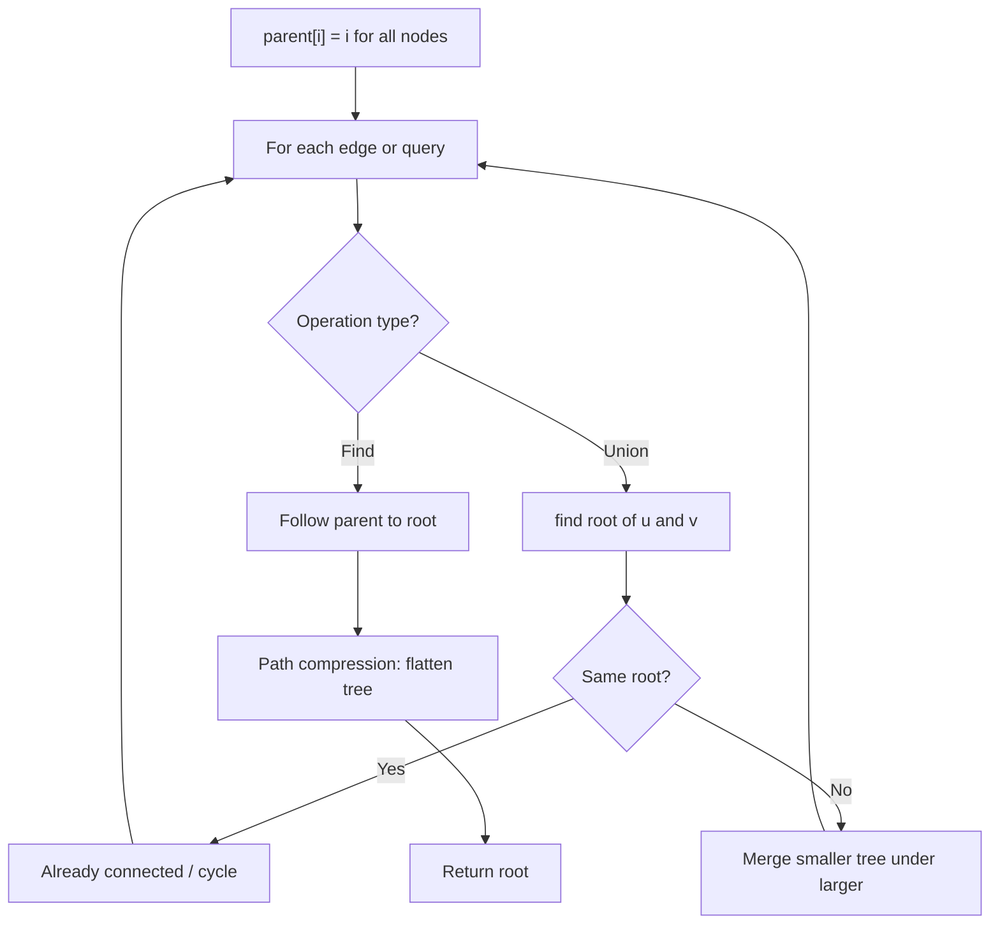
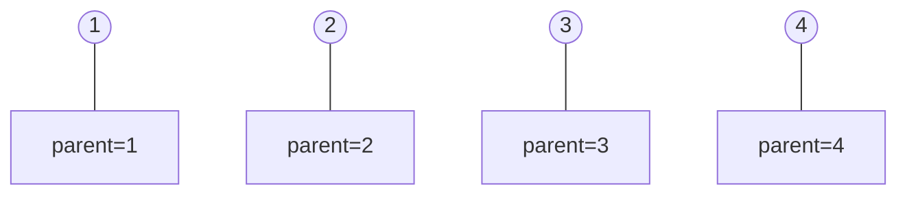
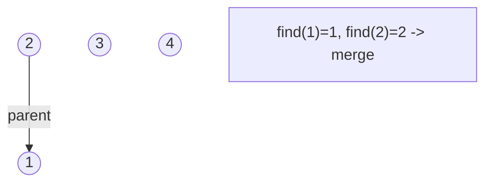
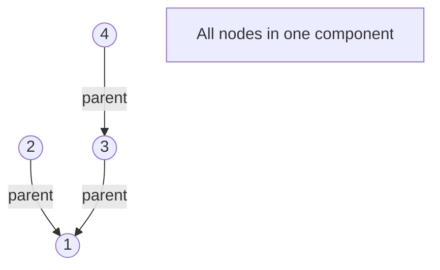
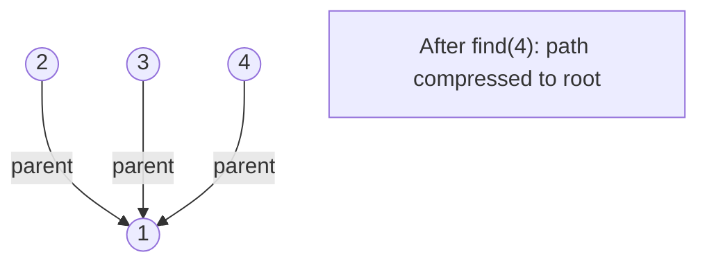

# Problem 2076: Process Restricted Friend Requests

**Difficulty:** Hard  
**Tags:** Union-Find, Graph Theory  
**Pattern:** Union-Find / Disjoint Set  
**Link:** [leetcode.com/problems/process-restricted-friend-requests](https://leetcode.com/problems/process-restricted-friend-requests/)

## Description

You are given an integer `n` indicating the number of people in a network. Each person is labeled from `0` to `n - 1`.

You are also given a **0-indexed** 2D integer array `restrictions`, where `restrictions[i] = [xi, yi]` means that person `xi` and person `yi` **cannot **become **friends**,** **either **directly** or **indirectly** through other people.

Initially, no one is friends with each other. You are given a list of friend requests as a **0-indexed** 2D integer array `requests`, where `requests[j] = [uj, vj]` is a friend request between person `uj` and person `vj`.

A friend request is **successful **if `uj` and `vj` can be **friends**. Each friend request is processed in the given order (i.e., `requests[j]` occurs before `requests[j + 1]`), and upon a successful request, `uj` and `vj` **become direct friends** for all future friend requests.

Return *a **boolean array** *`result`,* where each *`result[j]`* is *`true`* if the *`j^th`* friend request is **successful** or *`false`* if it is not*.

**Note:** If `uj` and `vj` are already direct friends, the request is still **successful**.

 

Example 1:

```

**Input:** n = 3, restrictions = [[0,1]], requests = [[0,2],[2,1]]
**Output:** [true,false]
Explanation:
Request 0: Person 0 and person 2 can be friends, so they become direct friends. 
Request 1: Person 2 and person 1 cannot be friends since person 0 and person 1 would be indirect friends (1--2--0).

```

Example 2:

```

**Input:** n = 3, restrictions = [[0,1]], requests = [[1,2],[0,2]]
**Output:** [true,false]
Explanation:
Request 0: Person 1 and person 2 can be friends, so they become direct friends.
Request 1: Person 0 and person 2 cannot be friends since person 0 and person 1 would be indirect friends (0--2--1).

```

Example 3:

```

**Input:** n = 5, restrictions = [[0,1],[1,2],[2,3]], requests = [[0,4],[1,2],[3,1],[3,4]]
**Output:** [true,false,true,false]
Explanation:
Request 0: Person 0 and person 4 can be friends, so they become direct friends.
Request 1: Person 1 and person 2 cannot be friends since they are directly restricted.
Request 2: Person 3 and person 1 can be friends, so they become direct friends.
Request 3: Person 3 and person 4 cannot be friends since person 0 and person 1 would be indirect friends (0--4--3--1).

```

 

**Constraints:**

	- `2 <= n <= 1000`
	- `0 <= restrictions.length <= 1000`
	- `restrictions[i].length == 2`
	- `0 <= xi, yi <= n - 1`
	- `xi != yi`
	- `1 <= requests.length <= 1000`
	- `requests[j].length == 2`
	- `0 <= uj, vj <= n - 1`
	- `uj != vj`

## Approach: Union-Find / Disjoint Set

Use Union-Find with path compression and union by rank to efficiently manage connected components. Find(x) returns the root of x's component; Union(x,y) merges two components.

## Pseudocode

```
1. parent[i] = i for all nodes (each is its own set)
2. find(x): follow parent pointers to root (with path compression)
3. union(x, y): merge sets of x and y by rank
4. Process edges/operations:
   a. For each edge (u, v): union(u, v)
5. Answer queries using find()
```

## Algorithm Flow



## Visual State Transitions

**Union-Find Step-by-Step:**

**Frame 1: Initial - each node is own parent**


**Frame 2: Union(1,2) - merge components**


**Frame 3: Union(3,4) then Union(2,3)**


**Frame 4: Path compression on find(4)**



## Complexity Analysis

- **Time:** O(n * alpha(n))
- **Space:** O(n)

## Solution (Python3)

```python
class Solution:
    def friendRequests(self, n: int, restrictions: List[List[int]], requests: List[List[int]]) -> List[bool]:
        # Union Find (Disjoint Set Union) - O(n * alpha(n))
        parent = list(range(len(n) + 1 if isinstance(n, list) else n + 1))
        rank = [0] * len(parent)
        
        def find(x):
            if parent[x] != x:
                parent[x] = find(parent[x])
            return parent[x]
        
        def union(x, y):
            px, py = find(x), find(y)
            if px == py:
                return False
            if rank[px] < rank[py]:
                px, py = py, px
            parent[py] = px
            if rank[px] == rank[py]:
                rank[px] += 1
            return True
        
        components = len(parent)
        # Process edges/connections
        return components
```

## Solution (C++)

```cpp
#include <functional>
#include <numeric>
#include <string>
#include <vector>
using namespace std;

class Solution {
public:
    vector<bool> friendRequests(int n, vector<vector<int>>& restrictions, vector<vector<int>>& requests) {
        // Union Find (DSU) - O(n * alpha(n))
        int n = n.size();
        vector<int> parent(n + 1), rnk(n + 1, 0);
        iota(parent.begin(), parent.end(), 0);
        function<int(int)> find = [&](int x) -> int {
            return parent[x] == x ? x : parent[x] = find(parent[x]);
        };
        auto unite = [&](int x, int y) -> bool {
            int px = find(x), py = find(y);
            if (px == py) return false;
            if (rnk[px] < rnk[py]) swap(px, py);
            parent[py] = px;
            if (rnk[px] == rnk[py]) rnk[px]++;
            return true;
        };
        int components = n;
        return components;
    }
};
```
