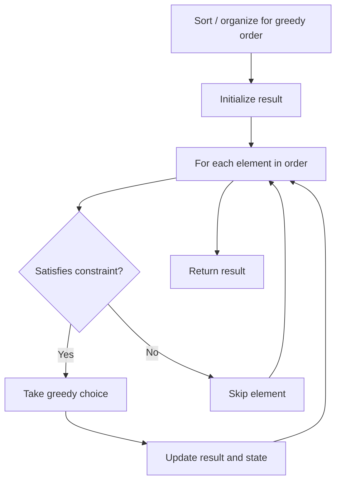

# Problem 2078: Two Furthest Houses With Different Colors

**Difficulty:** Easy  
**Tags:** Array, Greedy  
**Pattern:** Greedy  
**Link:** [leetcode.com/problems/two-furthest-houses-with-different-colors](https://leetcode.com/problems/two-furthest-houses-with-different-colors/)

## Description

There are `n` houses evenly lined up on the street, and each house is beautifully painted. You are given a **0-indexed** integer array `colors` of length `n`, where `colors[i]` represents the color of the `i^th` house.

Return *the **maximum** distance between **two** houses with **different** colors*.

The distance between the `i^th` and `j^th` houses is `abs(i - j)`, where `abs(x)` is the **absolute value** of `x`.

 

Example 1:

```

**Input:** colors = [**1**,1,1,**6**,1,1,1]
**Output:** 3
**Explanation:** In the above image, color 1 is blue, and color 6 is red.
The furthest two houses with different colors are house 0 and house 3.
House 0 has color 1, and house 3 has color 6. The distance between them is abs(0 - 3) = 3.
Note that houses 3 and 6 can also produce the optimal answer.

```

Example 2:

```

**Input:** colors = [**1**,8,3,8,**3**]
**Output:** 4
**Explanation:** In the above image, color 1 is blue, color 8 is yellow, and color 3 is green.
The furthest two houses with different colors are house 0 and house 4.
House 0 has color 1, and house 4 has color 3. The distance between them is abs(0 - 4) = 4.

```

Example 3:

```

**Input:** colors = [**0**,**1**]
**Output:** 1
**Explanation:** The furthest two houses with different colors are house 0 and house 1.
House 0 has color 0, and house 1 has color 1. The distance between them is abs(0 - 1) = 1.

```

 

**Constraints:**

	- `n == colors.length`
	- `2 <= n <= 100`
	- `0 <= colors[i] <= 100`
	- Test data are generated such that **at least** two houses have different colors.

## Approach: Greedy

Make the locally optimal choice at each step, trusting it leads to a global optimum. Greedy works when the problem has the greedy-choice property and optimal substructure.

## Pseudocode

```
1. Sort or organize data for greedy ordering
2. Initialize result
3. For each element in greedy order:
   a. If element satisfies constraint:
      - Take the greedy choice
      - Update result and state
4. Return result
```

## Algorithm Flow



## Complexity Analysis

- **Time:** O(n log n)
- **Space:** O(1)

## Solution (Python3)

```python
class Solution:
    def maxDistance(self, colors: List[int]) -> int:
        # Greedy approach - O(n) time
        result = 0
        curr_max = 0
        for i in range(len(colors)):
            if isinstance(colors[i], int):
                curr_max = max(curr_max, colors[i])
                result = max(result, curr_max)
            else:
                result += 1
        return result
```

## Solution (C++)

```cpp
#include <algorithm>
#include <string>
#include <vector>
using namespace std;

class Solution {
public:
    int maxDistance(vector<int>& colors) {
        // Greedy approach - O(n) time
        int result = 0, curr_max = 0;
        for (int i = 0; i < (int)colors.size(); i++) {
            curr_max = max(curr_max, colors[i]);
            result = max(result, curr_max);
        }
        return result;
    }
};
```
