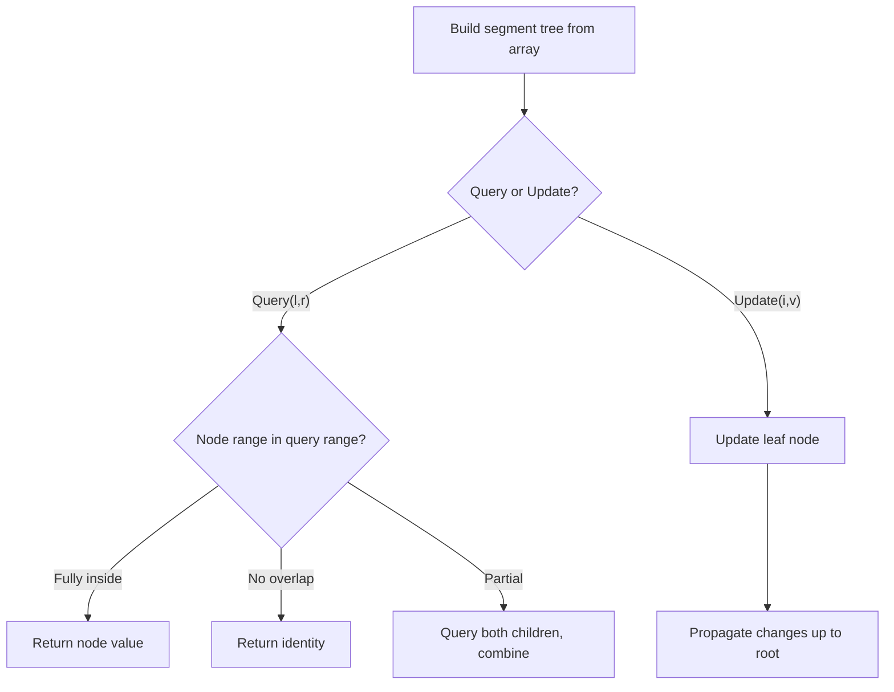

# Problem 2080: Range Frequency Queries

**Difficulty:** Medium  
**Tags:** Array, Hash Table, Binary Search, Design, Segment Tree  
**Pattern:** Segment Tree  
**Link:** [leetcode.com/problems/range-frequency-queries](https://leetcode.com/problems/range-frequency-queries/)

## Description

Design a data structure to find the **frequency** of a given value in a given subarray.

The **frequency** of a value in a subarray is the number of occurrences of that value in the subarray.

Implement the `RangeFreqQuery` class:

	- `RangeFreqQuery(int[] arr)` Constructs an instance of the class with the given **0-indexed** integer array `arr`.
	- `int query(int left, int right, int value)` Returns the **frequency** of `value` in the subarray `arr[left...right]`.

A **subarray** is a contiguous sequence of elements within an array. `arr[left...right]` denotes the subarray that contains the elements of `nums` between indices `left` and `right` (**inclusive**).

 

Example 1:

```

**Input**
["RangeFreqQuery", "query", "query"]
[[[12, 33, 4, 56, 22, 2, 34, 33, 22, 12, 34, 56]], [1, 2, 4], [0, 11, 33]]
**Output**
[null, 1, 2]

**Explanation**
RangeFreqQuery rangeFreqQuery = new RangeFreqQuery([12, 33, 4, 56, 22, 2, 34, 33, 22, 12, 34, 56]);
rangeFreqQuery.query(1, 2, 4); // return 1. The value 4 occurs 1 time in the subarray [33, 4]
rangeFreqQuery.query(0, 11, 33); // return 2. The value 33 occurs 2 times in the whole array.

```

 

**Constraints:**

	- `1 <= arr.length <= 10^5`
	- `1 <= arr[i], value <= 10^4`
	- `0 <= left <= right < arr.length`
	- At most `10^5` calls will be made to `query`

## Approach: Segment Tree

Build a segment tree for range queries (sum, min, max) with point or range updates. Each node covers a range; queries are answered by combining relevant segments.

## Pseudocode

```
1. Build segment tree from array (O(n))
2. Query(l, r):
   - If node range within [l,r]: return node value
   - If no overlap: return identity
   - Else: combine query(left_child) and query(right_child)
3. Update(i, val): update leaf and propagate up
```

## Algorithm Flow



## Complexity Analysis

- **Time:** O(n log n) build, O(log n) query/update
- **Space:** O(n)

## Solution (Python3)

```python
class RangeFreqQuery:
    def __init__(self, arr: List[int]):
        # Initialize data structure
        self.arr = arr

    def query(self, left: int, right: int, value: int) -> int:
        return 0

```

## Solution (C++)

```cpp
#include <functional>
#include <string>
#include <vector>
using namespace std;

class RangeFreqQuery {
public:
    RangeFreqQuery(vector<int>& arr) {
        // Initialize
    }

    int query(int left, int right, int value) {
        return 0;
    }

};
```
