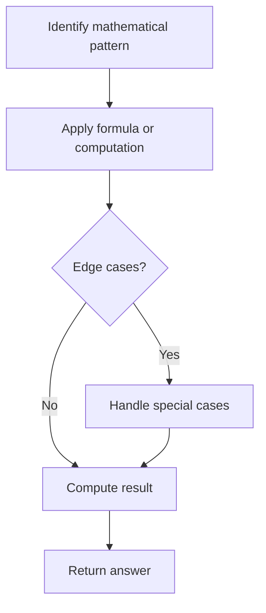

# Problem 2081: Sum of k-Mirror Numbers

**Difficulty:** Hard  
**Tags:** Math, Enumeration  
**Pattern:** Math  
**Link:** [leetcode.com/problems/sum-of-k-mirror-numbers](https://leetcode.com/problems/sum-of-k-mirror-numbers/)

## Description

A **k-mirror number** is a **positive** integer **without leading zeros** that reads the same both forward and backward in base-10 **as well as** in base-k.

	- For example, `9` is a 2-mirror number. The representation of `9` in base-10 and base-2 are `9` and `1001` respectively, which read the same both forward and backward.
	- On the contrary, `4` is not a 2-mirror number. The representation of `4` in base-2 is `100`, which does not read the same both forward and backward.

Given the base `k` and the number `n`, return *the **sum** of the* `n` ***smallest** k-mirror numbers*.

 

Example 1:

```

**Input:** k = 2, n = 5
**Output:** 25
Explanation:
The 5 smallest 2-mirror numbers and their representations in base-2 are listed as follows:
  base-10    base-2
    1          1
    3          11
    5          101
    7          111
    9          1001
Their sum = 1 + 3 + 5 + 7 + 9 = 25. 

```

Example 2:

```

**Input:** k = 3, n = 7
**Output:** 499
Explanation:
The 7 smallest 3-mirror numbers are and their representations in base-3 are listed as follows:
  base-10    base-3
    1          1
    2          2
    4          11
    8          22
    121        11111
    151        12121
    212        21212
Their sum = 1 + 2 + 4 + 8 + 121 + 151 + 212 = 499.

```

Example 3:

```

**Input:** k = 7, n = 17
**Output:** 20379000
**Explanation:** The 17 smallest 7-mirror numbers are:
1, 2, 3, 4, 5, 6, 8, 121, 171, 242, 292, 16561, 65656, 2137312, 4602064, 6597956, 6958596

```

 

**Constraints:**

	- `2 <= k <= 9`
	- `1 <= n <= 30`

## Approach: Math

Apply mathematical properties, formulas, or number-theoretic concepts. Look for patterns, modular arithmetic, or closed-form solutions.

## Pseudocode

```
1. Identify the mathematical pattern or formula
2. Apply computation:
   - Modular arithmetic for large numbers
   - GCD/LCM for divisibility
   - Sieve for primes
3. Handle edge cases
4. Return result
```

## Algorithm Flow



## Complexity Analysis

- **Time:** O(n) or O(sqrt(n))
- **Space:** O(1)

## Solution (Python3)

```python
class Solution:
    def kMirror(self, k: int, n: int) -> int:
        # Mathematical approach
        result = 0
        x = k
        while x != 0:
            result = result * 10 + x % 10
            x //= 10 if isinstance(x, int) else 1
        return result
```

## Solution (C++)

```cpp
#include <string>
#include <vector>
using namespace std;

class Solution {
public:
    int kMirror(int k, int n) {
        // Mathematical approach
        long long result = 0;
        int x = k;
        while (x != 0) {
            result = result * 10 + x % 10;
            x /= 10;
        }
        return (int)result;
    }
};
```
