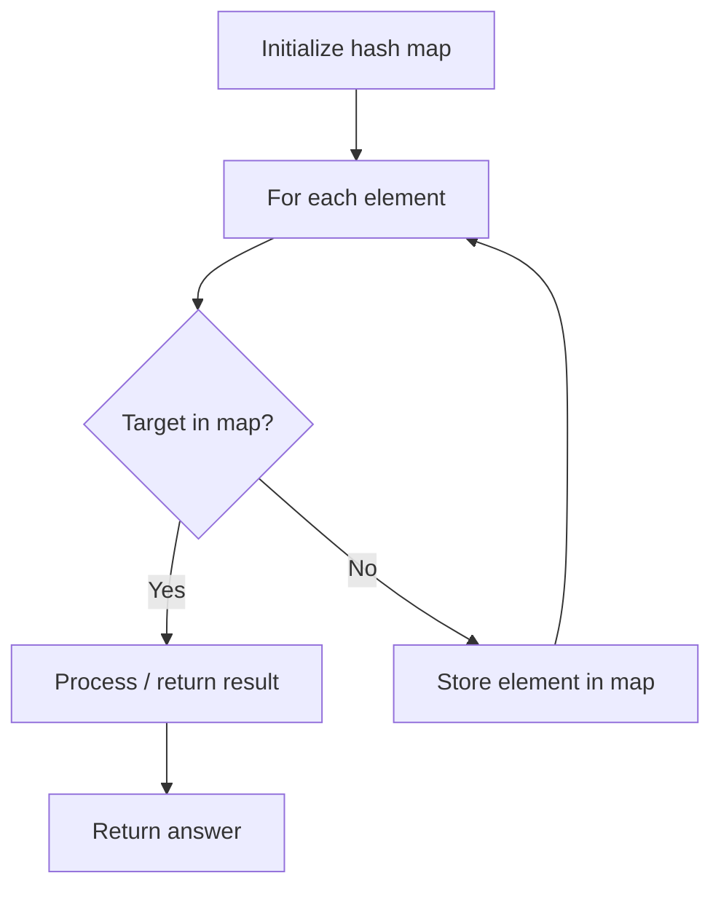

# Problem 2085: Count Common Words With One Occurrence

**Difficulty:** Easy  
**Tags:** Array, Hash Table, String, Counting  
**Pattern:** Hash Map Lookup  
**Link:** [leetcode.com/problems/count-common-words-with-one-occurrence](https://leetcode.com/problems/count-common-words-with-one-occurrence/)

## Description

Given two string arrays `words1` and `words2`, return *the number of strings that appear **exactly once** in **each** of the two arrays.*

 

Example 1:

```

**Input:** words1 = ["leetcode","is","amazing","as","is"], words2 = ["amazing","leetcode","is"]
**Output:** 2
**Explanation:**
- "leetcode" appears exactly once in each of the two arrays. We count this string.
- "amazing" appears exactly once in each of the two arrays. We count this string.
- "is" appears in each of the two arrays, but there are 2 occurrences of it in words1. We do not count this string.
- "as" appears once in words1, but does not appear in words2. We do not count this string.
Thus, there are 2 strings that appear exactly once in each of the two arrays.

```

Example 2:

```

**Input:** words1 = ["b","bb","bbb"], words2 = ["a","aa","aaa"]
**Output:** 0
**Explanation:** There are no strings that appear in each of the two arrays.

```

Example 3:

```

**Input:** words1 = ["a","ab"], words2 = ["a","a","a","ab"]
**Output:** 1
**Explanation:** The only string that appears exactly once in each of the two arrays is "ab".

```

 

**Constraints:**

	- `1 <= words1.length, words2.length <= 1000`
	- `1 <= words1[i].length, words2[j].length <= 30`
	- `words1[i]` and `words2[j]` consists only of lowercase English letters.

## Approach: Hash Map Lookup

Use a hash map (dictionary) to store elements for O(1) lookup. Iterate through the input, checking membership or counting frequencies in the map.

## Pseudocode

```
1. Initialize hash map
2. Iterate through elements:
   a. Check if target/complement exists in map
   b. If found: process result
   c. Otherwise: store element in map
3. Return result
```

## Algorithm Flow



## Complexity Analysis

- **Time:** O(n)
- **Space:** O(n)

## Solution (Python3)

```python
class Solution:
    def countWords(self, words1: List[str], words2: List[str]) -> int:
        # Hash map approach - O(n) time, O(n) space
        seen = {}
        for i, val in enumerate(words1):
            complement = words2 - val
            if complement in seen:
                return [seen[complement], i]
            seen[val] = i
        return 0
```

## Solution (C++)

```cpp
#include <string>
#include <unordered_map>
#include <vector>
using namespace std;

class Solution {
public:
    int countWords(vector<string>& words1, vector<string>& words2) {
        // Hash map approach - O(n) time, O(n) space
        unordered_map<int, int> seen;
        for (int i = 0; i < words1.size(); i++) {
            int complement = words2 - words1[i];
            if (seen.count(complement)) {
                return {seen[complement], i};
            }
            seen[words1[i]] = i;
        }
        return 0;
    }
};
```
