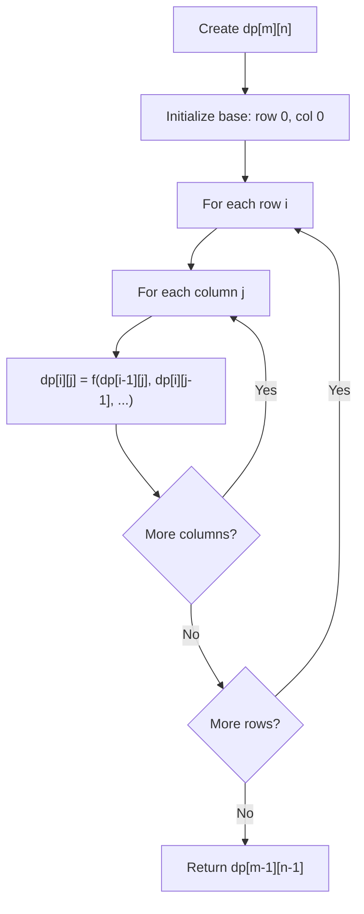
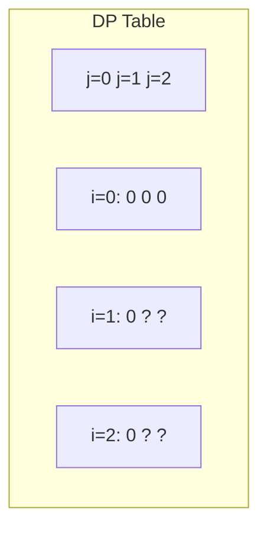
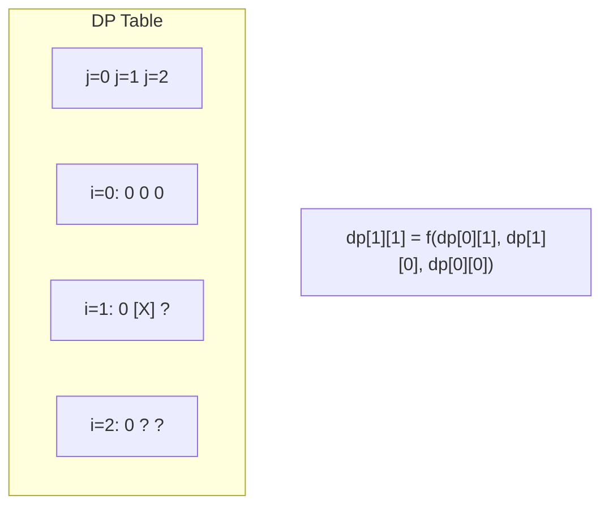
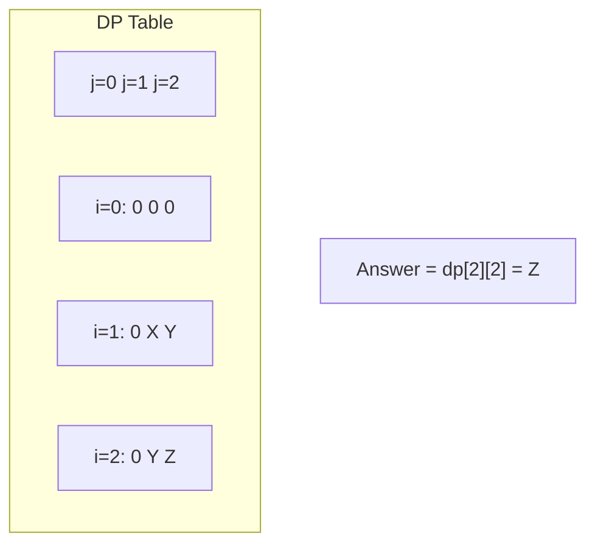

# Problem 2088: Count Fertile Pyramids in a Land

**Difficulty:** Hard  
**Tags:** Array, Dynamic Programming, Matrix  
**Pattern:** Dynamic Programming (2D Grid/Matrix)  
**Link:** [leetcode.com/problems/count-fertile-pyramids-in-a-land](https://leetcode.com/problems/count-fertile-pyramids-in-a-land/)

## Description

A farmer has a **rectangular grid** of land with `m` rows and `n` columns that can be divided into unit cells. Each cell is either **fertile** (represented by a `1`) or **barren** (represented by a `0`). All cells outside the grid are considered barren.

A **pyramidal plot** of land can be defined as a set of cells with the following criteria:

	- The number of cells in the set has to be **greater than **`1` and all cells must be **fertile**.
	- The **apex** of a pyramid is the **topmost** cell of the pyramid. The **height** of a pyramid is the number of rows it covers. Let `(r, c)` be the apex of the pyramid, and its height be `h`. Then, the plot comprises of cells `(i, j)` where `r <= i <= r + h - 1` **and** `c - (i - r) <= j <= c + (i - r)`.

An **inverse pyramidal plot** of land can be defined as a set of cells with similar criteria:

	- The number of cells in the set has to be **greater than **`1` and all cells must be **fertile**.
	- The **apex** of an inverse pyramid is the **bottommost** cell of the inverse pyramid. The **height** of an inverse pyramid is the number of rows it covers. Let `(r, c)` be the apex of the pyramid, and its height be `h`. Then, the plot comprises of cells `(i, j)` where `r - h + 1 <= i <= r` **and** `c - (r - i) <= j <= c + (r - i)`.

Some examples of valid and invalid pyramidal (and inverse pyramidal) plots are shown below. Black cells indicate fertile cells.

Given a **0-indexed** `m x n` binary matrix `grid` representing the farmland, return *the **total number** of pyramidal and inverse pyramidal plots that can be found in* `grid`.

 

Example 1:

```

**Input:** grid = [[0,1,1,0],[1,1,1,1]]
**Output:** 2
**Explanation:** The 2 possible pyramidal plots are shown in blue and red respectively.
There are no inverse pyramidal plots in this grid. 
Hence total number of pyramidal and inverse pyramidal plots is 2 + 0 = 2.

```

Example 2:

```

**Input:** grid = [[1,1,1],[1,1,1]]
**Output:** 2
**Explanation:** The pyramidal plot is shown in blue, and the inverse pyramidal plot is shown in red. 
Hence the total number of plots is 1 + 1 = 2.

```

Example 3:

```

**Input:** grid = [[1,1,1,1,0],[1,1,1,1,1],[1,1,1,1,1],[0,1,0,0,1]]
**Output:** 13
**Explanation:** There are 7 pyramidal plots, 3 of which are shown in the 2nd and 3rd figures.
There are 6 inverse pyramidal plots, 2 of which are shown in the last figure.
The total number of plots is 7 + 6 = 13.

```

 

**Constraints:**

	- `m == grid.length`
	- `n == grid[i].length`
	- `1 <= m, n <= 1000`
	- `1 <= m * n <= 10^5`
	- `grid[i][j]` is either `0` or `1`.

## Approach: Dynamic Programming (2D Grid/Matrix)

Use a 2D DP table where dp[i][j] represents the optimal value for the subproblem defined by rows 0..i and columns 0..j. Fill row by row or column by column.

## Pseudocode

```
1. Create dp[m][n] table
2. Initialize base cases (first row, first column)
3. For i from 1 to m-1:
   For j from 1 to n-1:
     dp[i][j] = recurrence(dp[i-1][j], dp[i][j-1], dp[i-1][j-1])
4. Return dp[m-1][n-1]
```

## Algorithm Flow



## Visual State Transitions

**2D DP Table Build:**

**Frame 1: Initialize borders**


**Frame 2: Fill cell by cell**


**Frame 3: Table complete**



## Complexity Analysis

- **Time:** O(m * n)
- **Space:** O(m * n)

## Solution (Python3)

```python
class Solution:
    def countPyramids(self, grid: List[List[int]]) -> int:
        # Dynamic programming (2D) - O(m*n) time and space
        if not grid:
            return 0
        m, n = len(grid), len(grid[0])
        dp = [[0] * (n + 1) for _ in range(m + 1)]
        for i in range(1, m + 1):
            for j in range(1, n + 1):
                dp[i][j] = max(dp[i-1][j], dp[i][j-1])
                # Add problem-specific transition
        return dp[m][n]
```

## Solution (C++)

```cpp
#include <algorithm>
#include <string>
#include <vector>
using namespace std;

class Solution {
public:
    int countPyramids(vector<vector<int>>& grid) {
        // Dynamic programming (2D) - O(m*n) time and space
        if (grid.empty()) return 0;
        int m = grid.size(), n = grid[0].size();
        vector<vector<int>> dp(m + 1, vector<int>(n + 1, 0));
        for (int i = 1; i <= m; i++) {
            for (int j = 1; j <= n; j++) {
                dp[i][j] = max(dp[i-1][j], dp[i][j-1]);
            }
        }
        return dp[m][n];
    }
};
```
