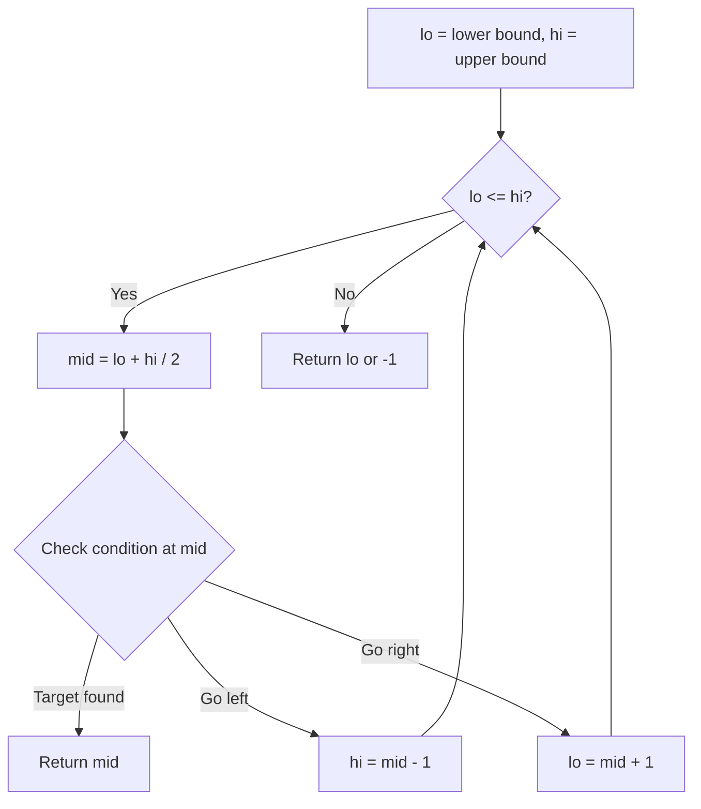
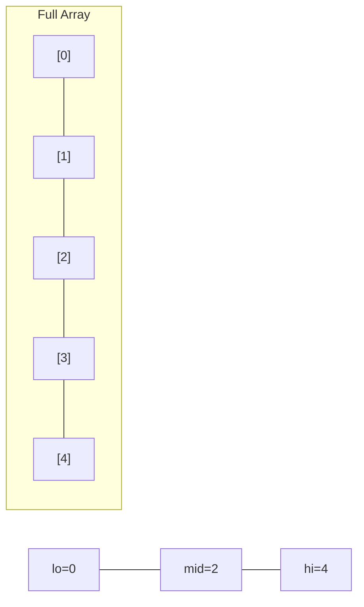
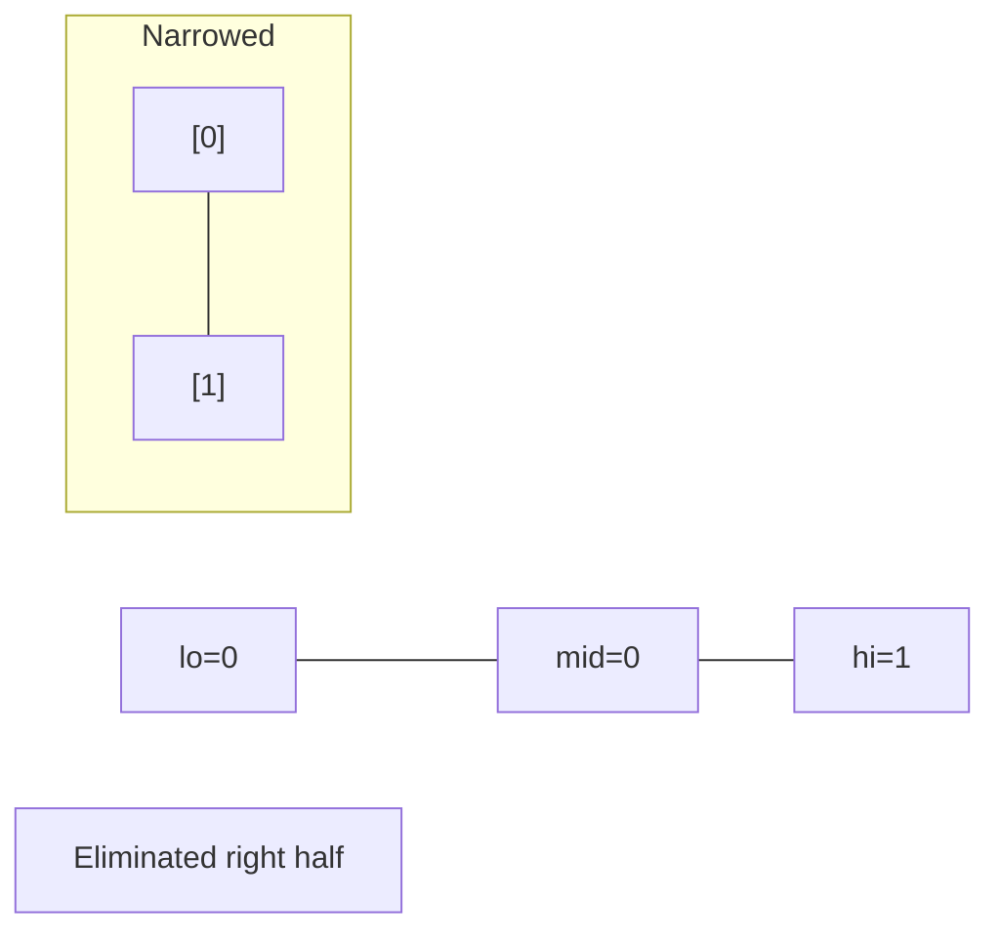
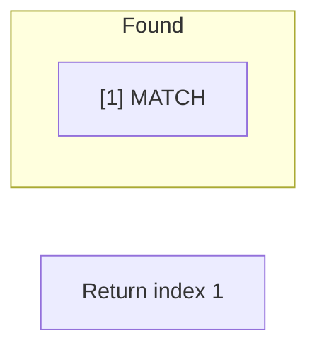

# Problem 2089: Find Target Indices After Sorting Array

**Difficulty:** Easy  
**Tags:** Array, Binary Search, Sorting  
**Pattern:** Binary Search  
**Link:** [leetcode.com/problems/find-target-indices-after-sorting-array](https://leetcode.com/problems/find-target-indices-after-sorting-array/)

## Description

You are given a **0-indexed** integer array `nums` and a target element `target`.

A **target index** is an index `i` such that `nums[i] == target`.

Return *a list of the target indices of* `nums` after* sorting *`nums`* in **non-decreasing** order*. If there are no target indices, return *an **empty** list*. The returned list must be sorted in **increasing** order.

 

Example 1:

```

**Input:** nums = [1,2,5,2,3], target = 2
**Output:** [1,2]
**Explanation:** After sorting, nums is [1,**2**,**2**,3,5].
The indices where nums[i] == 2 are 1 and 2.

```

Example 2:

```

**Input:** nums = [1,2,5,2,3], target = 3
**Output:** [3]
**Explanation:** After sorting, nums is [1,2,2,**3**,5].
The index where nums[i] == 3 is 3.

```

Example 3:

```

**Input:** nums = [1,2,5,2,3], target = 5
**Output:** [4]
**Explanation:** After sorting, nums is [1,2,2,3,**5**].
The index where nums[i] == 5 is 4.

```

 

**Constraints:**

	- `1 <= nums.length <= 100`
	- `1 <= nums[i], target <= 100`

## Approach: Binary Search

Use binary search to halve the search space each iteration. Define the search range [lo, hi], compute mid, and decide which half to keep based on the problem's monotonic condition.

## Pseudocode

```
1. lo = lower_bound, hi = upper_bound
2. While lo <= hi (or lo < hi):
   a. mid = (lo + hi) // 2
   b. If condition(mid) is satisfied: record answer, search left half
   c. Else: search right half
3. Return answer
```

## Algorithm Flow



## Visual State Transitions

**Binary Search Step-by-Step:**

**Frame 1: Initial search space**


**Frame 2: Compare mid, narrow search**


**Frame 3: Found target**



## Complexity Analysis

- **Time:** O(log n)
- **Space:** O(1)

## Solution (Python3)

```python
class Solution:
    def targetIndices(self, nums: List[int], target: int) -> List[int]:
        # Binary search - O(log n) time, O(1) space
        lo, hi = 0, len(nums) - 1
        while lo <= hi:
            mid = lo + (hi - lo) // 2
            if nums[mid] == target:
                return mid
            elif nums[mid] < target:
                lo = mid + 1
            else:
                hi = mid - 1
        return []
```

## Solution (C++)

```cpp
#include <string>
#include <vector>
using namespace std;

class Solution {
public:
    vector<int> targetIndices(vector<int>& nums, int target) {
        // Binary search - O(log n) time, O(1) space
        int lo = 0, hi = nums.size() - 1;
        while (lo <= hi) {
            int mid = lo + (hi - lo) / 2;
            if (nums[mid] == target) {
                return mid;
            } else if (nums[mid] < target) {
                lo = mid + 1;
            } else {
                hi = mid - 1;
            }
        }
        return {};
    }
};
```
