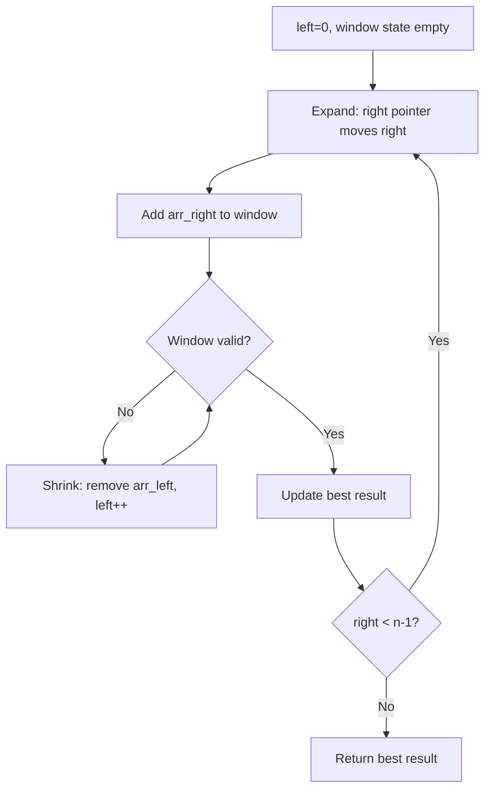
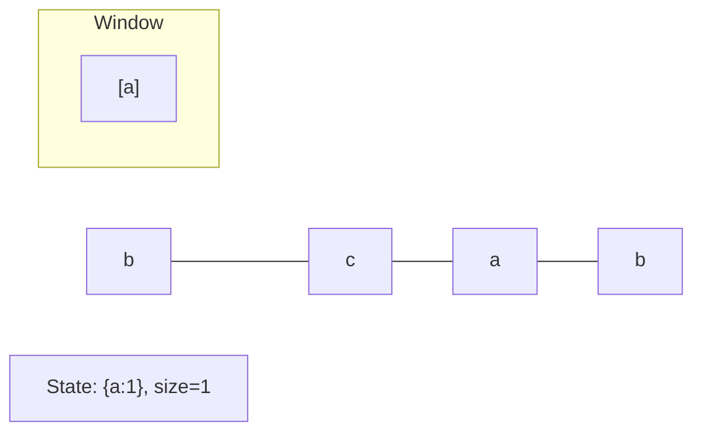
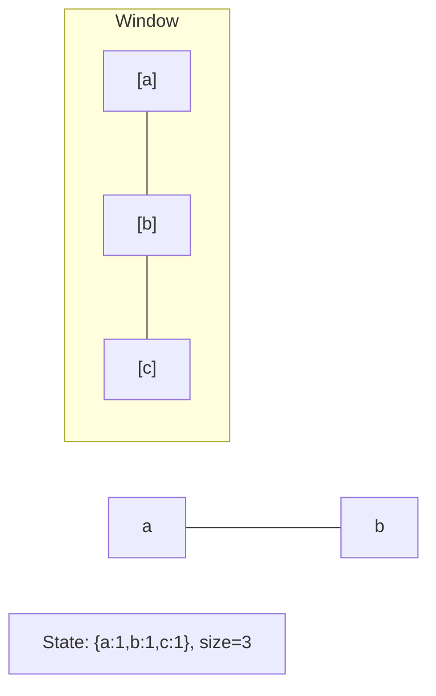
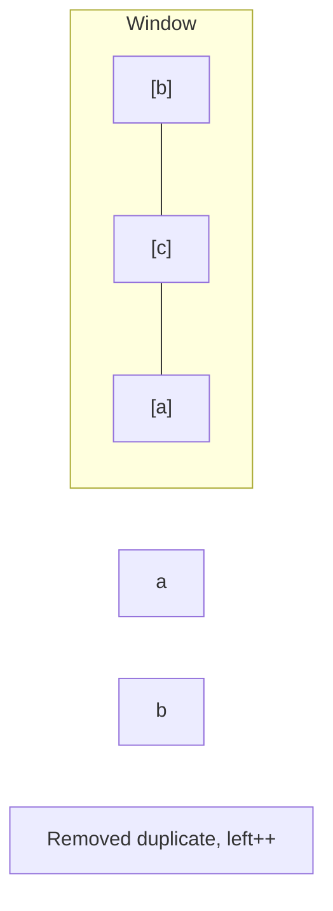
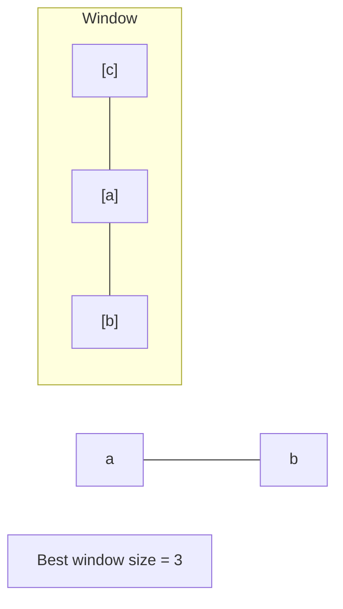

# Problem 2090: K Radius Subarray Averages

**Difficulty:** Medium  
**Tags:** Array, Sliding Window  
**Pattern:** Sliding Window  
**Link:** [leetcode.com/problems/k-radius-subarray-averages](https://leetcode.com/problems/k-radius-subarray-averages/)

## Description

You are given a **0-indexed** array `nums` of `n` integers, and an integer `k`.

The **k-radius average** for a subarray of `nums` **centered** at some index `i` with the **radius** `k` is the average of **all** elements in `nums` between the indices `i - k` and `i + k` (**inclusive**). If there are less than `k` elements before **or** after the index `i`, then the **k-radius average** is `-1`.

Build and return *an array *`avgs`* of length *`n`* where *`avgs[i]`* is the **k-radius average** for the subarray centered at index *`i`.

The **average** of `x` elements is the sum of the `x` elements divided by `x`, using **integer division**. The integer division truncates toward zero, which means losing its fractional part.

	- For example, the average of four elements `2`, `3`, `1`, and `5` is `(2 + 3 + 1 + 5) / 4 = 11 / 4 = 2.75`, which truncates to `2`.

 

Example 1:

```

**Input:** nums = [7,4,3,9,1,8,5,2,6], k = 3
**Output:** [-1,-1,-1,5,4,4,-1,-1,-1]
**Explanation:**
- avg[0], avg[1], and avg[2] are -1 because there are less than k elements **before** each index.
- The sum of the subarray centered at index 3 with radius 3 is: 7 + 4 + 3 + 9 + 1 + 8 + 5 = 37.
  Using **integer division**, avg[3] = 37 / 7 = 5.
- For the subarray centered at index 4, avg[4] = (4 + 3 + 9 + 1 + 8 + 5 + 2) / 7 = 4.
- For the subarray centered at index 5, avg[5] = (3 + 9 + 1 + 8 + 5 + 2 + 6) / 7 = 4.
- avg[6], avg[7], and avg[8] are -1 because there are less than k elements **after** each index.

```

Example 2:

```

**Input:** nums = [100000], k = 0
**Output:** [100000]
**Explanation:**
- The sum of the subarray centered at index 0 with radius 0 is: 100000.
  avg[0] = 100000 / 1 = 100000.

```

Example 3:

```

**Input:** nums = [8], k = 100000
**Output:** [-1]
**Explanation:** 
- avg[0] is -1 because there are less than k elements before and after index 0.

```

 

**Constraints:**

	- `n == nums.length`
	- `1 <= n <= 10^5`
	- `0 <= nums[i], k <= 10^5`

## Approach: Sliding Window

Maintain a window over the data using two pointers. Expand the right boundary to include new elements, and shrink the left boundary when the window constraint is violated. Track the optimal window.

## Pseudocode

```
1. Initialize left = 0, result = initial_value
2. For right in range(n):
   a. Add element at right to window state
   b. While window is invalid:
      - Remove element at left from window state
      - left++
   c. Update result = best of (result, window size/value)
3. Return result
```

## Algorithm Flow



## Visual State Transitions

**Sliding Window Step-by-Step:**

**Frame 1: Initial window (left=0, right=0)**


**Frame 2: Expand right (right=2)**


**Frame 3: Violation - shrink left**


**Frame 4: Continue expanding**



## Complexity Analysis

- **Time:** O(n)
- **Space:** O(k)

## Solution (Python3)

```python
class Solution:
    def getAverages(self, nums: List[int], k: int) -> List[int]:
        # Sliding window approach - O(n) time, O(k) space
        from collections import defaultdict
        window = defaultdict(int)
        left = 0
        result = 0
        for right in range(len(nums)):
            window[nums[right]] += 1
            while len(window) > (k if isinstance(k, int) else len(nums)):
                window[nums[left]] -= 1
                if window[nums[left]] == 0:
                    del window[nums[left]]
                left += 1
            result = max(result, right - left + 1)
        return result
```

## Solution (C++)

```cpp
#include <algorithm>
#include <string>
#include <unordered_map>
#include <vector>
using namespace std;

class Solution {
public:
    vector<int> getAverages(vector<int>& nums, int k) {
        // Sliding window approach - O(n) time, O(k) space
        unordered_map<char, int> window;
        int left = 0, result = 0;
        for (int right = 0; right < nums.size(); right++) {
            window[nums[right]]++;
            while ((int)window.size() > k) {
                window[nums[left]]--;
                if (window[nums[left]] == 0)
                    window.erase(nums[left]);
                left++;
            }
            result = max(result, right - left + 1);
        }
        return result;
    }
};
```
