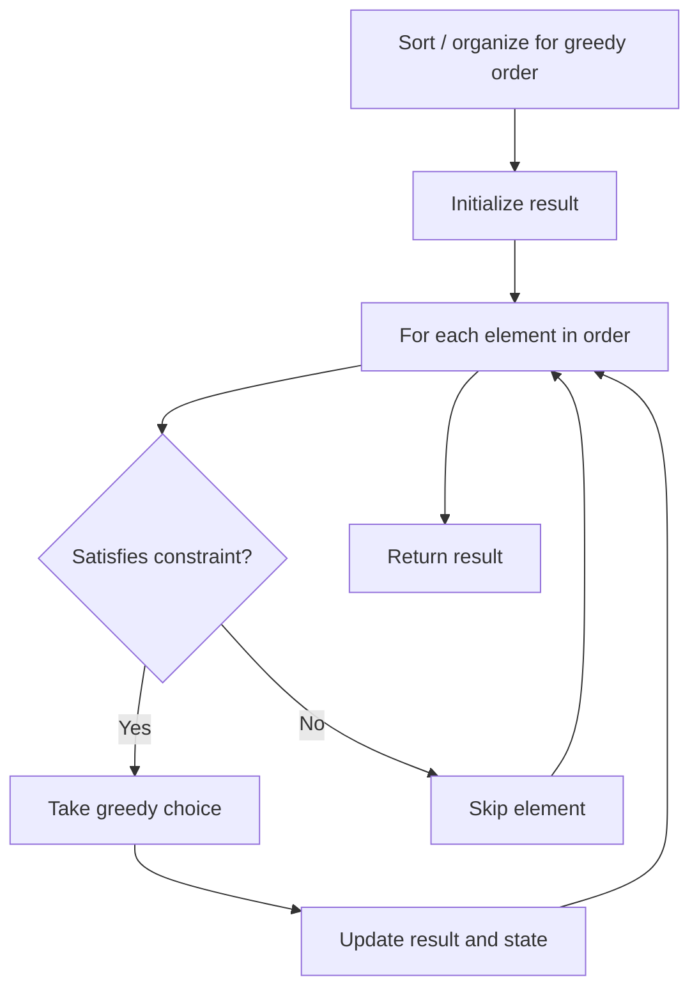

# Problem 2091: Removing Minimum and Maximum From Array

**Difficulty:** Medium  
**Tags:** Array, Greedy  
**Pattern:** Greedy  
**Link:** [leetcode.com/problems/removing-minimum-and-maximum-from-array](https://leetcode.com/problems/removing-minimum-and-maximum-from-array/)

## Description

You are given a **0-indexed** array of **distinct** integers `nums`.

There is an element in `nums` that has the **lowest** value and an element that has the **highest** value. We call them the **minimum** and **maximum** respectively. Your goal is to remove **both** these elements from the array.

A **deletion** is defined as either removing an element from the **front** of the array or removing an element from the **back** of the array.

Return *the **minimum** number of deletions it would take to remove **both** the minimum and maximum element from the array.*

 

Example 1:

```

**Input:** nums = [2,**10**,7,5,4,**1**,8,6]
**Output:** 5
**Explanation:** 
The minimum element in the array is nums[5], which is 1.
The maximum element in the array is nums[1], which is 10.
We can remove both the minimum and maximum by removing 2 elements from the front and 3 elements from the back.
This results in 2 + 3 = 5 deletions, which is the minimum number possible.

```

Example 2:

```

**Input:** nums = [0,**-4**,**19**,1,8,-2,-3,5]
**Output:** 3
**Explanation:** 
The minimum element in the array is nums[1], which is -4.
The maximum element in the array is nums[2], which is 19.
We can remove both the minimum and maximum by removing 3 elements from the front.
This results in only 3 deletions, which is the minimum number possible.

```

Example 3:

```

**Input:** nums = [**101**]
**Output:** 1
**Explanation:**  
There is only one element in the array, which makes it both the minimum and maximum element.
We can remove it with 1 deletion.

```

 

**Constraints:**

	- `1 <= nums.length <= 10^5`
	- `-10^5 <= nums[i] <= 10^5`
	- The integers in `nums` are **distinct**.

## Approach: Greedy

Make the locally optimal choice at each step, trusting it leads to a global optimum. Greedy works when the problem has the greedy-choice property and optimal substructure.

## Pseudocode

```
1. Sort or organize data for greedy ordering
2. Initialize result
3. For each element in greedy order:
   a. If element satisfies constraint:
      - Take the greedy choice
      - Update result and state
4. Return result
```

## Algorithm Flow



## Complexity Analysis

- **Time:** O(n log n)
- **Space:** O(1)

## Solution (Python3)

```python
class Solution:
    def minimumDeletions(self, nums: List[int]) -> int:
        # Greedy approach - O(n) time
        result = 0
        curr_max = 0
        for i in range(len(nums)):
            if isinstance(nums[i], int):
                curr_max = max(curr_max, nums[i])
                result = max(result, curr_max)
            else:
                result += 1
        return result
```

## Solution (C++)

```cpp
#include <algorithm>
#include <string>
#include <vector>
using namespace std;

class Solution {
public:
    int minimumDeletions(vector<int>& nums) {
        // Greedy approach - O(n) time
        int result = 0, curr_max = 0;
        for (int i = 0; i < (int)nums.size(); i++) {
            curr_max = max(curr_max, nums[i]);
            result = max(result, curr_max);
        }
        return result;
    }
};
```
