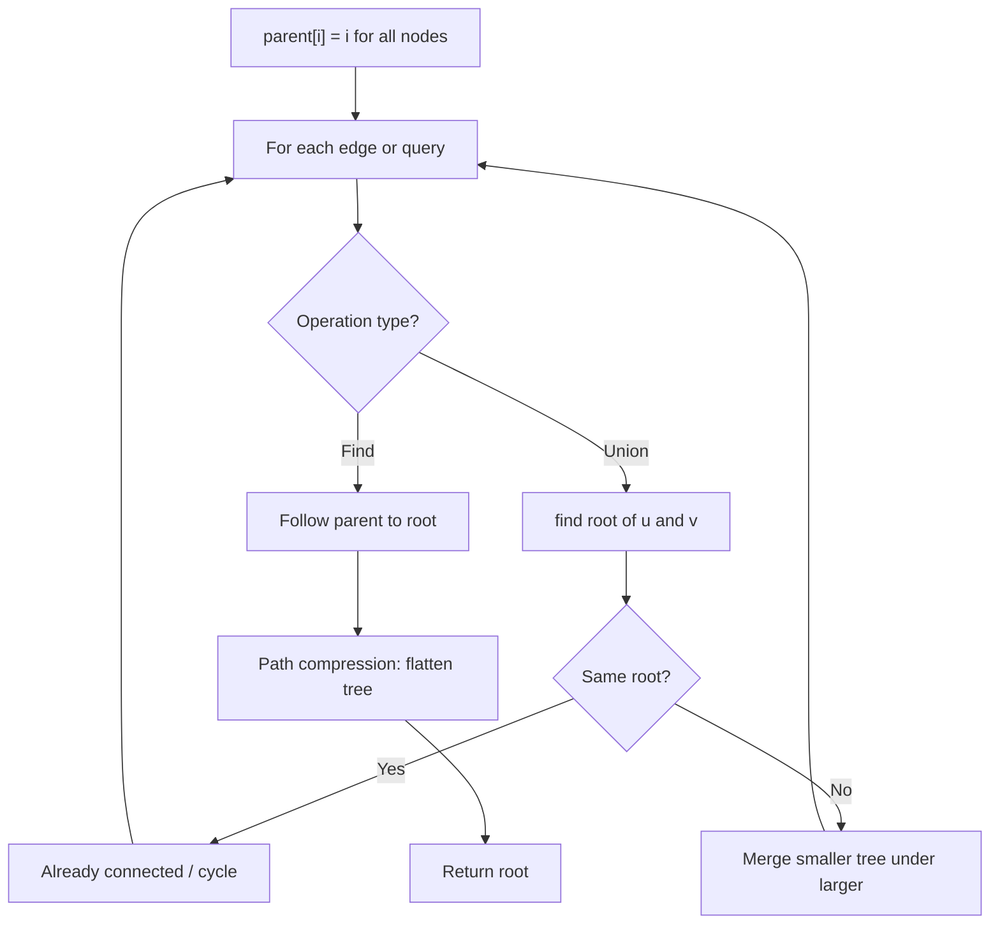
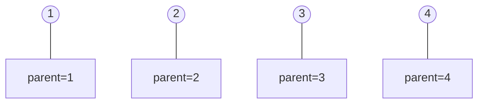
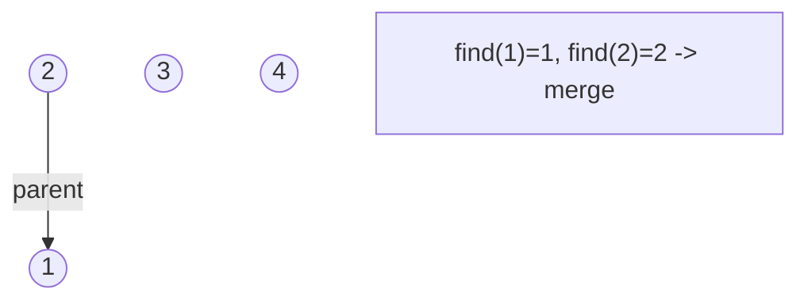
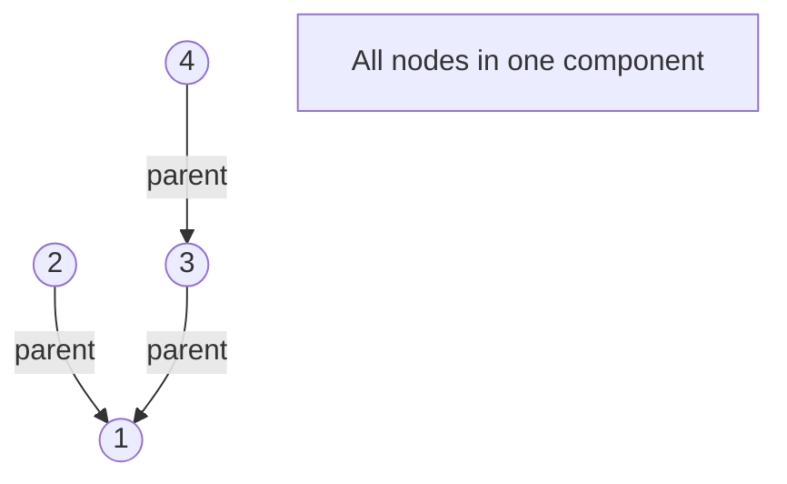
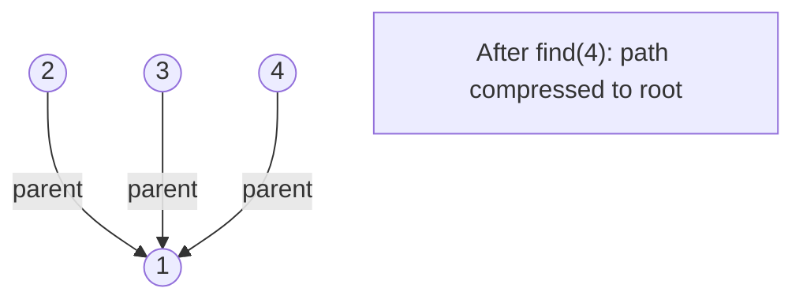

# Problem 2092: Find All People With Secret

**Difficulty:** Hard  
**Tags:** Depth-First Search, Breadth-First Search, Union-Find, Graph Theory, Sorting  
**Pattern:** Union-Find / Disjoint Set  
**Link:** [leetcode.com/problems/find-all-people-with-secret](https://leetcode.com/problems/find-all-people-with-secret/)

## Description

You are given an integer `n` indicating there are `n` people numbered from `0` to `n - 1`. You are also given a **0-indexed** 2D integer array `meetings` where `meetings[i] = [xi, yi, timei]` indicates that person `xi` and person `yi` have a meeting at `timei`. A person may attend **multiple meetings** at the same time. Finally, you are given an integer `firstPerson`.

Person `0` has a **secret** and initially shares the secret with a person `firstPerson` at time `0`. This secret is then shared every time a meeting takes place with a person that has the secret. More formally, for every meeting, if a person `xi` has the secret at `timei`, then they will share the secret with person `yi`, and vice versa.

The secrets are shared **instantaneously**. That is, a person may receive the secret and share it with people in other meetings within the same time frame.

Return *a list of all the people that have the secret after all the meetings have taken place. *You may return the answer in **any order**.

 

Example 1:

```

**Input:** n = 6, meetings = [[1,2,5],[2,3,8],[1,5,10]], firstPerson = 1
**Output:** [0,1,2,3,5]
Explanation:
At time 0, person 0 shares the secret with person 1.
At time 5, person 1 shares the secret with person 2.
At time 8, person 2 shares the secret with person 3.
At time 10, person 1 shares the secret with person 5.​​​​
Thus, people 0, 1, 2, 3, and 5 know the secret after all the meetings.

```

Example 2:

```

**Input:** n = 4, meetings = [[3,1,3],[1,2,2],[0,3,3]], firstPerson = 3
**Output:** [0,1,3]
**Explanation:**
At time 0, person 0 shares the secret with person 3.
At time 2, neither person 1 nor person 2 know the secret.
At time 3, person 3 shares the secret with person 0 and person 1.
Thus, people 0, 1, and 3 know the secret after all the meetings.

```

Example 3:

```

**Input:** n = 5, meetings = [[3,4,2],[1,2,1],[2,3,1]], firstPerson = 1
**Output:** [0,1,2,3,4]
**Explanation:**
At time 0, person 0 shares the secret with person 1.
At time 1, person 1 shares the secret with person 2, and person 2 shares the secret with person 3.
Note that person 2 can share the secret at the same time as receiving it.
At time 2, person 3 shares the secret with person 4.
Thus, people 0, 1, 2, 3, and 4 know the secret after all the meetings.

```

 

**Constraints:**

	- `2 <= n <= 10^5`
	- `1 <= meetings.length <= 10^5`
	- `meetings[i].length == 3`
	- `0 <= xi, yi <= n - 1`
	- `xi != yi`
	- `1 <= timei <= 10^5`
	- `1 <= firstPerson <= n - 1`

## Approach: Union-Find / Disjoint Set

Use Union-Find with path compression and union by rank to efficiently manage connected components. Find(x) returns the root of x's component; Union(x,y) merges two components.

## Pseudocode

```
1. parent[i] = i for all nodes (each is its own set)
2. find(x): follow parent pointers to root (with path compression)
3. union(x, y): merge sets of x and y by rank
4. Process edges/operations:
   a. For each edge (u, v): union(u, v)
5. Answer queries using find()
```

## Algorithm Flow



## Visual State Transitions

**Union-Find Step-by-Step:**

**Frame 1: Initial - each node is own parent**


**Frame 2: Union(1,2) - merge components**


**Frame 3: Union(3,4) then Union(2,3)**


**Frame 4: Path compression on find(4)**



## Complexity Analysis

- **Time:** O(n * alpha(n))
- **Space:** O(n)

## Solution (Python3)

```python
class Solution:
    def findAllPeople(self, n: int, meetings: List[List[int]], firstPerson: int) -> List[int]:
        # Union Find (Disjoint Set Union) - O(n * alpha(n))
        parent = list(range(len(n) + 1 if isinstance(n, list) else n + 1))
        rank = [0] * len(parent)
        
        def find(x):
            if parent[x] != x:
                parent[x] = find(parent[x])
            return parent[x]
        
        def union(x, y):
            px, py = find(x), find(y)
            if px == py:
                return False
            if rank[px] < rank[py]:
                px, py = py, px
            parent[py] = px
            if rank[px] == rank[py]:
                rank[px] += 1
            return True
        
        components = len(parent)
        # Process edges/connections
        return components
```

## Solution (C++)

```cpp
#include <functional>
#include <numeric>
#include <string>
#include <vector>
using namespace std;

class Solution {
public:
    vector<int> findAllPeople(int n, vector<vector<int>>& meetings, int firstPerson) {
        // Union Find (DSU) - O(n * alpha(n))
        int n = n.size();
        vector<int> parent(n + 1), rnk(n + 1, 0);
        iota(parent.begin(), parent.end(), 0);
        function<int(int)> find = [&](int x) -> int {
            return parent[x] == x ? x : parent[x] = find(parent[x]);
        };
        auto unite = [&](int x, int y) -> bool {
            int px = find(x), py = find(y);
            if (px == py) return false;
            if (rnk[px] < rnk[py]) swap(px, py);
            parent[py] = px;
            if (rnk[px] == rnk[py]) rnk[px]++;
            return true;
        };
        int components = n;
        return components;
    }
};
```
