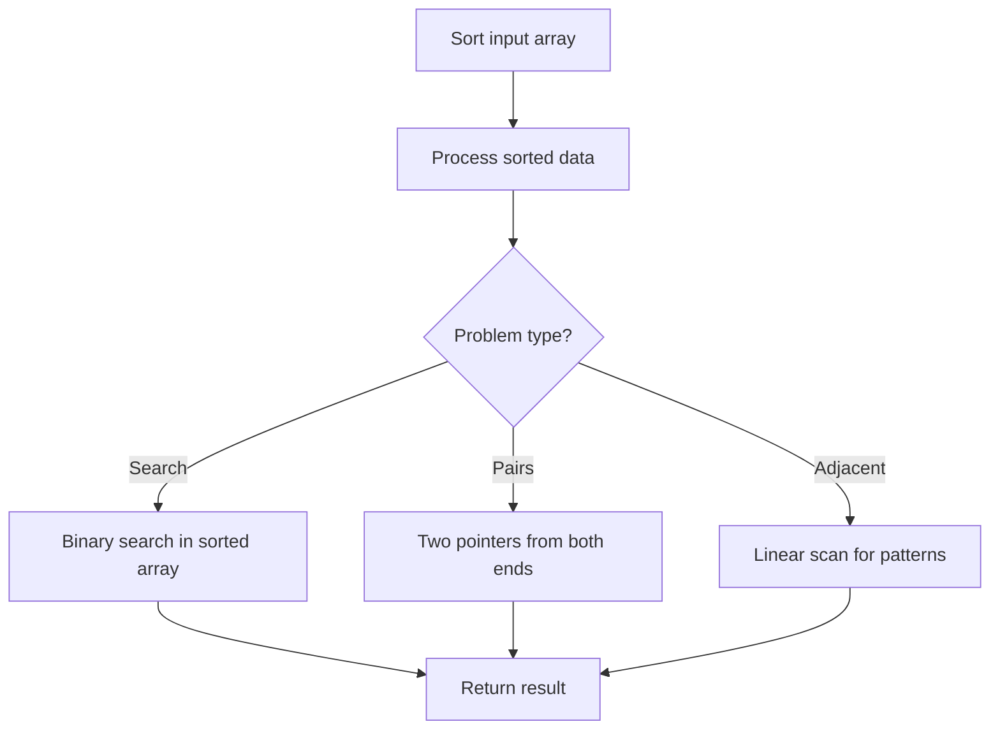

# Problem 2094: Finding 3-Digit Even Numbers

**Difficulty:** Easy  
**Tags:** Array, Hash Table, Recursion, Sorting, Enumeration  
**Pattern:** Sorting  
**Link:** [leetcode.com/problems/finding-3-digit-even-numbers](https://leetcode.com/problems/finding-3-digit-even-numbers/)

## Description

You are given an integer array `digits`, where each element is a digit. The array may contain duplicates.

You need to find **all** the **unique** integers that follow the given requirements:

	- The integer consists of the **concatenation** of **three** elements from `digits` in **any** arbitrary order.
	- The integer does not have **leading zeros**.
	- The integer is **even**.

For example, if the given `digits` were `[1, 2, 3]`, integers `132` and `312` follow the requirements.

Return *a **sorted** array of the unique integers.*

 

Example 1:

```

**Input:** digits = [2,1,3,0]
**Output:** [102,120,130,132,210,230,302,310,312,320]
**Explanation:** All the possible integers that follow the requirements are in the output array. 
Notice that there are no **odd** integers or integers with **leading zeros**.

```

Example 2:

```

**Input:** digits = [2,2,8,8,2]
**Output:** [222,228,282,288,822,828,882]
**Explanation:** The same digit can be used as many times as it appears in digits. 
In this example, the digit 8 is used twice each time in 288, 828, and 882. 

```

Example 3:

```

**Input:** digits = [3,7,5]
**Output:** []
**Explanation:** No **even** integers can be formed using the given digits.

```

 

**Constraints:**

	- `3 <= digits.length <= 100`
	- `0 <= digits[i] <= 9`

## Approach: Sorting

Sort the data to enable efficient processing. After sorting, use techniques like binary search, two pointers, or linear scan to solve the problem.

## Pseudocode

```
1. Sort the input array
2. Process sorted data:
   - Use binary search for lookups
   - Use two pointers for pair finding
   - Scan for adjacent patterns
3. Return result
```

## Algorithm Flow



## Complexity Analysis

- **Time:** O(n log n)
- **Space:** O(n)

## Solution (Python3)

```python
class Solution:
    def findEvenNumbers(self, digits: List[int]) -> List[int]:
        # Sort-based approach - O(n log n) time
        digits.sort(key=lambda x: x[0] if isinstance(x, (list, tuple)) else x)
        result = [digits[0]]
        for i in range(1, len(digits)):
            curr = digits[i]
            if isinstance(curr, (list, tuple)) and isinstance(result[-1], (list, tuple)):
                if curr[0] <= result[-1][1]:
                    result[-1] = [result[-1][0], max(result[-1][1], curr[1])]
                else:
                    result.append(curr)
            else:
                result.append(curr)
        return result
```

## Solution (C++)

```cpp
#include <algorithm>
#include <string>
#include <vector>
using namespace std;

class Solution {
public:
    vector<int> findEvenNumbers(vector<int>& digits) {
        // Sort-based approach - O(n log n) time
        sort(digits.begin(), digits.end());
        vector<vector<int>> result;
        result.push_back(digits[0]);
        for (int i = 1; i < (int)digits.size(); i++) {
            if (digits[i][0] <= result.back()[1]) {
                result.back()[1] = max(result.back()[1], digits[i][1]);
            } else {
                result.push_back(digits[i]);
            }
        }
        return result;
    }
};
```
