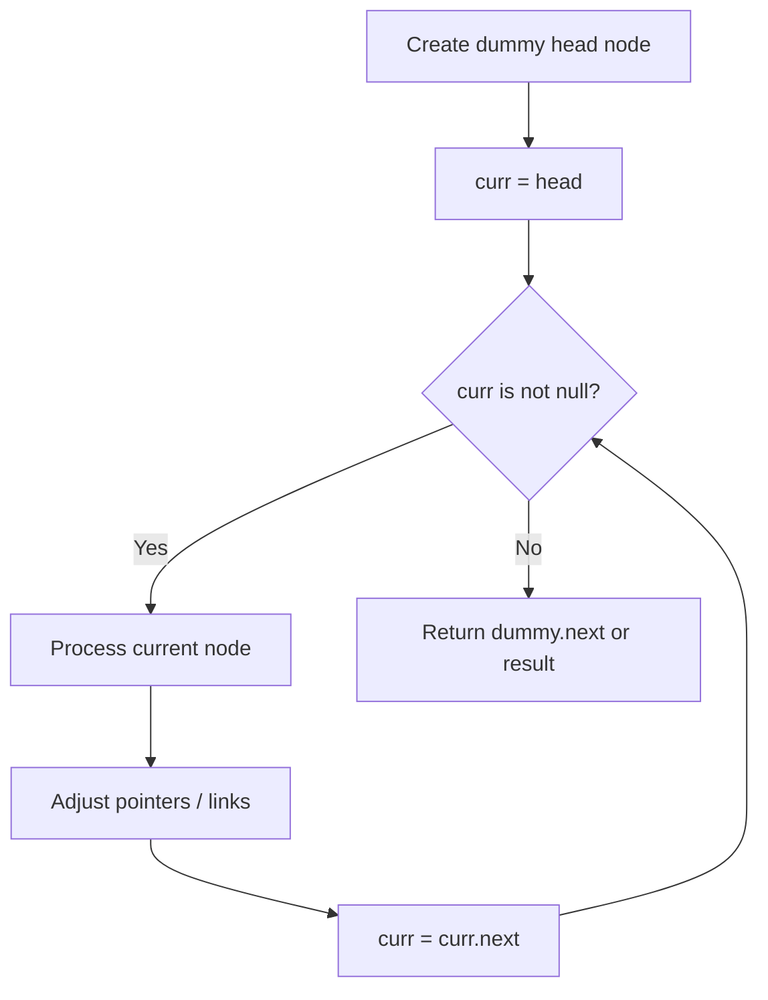
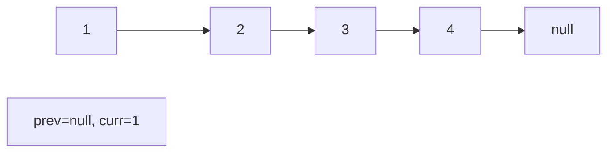
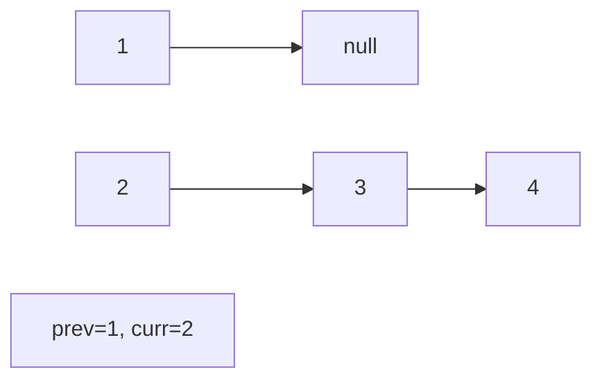
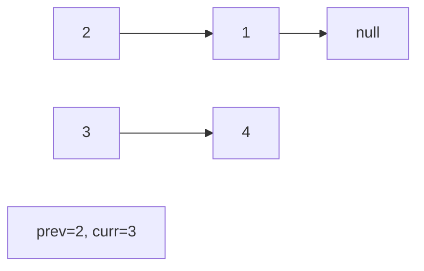
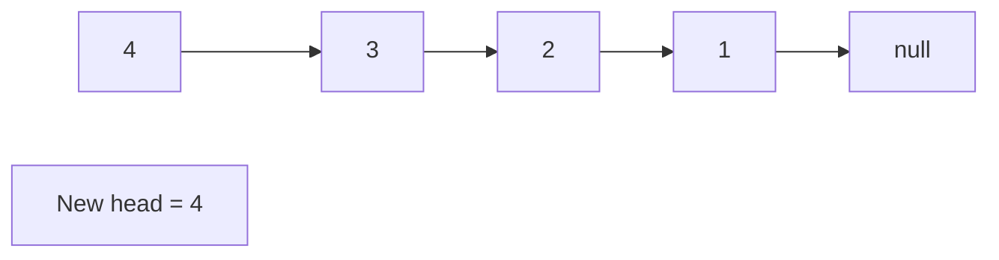

# Problem 2095: Delete the Middle Node of a Linked List

**Difficulty:** Medium  
**Tags:** Linked List, Two Pointers  
**Pattern:** Linked List / Fast-Slow Pointers  
**Link:** [leetcode.com/problems/delete-the-middle-node-of-a-linked-list](https://leetcode.com/problems/delete-the-middle-node-of-a-linked-list/)

## Description

You are given the `head` of a linked list. **Delete** the **middle node**, and return *the* `head` *of the modified linked list*.

The **middle node** of a linked list of size `n` is the `⌊n / 2⌋^th` node from the **start** using **0-based indexing**, where `⌊x⌋` denotes the largest integer less than or equal to `x`.

	- For `n` = `1`, `2`, `3`, `4`, and `5`, the middle nodes are `0`, `1`, `1`, `2`, and `2`, respectively.

 

Example 1:

```

**Input:** head = [1,3,4,7,1,2,6]
**Output:** [1,3,4,1,2,6]
**Explanation:**
The above figure represents the given linked list. The indices of the nodes are written below.
Since n = 7, node 3 with value 7 is the middle node, which is marked in red.
We return the new list after removing this node. 

```

Example 2:

```

**Input:** head = [1,2,3,4]
**Output:** [1,2,4]
**Explanation:**
The above figure represents the given linked list.
For n = 4, node 2 with value 3 is the middle node, which is marked in red.

```

Example 3:

```

**Input:** head = [2,1]
**Output:** [2]
**Explanation:**
The above figure represents the given linked list.
For n = 2, node 1 with value 1 is the middle node, which is marked in red.
Node 0 with value 2 is the only node remaining after removing node 1.
```

 

**Constraints:**

	- The number of nodes in the list is in the range `[1, 10^5]`.
	- `1 <= Node.val <= 10^5`

## Approach: Linked List / Fast-Slow Pointers

Fast pointer starts 2 ahead. When fast reaches end, slow is before middle. Delete slow.next.

## Pseudocode

```
1. Create dummy head if needed
2. Initialize pointer(s) at head
3. Traverse / modify list:
   a. Process current node
   b. Adjust next pointers as needed
   c. Move to next node
4. Return dummy.next or result
```

## Algorithm Flow



## Visual State Transitions

**Linked List Operation (Reverse):**

**Frame 1: Initial list**


**Frame 2: Reverse first link**


**Frame 3: Reverse second link**


**Frame 4: Fully reversed**



## Complexity Analysis

- **Time:** O(n)
- **Space:** O(1)

## Solution (Python3)

```python
class Solution:
    def deleteMiddle(self, head):
        if not head.next:
            return None
        slow = head
        fast = head.next.next
        while fast and fast.next:
            slow = slow.next
            fast = fast.next.next
        slow.next = slow.next.next
        return head
```

## Solution (C++)

```cpp
#include <string>
#include <vector>
using namespace std;

class Solution {
public:
    ListNode* deleteMiddle(ListNode* head) {
        // Linked list traversal/manipulation
        ListNode dummy(0);
        dummy.next = head;
        ListNode* prev = &dummy;
        ListNode* curr = head;
        while (curr) {
            ListNode* nxt = curr->next;
            // Process current node
            prev = curr;
            curr = nxt;
        }
        return dummy.next;
    }
};
```
