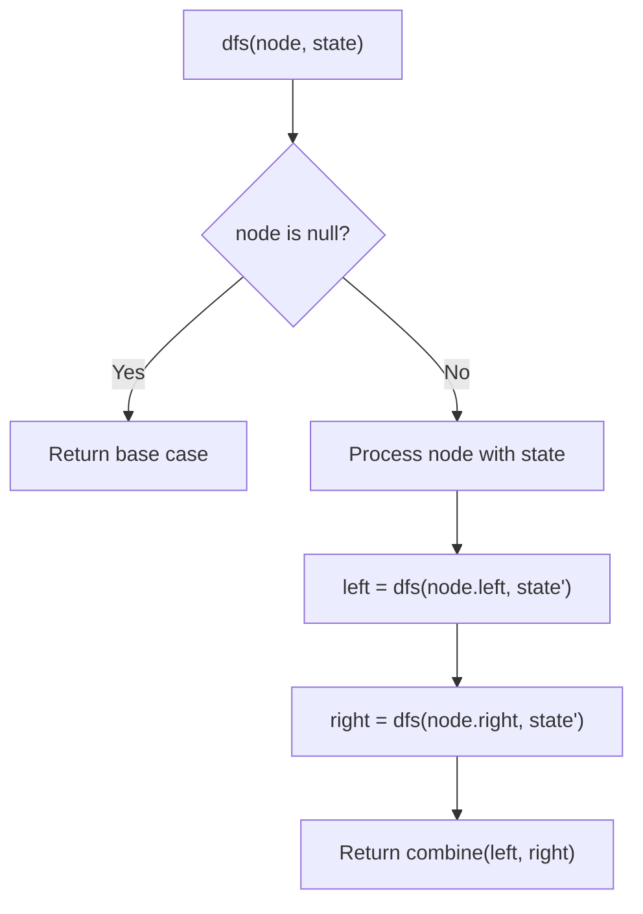
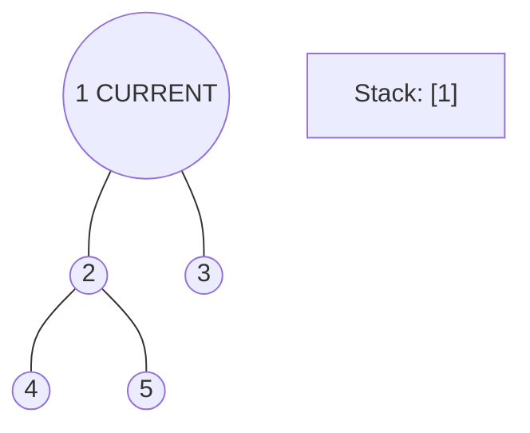
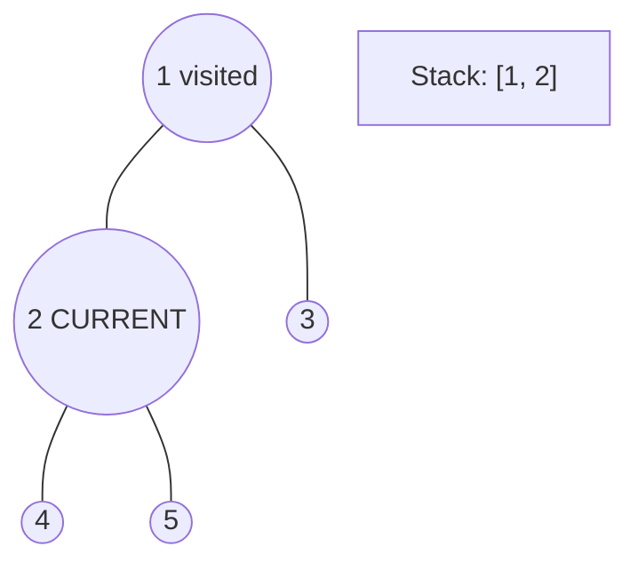
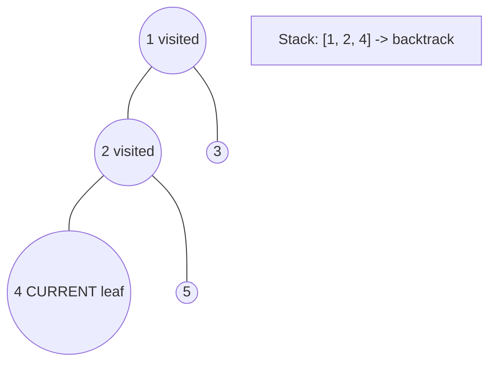
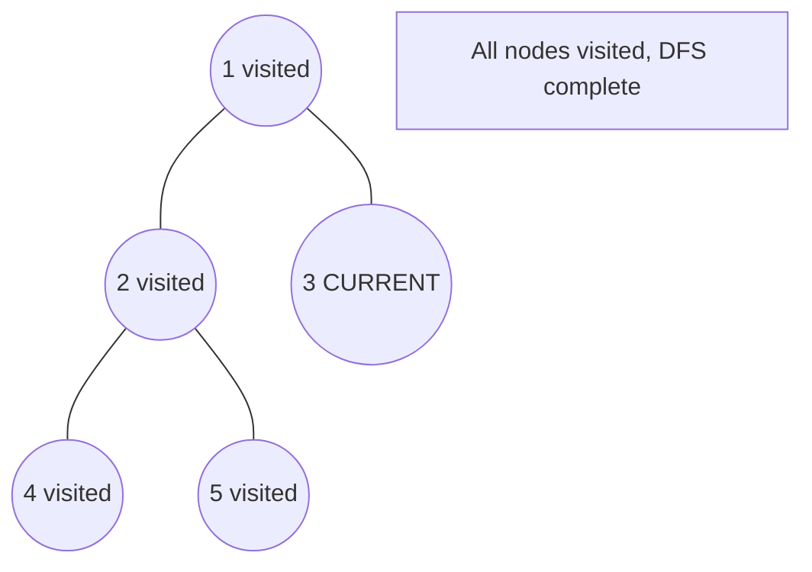

# Problem 2096: Step-By-Step Directions From a Binary Tree Node to Another

**Difficulty:** Medium  
**Tags:** String, Tree, Depth-First Search, Binary Tree  
**Pattern:** DFS Tree Traversal  
**Link:** [leetcode.com/problems/step-by-step-directions-from-a-binary-tree-node-to-another](https://leetcode.com/problems/step-by-step-directions-from-a-binary-tree-node-to-another/)

## Description

You are given the `root` of a **binary tree** with `n` nodes. Each node is uniquely assigned a value from `1` to `n`. You are also given an integer `startValue` representing the value of the start node `s`, and a different integer `destValue` representing the value of the destination node `t`.

Find the **shortest path** starting from node `s` and ending at node `t`. Generate step-by-step directions of such path as a string consisting of only the **uppercase** letters `'L'`, `'R'`, and `'U'`. Each letter indicates a specific direction:

	- `'L'` means to go from a node to its **left child** node.
	- `'R'` means to go from a node to its **right child** node.
	- `'U'` means to go from a node to its **parent** node.

Return *the step-by-step directions of the **shortest path** from node *`s`* to node* `t`.

 

Example 1:

```

**Input:** root = [5,1,2,3,null,6,4], startValue = 3, destValue = 6
**Output:** "UURL"
**Explanation:** The shortest path is: 3 → 1 → 5 → 2 → 6.

```

Example 2:

```

**Input:** root = [2,1], startValue = 2, destValue = 1
**Output:** "L"
**Explanation:** The shortest path is: 2 → 1.

```

 

**Constraints:**

	- The number of nodes in the tree is `n`.
	- `2 <= n <= 10^5`
	- `1 <= Node.val <= n`
	- All the values in the tree are **unique**.
	- `1 <= startValue, destValue <= n`
	- `startValue != destValue`

## Approach: DFS Tree Traversal

Perform depth-first search on the tree. Recurse on left and right subtrees, combining results bottom-up. Track state (path, depth, sum) during traversal.

## Pseudocode

```
1. Define dfs(node, state):
   a. Base case: if null, return default
   b. Process node with current state
   c. left_result = dfs(node.left, updated_state)
   d. right_result = dfs(node.right, updated_state)
   e. Return combine(left_result, right_result)
2. Return dfs(root, initial_state)
```

## Algorithm Flow



## Visual State Transitions

**DFS Tree Traversal Step-by-Step:**

**Frame 1: Start at root**


**Frame 2: Go left - visit node 2**


**Frame 3: Go left - visit node 4 (leaf)**


**Frame 4: Backtrack, visit node 5, then node 3**



## Complexity Analysis

- **Time:** O(n)
- **Space:** O(h)

## Solution (Python3)

```python
class Solution:
    def getDirections(self, root: Optional[TreeNode], startValue: int, destValue: int) -> str:
        # DFS on binary tree - O(n) time, O(h) space
        def dfs(node):
            if not node:
                return 0
            left = dfs(node.left)
            right = dfs(node.right)
            return 1 + max(left, right)
        
        result = dfs(root)
        return result
```

## Solution (C++)

```cpp
#include <algorithm>
#include <functional>
#include <string>
#include <vector>
using namespace std;

class Solution {
public:
    string getDirections(TreeNode* root, int startValue, int destValue) {
        // DFS on binary tree - O(n) time, O(h) space
        function<int(TreeNode*)> dfs = [&](TreeNode* node) -> int {
            if (!node) return 0;
            int left = dfs(node->left);
            int right = dfs(node->right);
            return 1 + max(left, right);
        };
        return dfs(root);
    }
};
```
