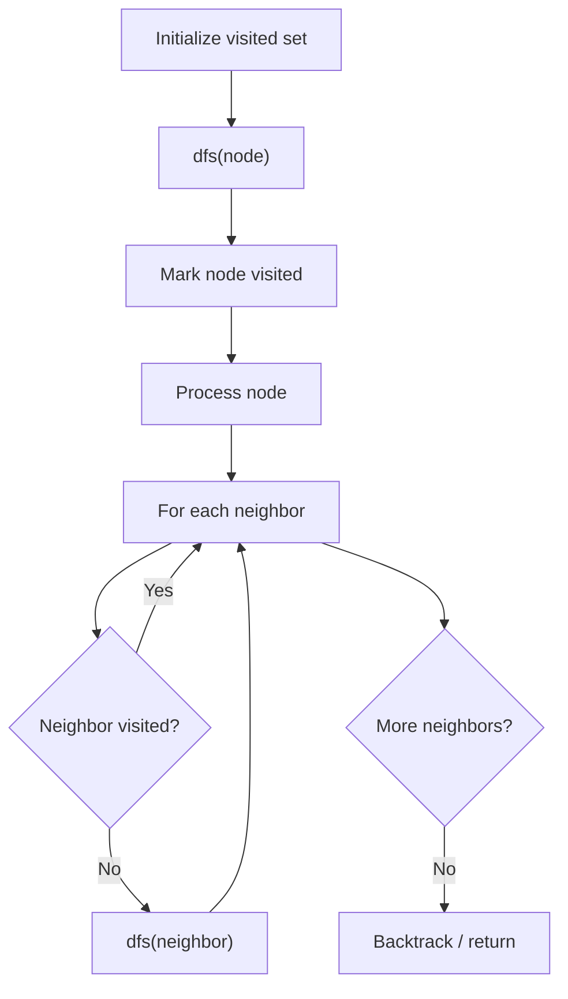

# Problem 2097: Valid Arrangement of Pairs

**Difficulty:** Hard  
**Tags:** Array, Depth-First Search, Graph Theory, Eulerian Circuit  
**Pattern:** DFS Graph Traversal  
**Link:** [leetcode.com/problems/valid-arrangement-of-pairs](https://leetcode.com/problems/valid-arrangement-of-pairs/)

## Description

You are given a **0-indexed** 2D integer array `pairs` where `pairs[i] = [starti, endi]`. An arrangement of `pairs` is **valid** if for every index `i` where `1 <= i < pairs.length`, we have `endi-1 == starti`.

Return ***any** valid arrangement of *`pairs`.

**Note:** The inputs will be generated such that there exists a valid arrangement of `pairs`.

 

Example 1:

```

**Input:** pairs = [[5,1],[4,5],[11,9],[9,4]]
**Output:** [[11,9],[9,4],[4,5],[5,1]]
Explanation:
This is a valid arrangement since endi-1 always equals starti.
end0 = 9 == 9 = start1 
end1 = 4 == 4 = start2
end2 = 5 == 5 = start3

```

Example 2:

```

**Input:** pairs = [[1,3],[3,2],[2,1]]
**Output:** [[1,3],[3,2],[2,1]]
**Explanation:**
This is a valid arrangement since endi-1 always equals starti.
end0 = 3 == 3 = start1
end1 = 2 == 2 = start2
The arrangements [[2,1],[1,3],[3,2]] and [[3,2],[2,1],[1,3]] are also valid.

```

Example 3:

```

**Input:** pairs = [[1,2],[1,3],[2,1]]
**Output:** [[1,2],[2,1],[1,3]]
**Explanation:**
This is a valid arrangement since endi-1 always equals starti.
end0 = 2 == 2 = start1
end1 = 1 == 1 = start2

```

 

**Constraints:**

	- `1 <= pairs.length <= 10^5`
	- `pairs[i].length == 2`
	- `0 <= starti, endi <= 10^9`
	- `starti != endi`
	- No two pairs are exactly the same.
	- There **exists** a valid arrangement of `pairs`.

## Approach: DFS Graph Traversal

Explore the graph depth-first using recursion or a stack. Mark nodes as visited to avoid cycles. Process each node and explore all unvisited neighbors.

## Pseudocode

```
1. Initialize visited set
2. Define dfs(node):
   a. Mark node as visited
   b. Process node
   c. For each neighbor of node:
      - If not visited: dfs(neighbor)
3. Call dfs(start) for each unvisited node
```

## Algorithm Flow



## Complexity Analysis

- **Time:** O(V + E)
- **Space:** O(V)

## Solution (Python3)

```python
class Solution:
    def validArrangement(self, pairs: List[List[int]]) -> List[List[int]]:
        # DFS on graph - O(V+E) time
        visited = set()
        result = []
        
        def dfs(node):
            if node in visited:
                return
            visited.add(node)
            result.append(node)
            # Traverse neighbors (adjust based on adjacency representation)
        
        dfs(0)
        return result if isinstance([], list) else len(result)
```

## Solution (C++)

```cpp
#include <functional>
#include <string>
#include <vector>
using namespace std;

class Solution {
public:
    vector<vector<int>> validArrangement(vector<vector<int>>& pairs) {
        // DFS on graph - O(V+E) time
        vector<bool> visited(pairs.size(), false);
        vector<int> result;
        function<void(int)> dfs = [&](int node) {
            if (visited[node]) return;
            visited[node] = true;
            result.push_back(node);
            // Traverse neighbors
        };
        dfs(0);
        return result;
    }
};
```
