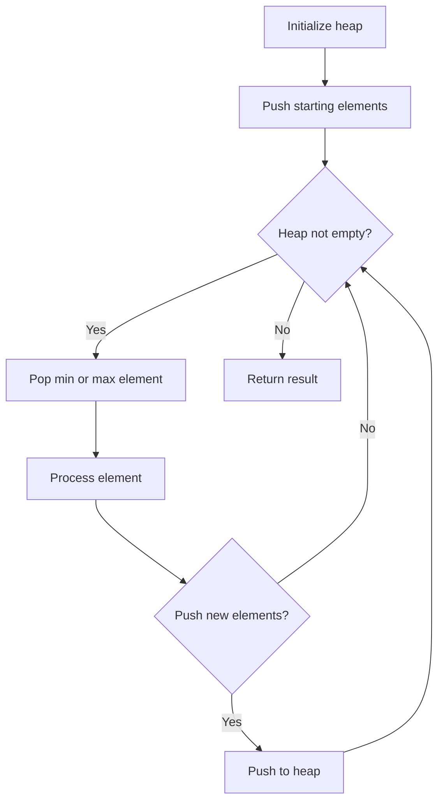
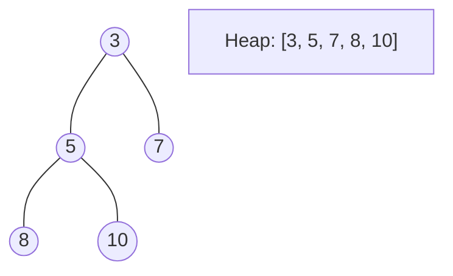
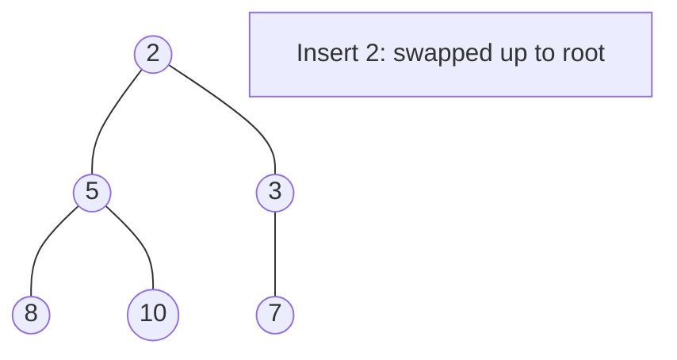
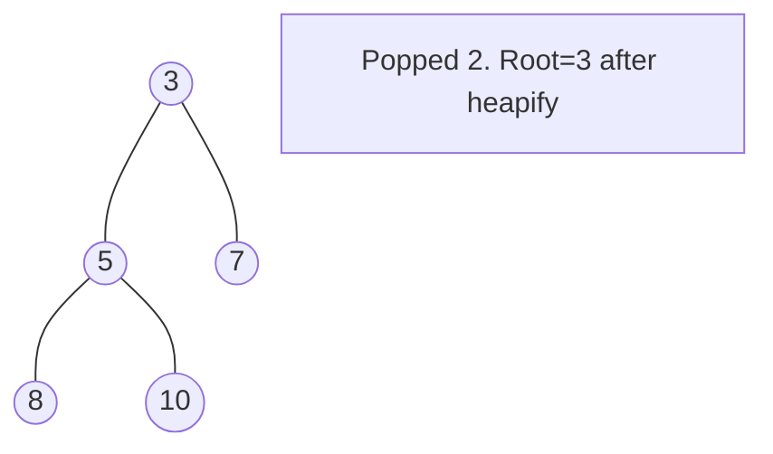

# Problem 2099: Find Subsequence of Length K With the Largest Sum

**Difficulty:** Easy  
**Tags:** Array, Hash Table, Sorting, Heap (Priority Queue)  
**Pattern:** Heap / Priority Queue  
**Link:** [leetcode.com/problems/find-subsequence-of-length-k-with-the-largest-sum](https://leetcode.com/problems/find-subsequence-of-length-k-with-the-largest-sum/)

## Description

You are given an integer array `nums` and an integer `k`. You want to find a **subsequence **of `nums` of length `k` that has the **largest** sum.

Return* ****any** such subsequence as an integer array of length *`k`.

A **subsequence** is an array that can be derived from another array by deleting some or no elements without changing the order of the remaining elements.

 

Example 1:

```

**Input:** nums = [2,1,3,3], k = 2
**Output:** [3,3]
**Explanation:**
The subsequence has the largest sum of 3 + 3 = 6.
```

Example 2:

```

**Input:** nums = [-1,-2,3,4], k = 3
**Output:** [-1,3,4]
**Explanation:** 
The subsequence has the largest sum of -1 + 3 + 4 = 6.

```

Example 3:

```

**Input:** nums = [3,4,3,3], k = 2
**Output:** [3,4]
**Explanation:**
The subsequence has the largest sum of 3 + 4 = 7. 
Another possible subsequence is [4, 3].

```

 

**Constraints:**

	- `1 <= nums.length <= 1000`
	- `-10^5 <= nums[i] <= 10^5`
	- `1 <= k <= nums.length`

## Approach: Heap / Priority Queue

Use a min-heap or max-heap to efficiently access the smallest/largest element. Push elements and pop the top to process in priority order.

## Pseudocode

```
1. Initialize heap (min or max)
2. Push initial elements onto heap
3. While heap not empty and condition:
   a. Pop top element (min or max)
   b. Process element
   c. Push new elements if needed
4. Return result
```

## Algorithm Flow



## Visual State Transitions

**Heap Operations (Min-Heap):**

**Frame 1: Initial heap**


**Frame 2: Insert 2 - bubble up**


**Frame 3: Pop minimum (2) - heapify down**



## Complexity Analysis

- **Time:** O(n log n)
- **Space:** O(n)

## Solution (Python3)

```python
class Solution:
    def maxSubsequence(self, nums: List[int], k: int) -> List[int]:
        # Heap/Priority Queue - O(n log k) time
        import heapq
        if not nums:
            return []
        # Min heap (negate for max heap)
        heap = []
        for val in nums:
            heapq.heappush(heap, val)
            if len(heap) > (k if isinstance(k, int) else len(nums)):
                heapq.heappop(heap)
        return heap[0] if heap else []
```

## Solution (C++)

```cpp
#include <queue>
#include <string>
#include <vector>
using namespace std;

class Solution {
public:
    vector<int> maxSubsequence(vector<int>& nums, int k) {
        // Heap/Priority Queue - O(n log k) time
        priority_queue<int, vector<int>, greater<int>> pq;
        for (int val : nums) {
            pq.push(val);
            if ((int)pq.size() > k)
                pq.pop();
        }
        return pq.empty() ? {} : pq.top();
    }
};
```
