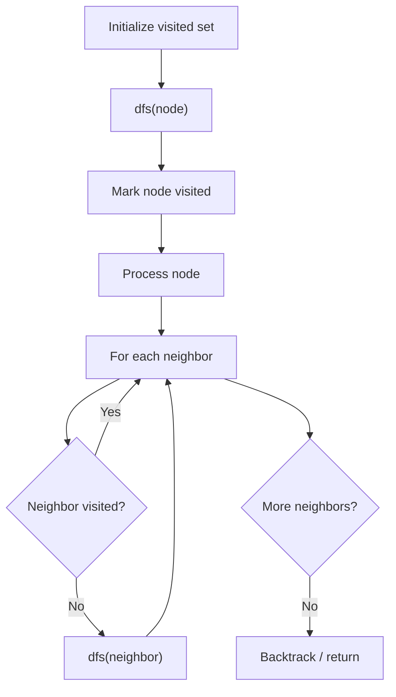

# Problem 2101: Detonate the Maximum Bombs

**Difficulty:** Medium  
**Tags:** Array, Math, Depth-First Search, Breadth-First Search, Graph Theory, Geometry  
**Pattern:** DFS Graph Traversal  
**Link:** [leetcode.com/problems/detonate-the-maximum-bombs](https://leetcode.com/problems/detonate-the-maximum-bombs/)

## Description

You are given a list of bombs. The **range** of a bomb is defined as the area where its effect can be felt. This area is in the shape of a **circle** with the center as the location of the bomb.

The bombs are represented by a **0-indexed** 2D integer array `bombs` where `bombs[i] = [xi, yi, ri]`. `xi` and `yi` denote the X-coordinate and Y-coordinate of the location of the `i^th` bomb, whereas `ri` denotes the **radius** of its range.

You may choose to detonate a **single** bomb. When a bomb is detonated, it will detonate **all bombs** that lie in its range. These bombs will further detonate the bombs that lie in their ranges.

Given the list of `bombs`, return *the **maximum** number of bombs that can be detonated if you are allowed to detonate **only one** bomb*.

 

Example 1:

```

**Input:** bombs = [[2,1,3],[6,1,4]]
**Output:** 2
**Explanation:**
The above figure shows the positions and ranges of the 2 bombs.
If we detonate the left bomb, the right bomb will not be affected.
But if we detonate the right bomb, both bombs will be detonated.
So the maximum bombs that can be detonated is max(1, 2) = 2.

```

Example 2:

```

**Input:** bombs = [[1,1,5],[10,10,5]]
**Output:** 1
Explanation:
Detonating either bomb will not detonate the other bomb, so the maximum number of bombs that can be detonated is 1.

```

Example 3:

```

**Input:** bombs = [[1,2,3],[2,3,1],[3,4,2],[4,5,3],[5,6,4]]
**Output:** 5
**Explanation:**
The best bomb to detonate is bomb 0 because:
- Bomb 0 detonates bombs 1 and 2. The red circle denotes the range of bomb 0.
- Bomb 2 detonates bomb 3. The blue circle denotes the range of bomb 2.
- Bomb 3 detonates bomb 4. The green circle denotes the range of bomb 3.
Thus all 5 bombs are detonated.

```

 

**Constraints:**

	- `1 <= bombs.length <= 100`
	- `bombs[i].length == 3`
	- `1 <= xi, yi, ri <= 10^5`

## Approach: DFS Graph Traversal

Explore the graph depth-first using recursion or a stack. Mark nodes as visited to avoid cycles. Process each node and explore all unvisited neighbors.

## Pseudocode

```
1. Initialize visited set
2. Define dfs(node):
   a. Mark node as visited
   b. Process node
   c. For each neighbor of node:
      - If not visited: dfs(neighbor)
3. Call dfs(start) for each unvisited node
```

## Algorithm Flow



## Complexity Analysis

- **Time:** O(V + E)
- **Space:** O(V)

## Solution (Python3)

```python
class Solution:
    def maximumDetonation(self, bombs: List[List[int]]) -> int:
        # DFS on graph - O(V+E) time
        visited = set()
        result = []
        
        def dfs(node):
            if node in visited:
                return
            visited.add(node)
            result.append(node)
            # Traverse neighbors (adjust based on adjacency representation)
        
        dfs(0)
        return result if isinstance(0, list) else len(result)
```

## Solution (C++)

```cpp
#include <functional>
#include <string>
#include <vector>
using namespace std;

class Solution {
public:
    int maximumDetonation(vector<vector<int>>& bombs) {
        // DFS on graph - O(V+E) time
        vector<bool> visited(bombs.size(), false);
        vector<int> result;
        function<void(int)> dfs = [&](int node) {
            if (visited[node]) return;
            visited[node] = true;
            result.push_back(node);
            // Traverse neighbors
        };
        dfs(0);
        return result;
    }
};
```
