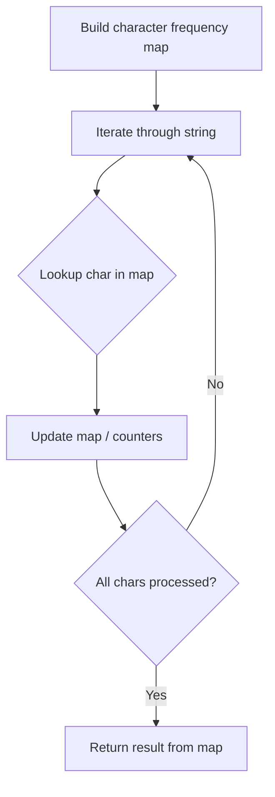

# Problem 2103: Rings and Rods

**Difficulty:** Easy  
**Tags:** Hash Table, String  
**Pattern:** Hash Map String Processing  
**Link:** [leetcode.com/problems/rings-and-rods](https://leetcode.com/problems/rings-and-rods/)

## Description

There are `n` rings and each ring is either red, green, or blue. The rings are distributed **across ten rods** labeled from `0` to `9`.

You are given a string `rings` of length `2n` that describes the `n` rings that are placed onto the rods. Every two characters in `rings` forms a **color-position pair** that is used to describe each ring where:

	- The **first** character of the `i^th` pair denotes the `i^th` ring's **color** (`'R'`, `'G'`, `'B'`).
	- The **second** character of the `i^th` pair denotes the **rod** that the `i^th` ring is placed on (`'0'` to `'9'`).

For example, `"R3G2B1"` describes `n == 3` rings: a red ring placed onto the rod labeled 3, a green ring placed onto the rod labeled 2, and a blue ring placed onto the rod labeled 1.

Return *the number of rods that have **all three colors** of rings on them.*

 

Example 1:

```

**Input:** rings = "B0B6G0R6R0R6G9"
**Output:** 1
**Explanation:** 
- The rod labeled 0 holds 3 rings with all colors: red, green, and blue.
- The rod labeled 6 holds 3 rings, but it only has red and blue.
- The rod labeled 9 holds only a green ring.
Thus, the number of rods with all three colors is 1.

```

Example 2:

```

**Input:** rings = "B0R0G0R9R0B0G0"
**Output:** 1
**Explanation:** 
- The rod labeled 0 holds 6 rings with all colors: red, green, and blue.
- The rod labeled 9 holds only a red ring.
Thus, the number of rods with all three colors is 1.

```

Example 3:

```

**Input:** rings = "G4"
**Output:** 0
**Explanation:** 
Only one ring is given. Thus, no rods have all three colors.

```

 

**Constraints:**

	- `rings.length == 2 * n`
	- `1 <= n <= 100`
	- `rings[i]` where `i` is **even** is either `'R'`, `'G'`, or `'B'` (**0-indexed**).
	- `rings[i]` where `i` is **odd** is a digit from `'0'` to `'9'` (**0-indexed**).

## Approach: Hash Map String Processing

Use a hash map to count character frequencies or map characters/strings for O(1) lookups. Process the string in one or two passes.

## Pseudocode

```
1. Build frequency map / char-to-index map
2. Iterate through string:
   a. Look up character in map
   b. Update counts or mappings
3. Return result based on map state
```

## Algorithm Flow



## Complexity Analysis

- **Time:** O(n)
- **Space:** O(n)

## Solution (Python3)

```python
class Solution:
    def countPoints(self, rings: str) -> int:
        # Hash map for string/character frequency - O(n) time
        freq = {}
        for ch in rings:
            freq[ch] = freq.get(ch, 0) + 1
        # Process frequency map
        for ch, cnt in freq.items():
            if cnt == 1:
                return rings.index(ch)
        return 0
```

## Solution (C++)

```cpp
#include <string>
#include <unordered_map>
#include <vector>
using namespace std;

class Solution {
public:
    int countPoints(string& rings) {
        // Hash map for string/character frequency - O(n) time
        unordered_map<char, int> freq;
        for (char ch : rings) {
            freq[ch]++;
        }
        // Process frequency map
        for (int i = 0; i < rings.size(); i++) {
            if (freq[rings[i]] == 1) return i;
        }
        return 0;
    }
};
```
