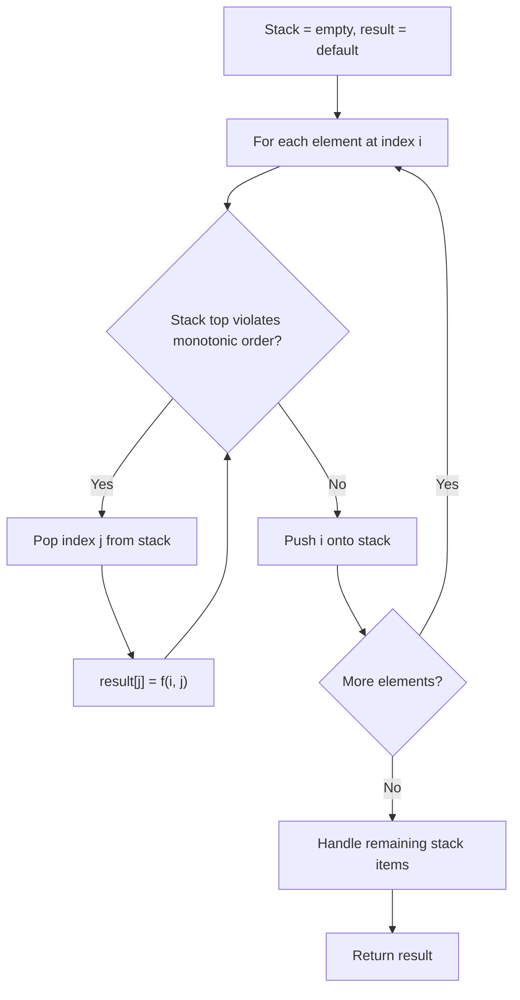
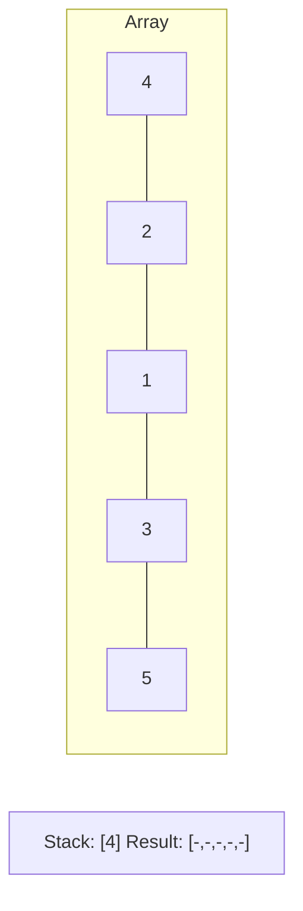
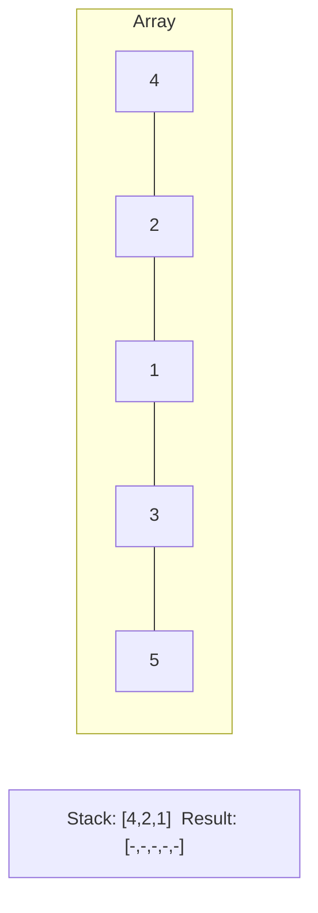
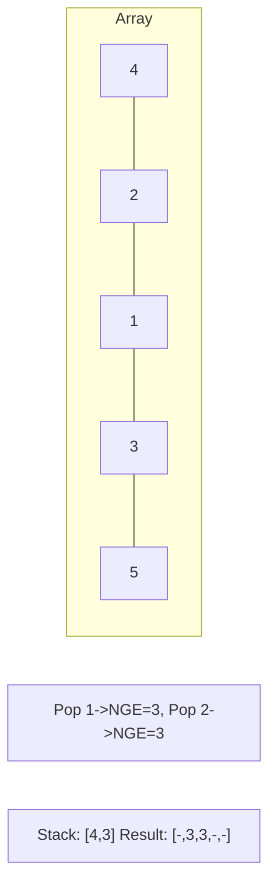
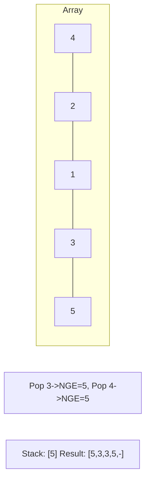

# Problem 2104: Sum of Subarray Ranges

**Difficulty:** Medium  
**Tags:** Array, Stack, Monotonic Stack  
**Pattern:** Monotonic Stack  
**Link:** [leetcode.com/problems/sum-of-subarray-ranges](https://leetcode.com/problems/sum-of-subarray-ranges/)

## Description

You are given an integer array `nums`. The **range** of a subarray of `nums` is the difference between the largest and smallest element in the subarray.

Return *the **sum of all** subarray ranges of *`nums`*.*

A subarray is a contiguous **non-empty** sequence of elements within an array.

 

Example 1:

```

**Input:** nums = [1,2,3]
**Output:** 4
**Explanation:** The 6 subarrays of nums are the following:
[1], range = largest - smallest = 1 - 1 = 0 
[2], range = 2 - 2 = 0
[3], range = 3 - 3 = 0
[1,2], range = 2 - 1 = 1
[2,3], range = 3 - 2 = 1
[1,2,3], range = 3 - 1 = 2
So the sum of all ranges is 0 + 0 + 0 + 1 + 1 + 2 = 4.
```

Example 2:

```

**Input:** nums = [1,3,3]
**Output:** 4
**Explanation:** The 6 subarrays of nums are the following:
[1], range = largest - smallest = 1 - 1 = 0
[3], range = 3 - 3 = 0
[3], range = 3 - 3 = 0
[1,3], range = 3 - 1 = 2
[3,3], range = 3 - 3 = 0
[1,3,3], range = 3 - 1 = 2
So the sum of all ranges is 0 + 0 + 0 + 2 + 0 + 2 = 4.

```

Example 3:

```

**Input:** nums = [4,-2,-3,4,1]
**Output:** 59
**Explanation:** The sum of all subarray ranges of nums is 59.

```

 

**Constraints:**

	- `1 <= nums.length <= 1000`
	- `-10^9 <= nums[i] <= 10^9`

 

**Follow-up:** Could you find a solution with `O(n)` time complexity?

## Approach: Monotonic Stack

Maintain a stack where elements are always in monotonic order (increasing or decreasing). When a new element violates the monotonic property, pop elements and compute results (e.g., next greater/smaller element, spans, areas).

## Pseudocode

```
1. Initialize empty stack, result array
2. For each element (index i):
   a. While stack not empty and arr[i] breaks monotonic order:
      - Pop index j from stack
      - result[j] = compute(i, j)
   b. Push i onto stack
3. Handle remaining elements in stack
4. Return result
```

## Algorithm Flow



## Visual State Transitions

**Monotonic Stack (Next Greater Element):**

**Frame 1: Process first elements**


**Frame 2: Push smaller elements**


**Frame 3: Element 3 pops 1 and 2**


**Frame 4: Element 5 pops all**



## Complexity Analysis

- **Time:** O(n)
- **Space:** O(n)

## Solution (Python3)

```python
class Solution:
    def subArrayRanges(self, nums: List[int]) -> int:
        # Monotonic stack - O(n) time, O(n) space
        n = len(nums)
        result = [0] * n
        stack = []  # indices
        for i in range(n):
            while stack and nums[i] > nums[stack[-1]]:
                idx = stack.pop()
                result[idx] = i - idx
            stack.append(i)
        return result
```

## Solution (C++)

```cpp
#include <stack>
#include <string>
#include <vector>
using namespace std;

class Solution {
public:
    int subArrayRanges(vector<int>& nums) {
        // Monotonic stack - O(n) time, O(n) space
        int n = nums.size();
        vector<int> result(n, 0);
        stack<int> st;
        for (int i = 0; i < n; i++) {
            while (!st.empty() && nums[i] > nums[st.top()]) {
                int idx = st.top(); st.pop();
                result[idx] = i - idx;
            }
            st.push(i);
        }
        return result;
    }
};
```
