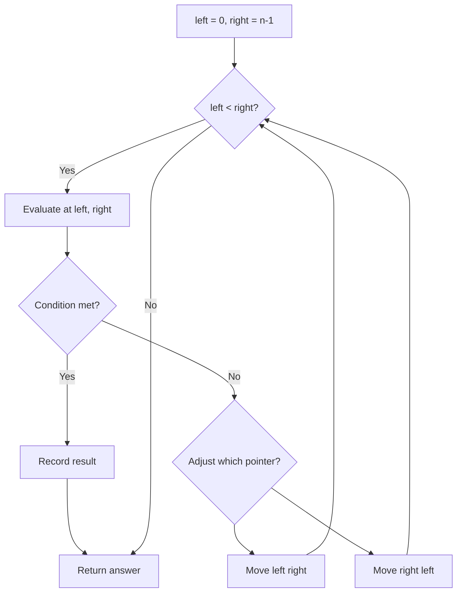
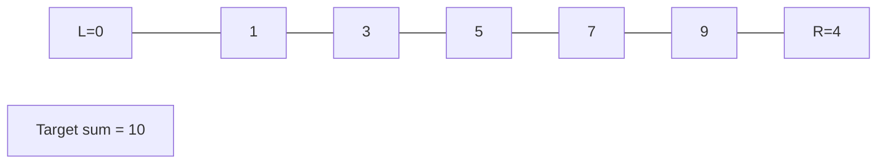
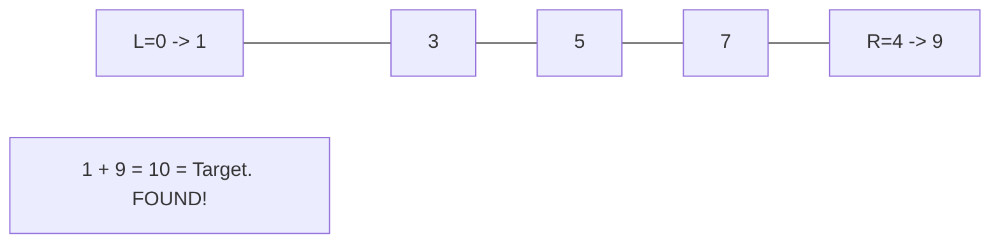

# Problem 2105: Watering Plants II

**Difficulty:** Medium  
**Tags:** Array, Two Pointers, Simulation  
**Pattern:** Two Pointers  
**Link:** [leetcode.com/problems/watering-plants-ii](https://leetcode.com/problems/watering-plants-ii/)

## Description

Alice and Bob want to water `n` plants in their garden. The plants are arranged in a row and are labeled from `0` to `n - 1` from left to right where the `i^th` plant is located at `x = i`.

Each plant needs a specific amount of water. Alice and Bob have a watering can each, **initially full**. They water the plants in the following way:

	- Alice waters the plants in order from **left to right**, starting from the `0^th` plant. Bob waters the plants in order from **right to left**, starting from the `(n - 1)^th` plant. They begin watering the plants **simultaneously**.
	- It takes the same amount of time to water each plant regardless of how much water it needs.
	- Alice/Bob **must** water the plant if they have enough in their can to **fully** water it. Otherwise, they **first** refill their can (instantaneously) then water the plant.
	- In case both Alice and Bob reach the same plant, the one with **more** water currently in his/her watering can should water this plant. If they have the same amount of water, then Alice should water this plant.

Given a **0-indexed** integer array `plants` of `n` integers, where `plants[i]` is the amount of water the `i^th` plant needs, and two integers `capacityA` and `capacityB` representing the capacities of Alice's and Bob's watering cans respectively, return *the **number of times** they have to refill to water all the plants*.

 

Example 1:

```

**Input:** plants = [2,2,3,3], capacityA = 5, capacityB = 5
**Output:** 1
**Explanation:**
- Initially, Alice and Bob have 5 units of water each in their watering cans.
- Alice waters plant 0, Bob waters plant 3.
- Alice and Bob now have 3 units and 2 units of water respectively.
- Alice has enough water for plant 1, so she waters it. Bob does not have enough water for plant 2, so he refills his can then waters it.
So, the total number of times they have to refill to water all the plants is 0 + 0 + 1 + 0 = 1.

```

Example 2:

```

**Input:** plants = [2,2,3,3], capacityA = 3, capacityB = 4
**Output:** 2
**Explanation:**
- Initially, Alice and Bob have 3 units and 4 units of water in their watering cans respectively.
- Alice waters plant 0, Bob waters plant 3.
- Alice and Bob now have 1 unit of water each, and need to water plants 1 and 2 respectively.
- Since neither of them have enough water for their current plants, they refill their cans and then water the plants.
So, the total number of times they have to refill to water all the plants is 0 + 1 + 1 + 0 = 2.

```

Example 3:

```

**Input:** plants = [5], capacityA = 10, capacityB = 8
**Output:** 0
**Explanation:**
- There is only one plant.
- Alice's watering can has 10 units of water, whereas Bob's can has 8 units. Since Alice has more water in her can, she waters this plant.
So, the total number of times they have to refill is 0.

```

 

**Constraints:**

	- `n == plants.length`
	- `1 <= n <= 10^5`
	- `1 <= plants[i] <= 10^6`
	- `max(plants[i]) <= capacityA, capacityB <= 10^9`

## Approach: Two Pointers

Use two pointers moving through the data structure. Depending on the problem, pointers may move toward each other (converging), in the same direction (fast/slow), or independently.

## Pseudocode

```
1. Initialize left = 0, right = n-1 (or two independent pointers)
2. While pointers haven't crossed:
   a. Evaluate condition at pointer positions
   b. Move left pointer right or right pointer left
3. Return result
```

## Algorithm Flow



## Visual State Transitions

**Two Pointer Convergence:**

**Frame 1: Initialize pointers**


**Frame 2: Sum = 1+9 = 10, found!**



## Complexity Analysis

- **Time:** O(n)
- **Space:** O(1)

## Solution (Python3)

```python
class Solution:
    def minimumRefill(self, plants: List[int], capacityA: int, capacityB: int) -> int:
        # Two pointer approach - O(n) time, O(1) space
        left, right = 0, len(plants) - 1
        while left < right:
            curr = plants[left] + plants[right]
            if curr == capacityA:
                return [left, right]
            elif curr < capacityA:
                left += 1
            else:
                right -= 1
        return 0
```

## Solution (C++)

```cpp
#include <string>
#include <vector>
using namespace std;

class Solution {
public:
    int minimumRefill(vector<int>& plants, int capacityA, int capacityB) {
        // Two pointer approach - O(n) time, O(1) space
        int left = 0, right = plants.size() - 1;
        while (left < right) {
            int curr = plants[left] + plants[right];
            if (curr == capacityA) {
                return {left, right};
            } else if (curr < capacityA) {
                left++;
            } else {
                right--;
            }
        }
        return 0;
    }
};
```
